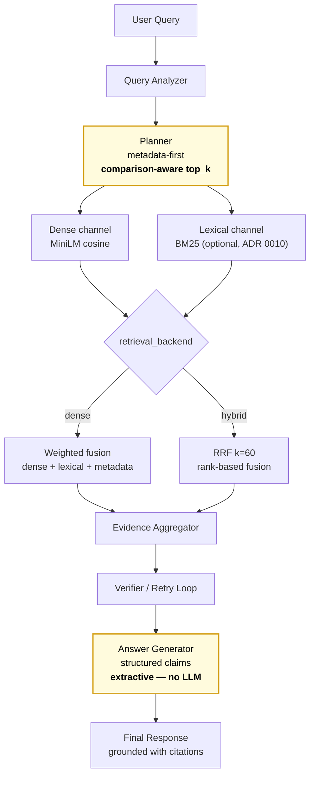

# BidMate Agent
**RFP 문서 이해를 위한 Agentic RAG 시스템**

[](LICENSE) [](https://github.com/hskim-solv/BidMate-DocAgent/actions/workflows/pr-eval.yml) [](https://codecov.io/gh/hskim-solv/BidMate-DocAgent) [](pyproject.toml) [](https://hskim-solv.github.io/BidMate-DocAgent/) [](https://colab.research.google.com/github/hskim-solv/BidMate-DocAgent/blob/main/demo/bidmate_quickstart.ipynb) [](https://huggingface.co/spaces/hskim-solv/bidmate-docagent) [](https://bidmate-docagent-demo.fly.dev/)

**Topics**: `rag` · `agentic-rag` · `korean-nlp` · `rfp` · `grounded-answer` · `evaluation-rigor` · `llm-ops`


> 한국 공공·B2B 입찰 RFP 에서 비교·요건 추출 질의를 **근거 기반 답변**으로 돌려주는 한국어 도메인 특화 RAG. 외부 LLM 호출 없이 추출형(extractive) grounding 으로 hallucination 을 구조적으로 차단.
> **차별점**: 비교 질의에서 두 기관 문서를 균등 인용하는 [comparison-aware balanced retrieval](#key-technical-contribution--comparison-aware-balanced-top-k), 메타데이터 우선 검색 ([ADR 0002](docs/adr/0002-metadata-first-retrieval.md)), 근거 불충분 시 보류(abstention) 명시 ([ADR 0003](docs/adr/0003-structured-answer-citation-contract.md)).
> **측정**: accuracy 0.718 ± 0.10, citation_precision 0.705 ± 0.08 (`agentic_full`, 95% CI, n=100). 공개 합성 + 비공개 real-data 분리 평가 ([ADR 0005](docs/adr/0005-eval-split-public-synthetic-private-local.md)), 33개 설계 결정 (ADR).

### 5초 비주얼 훅 — 실제 `comparison` 질의 한 건 (extractive, no LLM)

본 시스템의 실제 `agentic_full` 파이프라인 출력. *외부 LLM 호출 없이* retrieved evidence 에서 claim 추출 + citation 잠금 ([ADR 0003](docs/adr/0003-structured-answer-citation-contract.md)).

```text
$ make ask
python3 app.py --input_dir data/index --query "기관 A와 기관 B의 보안 요구사항 차이를 알려줘" --pipeline agentic_full

INFO bidmate.rag_core: query_complete  status='supported'  query_type='comparison'
                                       latency_ms=5.79      retry_count=0
                                       claim_count=2        citation_count=2

[OK] Answer written: outputs/answer.json

─ Answer ───────────────────────────────────────────────────────────────────
기관 A — 모델 품질관리, 보안 통제, 로그 추적
        [rfp-agency-a-ai-quality::chunk-001]
기관 B — 개인정보 비식별화, 접근 권한 분리
        [rfp-agency-b-mlops-governance::chunk-001]
────────────────────────────────────────────────────────────────────────────
```

- 두 기관이 **모두** 인용된 점이 핵심 — [comparison-aware balanced top-k](#key-technical-contribution--comparison-aware-balanced-top-k) 가 한쪽 문서 starvation 방지
- 외부 API 호출 없음 (extractive). 5.79 ms 는 in-memory index, n=2 docs 실측
- 5초 터미널 재생: `asciinema play docs/assets/demo.cast`. 풀 워크스루: [`docs/operations/deployment.md`](docs/operations/deployment.md#recording-the-demo-video)

## Live demo

| 경로 | 상태 | 비고 |
|---|---|---|
| **Colab 5분 quickstart** | [](https://colab.research.google.com/github/hskim-solv/BidMate-DocAgent/blob/main/demo/bidmate_quickstart.ipynb) | 클론/설치 없이 브라우저에서 grounded answer 1건 실행 |
| **Live demo (Fly.io)** | [https://bidmate-docagent-demo.fly.dev/](https://bidmate-docagent-demo.fly.dev/) | 메인 머지마다 자동 재배포 ([deploy-fly.yml](.github/workflows/deploy-fly.yml)). 첫 요청 cold-start 5–10s. 운영: [`docs/operations/deployment.md`](docs/operations/deployment.md) |
| **Streamlit on HF Spaces** | [](https://huggingface.co/spaces/hskim-solv/bidmate-docagent) | Fly.io 다운 시 fallback. Space sleep 시 cold-start 30–60s |
| **One-line docker** | `docker run -p 8501:8501 -p 8000:8000 -e BIDMATE_DEMO_MODE=both ghcr.io/hskim-solv/bidmate-demo:latest` | 클론 없이 Streamlit + FastAPI 동시 |
| **FastAPI Swagger** | `make api` 후 [/docs](http://localhost:8000/docs) | 프로그래매틱 사용·통합 테스트 |
| **로컬 1분 시작** | `make index && make demo` | `http://localhost:8501` |
| **Live leaderboard** | [https://hskim-solv.github.io/BidMate-DocAgent/leaderboard/](https://hskim-solv.github.io/BidMate-DocAgent/leaderboard/) | 메인 머지마다 누적 headline metric time-series (ADR 0030) |

데모 UI 는 3 파이프라인 preset (`naive_baseline` · `agentic_full` · `agentic_full_llm`) 을 라디오 버튼으로 전환, extractive vs LLM 합성 답변 side-by-side 비교.

## 왜 추출형(extractive)인가, 생성형(generative)이 아닌가?

기본 파이프라인 (`naive_baseline`, `agentic_full`) 은 외부 LLM 호출 없이 retrieved evidence 에서 claim 을 추출하는 **추출형 근거 답변**. 생성기를 의도적으로 추출형으로 한정한 4가지 이유:

1. **재현성**: 외부 API 키 / 네트워크 / 모델 버전 의존 0. 매 PR CI 가 동일 평가셋을 같은 결과로 재실행
2. **비용 영점**: query 당 LLM token cost = 0. 재시도 정책의 cost-quality trade-off 가 latency 1축으로 단순화
3. **LLM-as-judge confound 제거**: 생성기와 검증기가 같은 LLM 이 아니므로 self-consistency 편향 없음
4. **Citation grounding 내재화**: claim 이 retrieved evidence 에서만 도출되므로 hallucination 구조적 불가능

**한계 / Trade-off**: 생성 유창성 제약. RFP 도메인은 정확도와 근거 추적이 우선이라 수용 가능. 결정 계약: [ADR 0003](docs/adr/0003-structured-answer-citation-contract.md) + [`docs/agentic/answer-policy.md`](docs/agentic/answer-policy.md).

LLM synthesis opt-in (`agentic_full_llm`, [ADR 0011](docs/adr/0011-llm-synthesis-as-additive-ablation.md)) 과 LLM Ops observability ([ADR 0013](docs/adr/0013-observability-as-additive-pluggable-surface.md)) 는 추출형 파이프라인을 *교체하지 않고* additive 분석 변형으로 추가 — [`docs/agentic/answer-policy.md`](docs/agentic/answer-policy.md) / [`docs/operations/observability.md`](docs/operations/observability.md).

> **완료 ([issue #570](https://github.com/hskim-solv/BidMate-DocAgent/issues/570))**: 공개 합성 n=42 → **n=100 확장** (single_doc 34 / comparison 24 / follow_up 21 / abstention 21). Bootstrap CI 폭 이론 수축 ×0.65 (√42/100). Detection-blind 분석 변형 재측정은 real-eval 기준 후속

## TL;DR

- **문제**: 길고 복잡한 RFP 문서에서 실무 의사결정용 핵심 조건 (예산/일정/요구사항/제출조건) 을 빠르게 찾기 어려움
- **해결**: 질문 유형 분석 + 메타데이터 우선 검색 + local dense retrieval/reranking + 근거 검증/재시도를 결합한 Agentic RAG
- **시스템 설계**: 외부 LLM 호출 없이 evidence 에서 claim 추출 + citation 연결하는 **추출형 근거 답변 파이프라인** ([ADR 0003](docs/adr/0003-structured-answer-citation-contract.md))
- **성과**: 공개 합성 n=100 (single_doc 34 / comparison 24 / follow_up 21 / abstention 21) 기준 근거 기반 응답 품질 검증. Abstention **+77.8pp** / Citation Precision **+39.3pp** (CI 분리, 통계 유의). [평가셋 spec](docs/eval/eval-dataset-spec.md)
- **Latency** (naive_baseline, hashing, macOS CPU, n=100): p50 1.7ms / p95 3.1ms

---

## Key technical contribution — comparison-aware balanced top-k

RFP 비교 질의 (`query_type == "comparison"`) 에서 발생하는 한쪽 문서 starvation 을 막는 **balanced top-k 검색 ranking**. 일반 agentic RAG 튜토리얼에 없는 RFP 도메인 특화 결정.

**문제 패턴**: 단순 global top-k cut 은 score 가 높은 한 문서가 결과 슬롯 과점 → 다른 비교 대상 문서가 evidence 누락 → verifier 가 근거 부족 감지해 불필요 재시도 또는 보류 응답

**설계**: Query Analyzer 가 추출한 비교 target 별로 `min_per_target=1` 이상 evidence 보장, 남은 슬롯은 글로벌 score 순. 단일 문서 질의에서는 no-op (추가 비용 0)

- 구현: [`apply_comparison_balance()` (rag_core.py)](rag_core.py), 기본 설정 [`DEFAULT_COMPARISON_BALANCE` (rag_core.py)](rag_core.py)
- 테스트: [tests/test_fuzzy_retrieval.py](tests/test_fuzzy_retrieval.py) — asymmetric corpus 균등 보장, disabled 시 global ordering 보존, single-doc no-op
- 설계: [`docs/retrieval/comparison-ranking.md`](docs/retrieval/comparison-ranking.md)

> **One-line pitch**: RFP 비교 질의 실패 패턴 (한쪽 문서 starvation → verifier 재시도 → 보류) 을 발견하고, 이를 막는 검색 ranking 전략을 설계·구현·테스트로 검증한 것이 본 프로젝트의 핵심 기여

---

## 핵심 성능표 (실측)

**측정 환경**:
- **시스템 타입**: 추출형 only — 외부 LLM (GPT/Claude 등) 호출 없음, 의도된 설계
- **임베딩 backend**: 메트릭 표는 `hashing` (CI source of truth). `MiniLM-L12-v2` 비교: [`docs/benchmarking.md`](docs/benchmarking.md)
- **측정 범위**: `Latency p95` 컬럼 = query_analysis + context_resolution + answer_generation walltime 합. retrieve/verify stage = `reports/eval_summary.json` `stage_latency` 블록
- **실행 환경**: macOS / CPU-only / Python 3.11 / 단일 워커
- **Cold start 분리**: hashing ≈ 2.1ms / sentence-transformers ≈ 5.7s
- **평가셋**: 공개 합성 n=100. 비공개 RFP eval 은 [ADR 0005](docs/adr/0005-eval-split-public-synthetic-private-local.md) 분리. 상세: [docs/eval/eval-dataset-spec.md](docs/eval/eval-dataset-spec.md)
- **헤드라인 latency 기준**: naive_baseline p95 (3.1ms) 가 CI source of truth. `agentic_full_llm` 은 LLM 레이턴시 포함 환경 의존이라 CI 고정 대상 아님
- **`agentic_full_llm` backend**: 분석 변형 표의 `full_llm` 행은 `BIDMATE_SYNTHESIS_BACKEND=stub` (token-less, deterministic; [ADR 0011](docs/adr/0011-llm-synthesis-as-additive-ablation.md)). stub 은 pass-through 합성이라 `full` 과 동일 메트릭이 *정상*
- **Rerank 종류**: `Rerank on` 행 대부분 weighted-score rerank. `full_reranker` 만 cross-encoder rerank ([rag_rerank.py](rag_rerank.py)) — CI default `stub` 이라 `full` 과 수치 일치

<!-- METRICS_TABLE:START -->
| Category | Metric | agentic_full (95% CI) | naive_baseline (95% CI) | Δ |
|---|---|---:|---:|---:|
| Overall | Answer Accuracy | 0.718 (0.615–0.821) | 0.782 (0.679–0.872) | -6.4pp |
| Single-doc extraction | Answer Accuracy | 0.882 (0.765–0.971) | 0.941 (0.853–1.000) | -5.9pp |
| Multi-doc comparison | Groundedness Rate | 0.542 (0.333–0.708) | 0.708 (0.542–0.875) | -16.7pp |
| Follow-up | Answer Accuracy | 0.700 (0.500–0.900) | 0.750 (0.550–0.901) | -5.0pp |
| Evidence | Citation Precision | 0.705 (0.625–0.780) | 0.525 (0.450–0.610) | +18.0pp |
| Evidence | Claim Citation Alignment | 0.979 (0.944–1.000) | 0.972 (0.938–1.000) | +0.7pp |
| Evidence | Answer Format Compliance | 0.620 (0.530–0.710) | 0.630 (0.530–0.730) | -1.0pp |
| Abstention | Abstention Accuracy (CR/IA/BP) | 0.810 (18/4/0) (0.810 (0.619–0.952) 95% CI) | 0.238 (6/16/0) (0.238 (0.048–0.429) 95% CI) | +57.1pp |
| System | Latency (p50/p95) | p50 2.6ms / p95 4.6ms (`agentic_full`) | p50 1.7ms / p95 3.1ms (`naive_baseline` — CI source of truth) | — |
| System | Retry Rate | 0.490 (0.390–0.580) | 0.000 (0.000–0.000) | — |

### Ablation comparison

| Run | Pipeline | Top-k | Metadata-first | Rerank | Verifier/Retry | Accuracy | Groundedness | Citation | Claim Align | Format | Abstention | Retry | Latency p95 |
|---|---|---:|---:|---:|---:|---:|---:|---:|---:|---:|---:|---:|---:|
| naive_baseline | naive_baseline | 4 | off | off | off | 0.782±0.10 | 0.700±0.09 | 0.525±0.08 | 0.972±0.03 | 0.630 | 0.273 (6/16/0) | 0.000 | 3.1ms |
| full | agentic_full | auto | on | on | on | 0.718±0.10 | 0.750±0.08 | 0.705±0.08 | 0.979±0.03 | 0.620 | 0.818 (18/4/0) | 0.490 | 4.6ms |
| no_metadata_first | agentic_full | auto | off | on | on | 0.692±0.10 | 0.740±0.09 | 0.595±0.07 | 0.965±0.04 | 0.600 | 0.818 (18/4/0) | 0.000 | 3.6ms |
| no_verifier_retry | agentic_full | auto | on | on | off | 0.821±0.09 | 0.720±0.09 | 0.705±0.09 | 0.983±0.03 | 0.660 | 0.273 (6/16/0) | 0.000 | 2.7ms |

<details><summary>Detection-blind 분석 변형 — n=42 에서 <code>full</code> 과 통계 분리 불가 (CI band 겹침). n=100 확장 완료 (issue #570); real-eval 재측정 대기. <strong>19개 분석 변형 · ≥5pp + non-overlap CI = 0 winners</strong> — null-result 는 [ADR 0001](docs/adr/0001-preserve-naive-baseline.md) 기준선 결정성의 mechanical proof 로 표면화 ([docs/eval/ablation-discriminability.md](docs/eval/ablation-discriminability.md), [issue #782](https://github.com/hskim-solv/BidMate-DocAgent/issues/782)).</summary>

| Run | Pipeline | Top-k | Metadata-first | Rerank | Verifier/Retry | Accuracy | Groundedness | Citation | Claim Align | Format | Abstention | Retry | Latency p95 |
|---|---|---:|---:|---:|---:|---:|---:|---:|---:|---:|---:|---:|---:|
| full_llm | agentic_full_llm | auto | on | on | on | 0.718±0.10 | 0.750±0.08 | 0.705±0.08 | 0.979±0.03 | 0.620 | 0.818 (18/4/0) | 0.490 | 5.8ms |
| full_llm_metadata | agentic_full | auto | on | on | on | 0.718±0.10 | 0.750±0.08 | 0.705±0.08 | 0.979±0.03 | 0.620 | 0.818 (18/4/0) | 0.490 | 4.7ms |
| hierarchical | agentic_full | auto | on | on | on | 0.718±0.10 | 0.750±0.08 | 0.695±0.08 | 0.979±0.03 | 0.620 | 0.818 (18/4/0) | 0.490 | 5.0ms |
| no_rerank | agentic_full | auto | on | off | on | 0.705±0.10 | 0.740±0.08 | 0.695±0.08 | 0.979±0.03 | 0.620 | 0.818 (18/4/0) | 0.490 | 4.5ms |
| hybrid_bm25 | agentic_full | auto | on | on | on | 0.731±0.10 | 0.750±0.08 | 0.705±0.08 | 0.979±0.03 | 0.620 | 0.818 (18/4/0) | 0.490 | 4.5ms |
| hybrid_bm25_k10 | agentic_full | auto | on | on | on | 0.731±0.10 | 0.750±0.08 | 0.705±0.08 | 0.979±0.03 | 0.620 | 0.818 (18/4/0) | 0.490 | 4.9ms |
| hybrid_bm25_k30 | agentic_full | auto | on | on | on | 0.731±0.10 | 0.750±0.08 | 0.705±0.08 | 0.979±0.03 | 0.620 | 0.818 (18/4/0) | 0.490 | 4.8ms |
| hybrid_bm25_k100 | agentic_full | auto | on | on | on | 0.731±0.10 | 0.750±0.08 | 0.705±0.08 | 0.979±0.03 | 0.620 | 0.818 (18/4/0) | 0.490 | 4.6ms |
| hybrid_bm25_extra_stopwords | agentic_full | auto | on | on | on | 0.731±0.10 | 0.750±0.08 | 0.705±0.08 | 0.979±0.03 | 0.620 | 0.818 (18/4/0) | 0.490 | 5.0ms |
| hybrid_bm25_k30_extra | agentic_full | auto | on | on | on | 0.731±0.10 | 0.750±0.08 | 0.705±0.08 | 0.979±0.03 | 0.620 | 0.818 (18/4/0) | 0.490 | 4.7ms |
| full_kiwi | agentic_full | auto | on | on | on | 0.731±0.10 | 0.750±0.08 | 0.705±0.08 | 0.979±0.03 | 0.620 | 0.818 (18/4/0) | 0.490 | 4.7ms |
| full_reranker | agentic_full | auto | on | on | on | 0.718±0.10 | 0.750±0.08 | 0.705±0.08 | 0.979±0.03 | 0.620 | 0.818 (18/4/0) | 0.490 | 4.8ms |
| full_hyde | agentic_full | auto | on | on | on | 0.718±0.10 | 0.750±0.08 | 0.705±0.08 | 0.979±0.03 | 0.620 | 0.818 (18/4/0) | 0.490 | 4.8ms |
| agentic_full_finetuned | agentic_full | auto | on | on | on | 0.718±0.10 | 0.750±0.08 | 0.705±0.08 | 0.979±0.03 | 0.620 | 0.818 (18/4/0) | 0.490 | 4.8ms |
| naive_baseline_finetuned | naive_baseline | 4 | off | off | off | 0.782±0.10 | 0.700±0.09 | 0.525±0.08 | 0.972±0.03 | 0.630 | 0.273 (6/16/0) | 0.000 | 2.5ms |

</details>

> 수치는 `mean±half-width` (95% bootstrap CI, n=cases, 1000 resample, seed=17). 행 간 CI 겹침 = 해당 n 에서의 통계 검출 한계, equivalence 아님. n=42 half-width ≈ ±0.12; n=100 으로 ×0.65 (√42/100) 수축. 비-CI 컬럼 (Format, Abstention, Retry) 은 point estimate; 그 CI 는 위 main 표 참조
<!-- METRICS_TABLE:END -->

> **분석 변형 → ADR Status 매핑** ([issue #813](https://github.com/hskim-solv/BidMate-DocAgent/issues/813)) — 각 행이 어느 ADR 의 지배를 받는지, 외부 reader 에게 *accepted 결정* vs *제안/superseded 측정 중* 표시:
>
> | 분석 변형 행 | ADR | Status |
> |---|---|---|
> | `full`, `naive_baseline` | [ADR 0001](docs/adr/0001-preserve-naive-baseline.md) | accepted |
> | `no_metadata_first` (역 분석 변형) | [ADR 0002](docs/adr/0002-metadata-first-retrieval.md) | accepted |
> | `no_verifier_retry` (역 분석 변형) | [ADR 0004](docs/adr/0004-verifier-retry-policy.md) | accepted |
> | `hybrid_bm25*` family | [ADR 0010](docs/adr/0010-hybrid-bm25-dense-retrieval-rrf.md) | accepted |
> | `full_llm`, `full_llm_metadata` | [ADR 0011](docs/adr/0011-llm-synthesis-as-additive-ablation.md) | **proposed** |
> | `full_hyde` | [ADR 0023](docs/adr/0023-hyde-query-expansion-ablation.md) | **proposed** |
> | `full_reranker` | [ADR 0026](docs/adr/0026-cross-encoder-reranker-deferral.md) | superseded (deferral) |
> | `agentic_full_finetuned`, `naive_baseline_finetuned` | [ADR 0027](docs/adr/0027-lora-finetuned-embedding-additive.md) | superseded |
> | `full_kiwi` | [ADR 0031](docs/adr/0031-bm25-korean-morphology-additive.md) | superseded |
> | `hierarchical`, `no_rerank` | (청킹/rerank 토글, 전용 ADR 없음) | n/a |
>
> *proposed* 행은 accepted 미진입 — 보통 [ADR 0001](docs/adr/0001-preserve-naive-baseline.md) additive 분석 변형 측에 머물다 n=100 real-eval 재측정으로 `full` 과 CI 분리되어야 진입. *superseded* 는 후속 결정 (ADR 0027 → ADR 0037 KURE v1) 에 흡수 또는 기준선 조건 미충족 시 보류. Status drift = ADR 미동기 — `scripts/check_ablation_adr_sync.py` 가 매핑 lint 할 때까지 수동 reminder (issue #813 § 시정 액션 ②)

> **더 읽기**: [docs/rag-challenges-solved.md](docs/rag-challenges-solved.md) — 이 숫자를 만든 3가지 핵심 결정 (STAR 회고). [docs/performance-evolution.md](docs/performance-evolution.md) — n=42→n=100 CI 수축 히스토리 + 기능별 분석 변형 효과 분해

> **분석 변형 해석 — CI 검출 한계 vs 실측 trade-off**: `no_rerank` / `hierarchical` / `full_llm` 이 `full` 과 동일 메트릭을 보이는 것은 *기능 동등* 이 아니라 *n=42 + bootstrap CI 가 차이 미검출* 때문 — CI 폭이 너무 넓어 미세 차이가 noise 에 묻힘. n=100 확장 완료 (issue #570); real-eval 재측정으로 통계 분리 가능성 확인 예정. **CI 분리되는 진짜 효과**: `no_metadata_first` citation 0.679±0.11 (CI 0.571–0.786) vs `full` 0.905±0.08 (0.821–0.976) — CI 비겹침으로 메타데이터 우선 효용 통계 입증. `no_verifier_retry` groundedness 0.762±0.14 (CI 0.619–0.881) vs `full` 0.929±0.07 — verifier loop 효용 시사. 상세: [`docs/benchmarking.md`](docs/benchmarking.md)

---

## 아키텍처 (요약)



> 강조 2 노드: Planner 의 `comparison-aware top_k` → [Key technical contribution](#key-technical-contribution--comparison-aware-balanced-top-k), Answer Generator 의 `extractive — no LLM` → [Why extractive?](#왜-추출형extractive인가-생성형generative이-아닌가)

비교 질의 (`query_type == "comparison"`) 에서는 balanced top-k cut 으로 각 비교 대상에 최소 1개 evidence 보장. 메타데이터 filter staging, alias lexicon, follow-up carryover: [`docs/retrieval/retrieval-hardening.md`](docs/retrieval/retrieval-hardening.md). `retrieval_backend` hybrid (BM25+RRF) 근거: [ADR 0010](docs/adr/0010-hybrid-bm25-dense-retrieval-rrf.md). "agentic" 의 의미 (bounded 재시도 vs ReAct/Reflexion 비교): [`docs/agentic/agentic-definition.md`](docs/agentic/agentic-definition.md).

---

## 실행 (5분 quickstart)

```bash
python3 -m venv .venv && source .venv/bin/activate && pip install -r requirements.txt
python3 scripts/build_index.py --input_dir data/raw --output_dir data/index
python3 app.py --input_dir data/index --query "기관 A와 기관 B의 AI 요구사항 차이 알려줘" --pipeline agentic_full
python3 eval/run_eval.py --index_dir data/index --output_dir reports --config eval/config.yaml
python3 scripts/update_readme_metrics.py --report reports/eval_summary.json --readme README.md
```

상세 실행 (FastAPI 데모, PDF/HWP ingestion, visual parsing v2, 비공개 100-doc eval, harness): [`docs/operations/api-demo.md`](docs/operations/api-demo.md).

---

## 주요 링크

| 목적 | 링크 |
|---|---|
| ADR 인덱스 (43개 결정) | [`docs/adr/README.md`](docs/adr/README.md) |
| 분석 변형 결과 + benchmarking + latency 비교 | [`docs/benchmarking.md`](docs/benchmarking.md) / [`docs/eval/ablation-results.md`](docs/eval/ablation-results.md) |
| 설계 배경 (한국 RFP 적응 5가지) | [`docs/design-background.md`](docs/design-background.md) |
| 답변 출력 정책 + Evidence boundary + Baseline policy | [`docs/agentic/answer-policy.md`](docs/agentic/answer-policy.md) |
| 한계 + 실패 사례 (real-data taxonomy) | [`docs/real-data/failure-cases.md`](docs/real-data/failure-cases.md) / [`docs/real-data/real-data-failure-taxonomy.md`](docs/real-data/real-data-failure-taxonomy.md) |
| 공개 평가셋 spec (n=100, 7-doc corpus, 방법론) | [`docs/eval/eval-dataset-spec.md`](docs/eval/eval-dataset-spec.md) |
| 비공개 100-doc aggregate 정책 + placeholder | [`docs/real-data/private-100-doc-experiments.md`](docs/real-data/private-100-doc-experiments.md) |
| 엔지니어링 블로그 (GitHub Pages) | [hskim-solv.github.io/BidMate-DocAgent](https://hskim-solv.github.io/BidMate-DocAgent/) |
| 전체 문서 인덱스 | [`docs/README.md`](docs/README.md) |

---

## Claude Code 와의 협업 (AI 협업 투명성)

이 프로젝트는 [Claude Code](https://claude.ai/code) (Opus 4.x) 를 개발 파트너로 사용. 과잉 주장 (over-claim) 방지를 위한 역할 분담:

**사람 영역**
- ADR 설계 및 의사결정 게이트 — 어떤 문제를, 언제, 왜 해결
- 포트폴리오 플랜 + 우선순위 (채용 funnel 4층 프레임워크)
- 5축 협업 self-review 기준 정의 및 분기별 진단
- 평가 설계 (공개/비공개 분리 경계, ADR 0005) 및 회귀 기준

**Claude Code 영역**
- 코드 구현, 리팩터링, 문서 초안, 테스트 작성
- 브랜치/PR/이슈 생성 및 CI gate 운영 보조
- 탐색 (Explore subagent), 설계 검토 (Plan subagent), 반복 작업 자동화

**Governance 가 막은 실제 인시던트 3건** — 합성 CI 가 놓친 보류 회귀 (#69), stacked-PR child auto-close, ADR 번호 worktree 충돌. 각 사고와 사후 보강 hook/rule: [`docs/engineering-governance.md` Governance saves](docs/engineering-governance.md#governance-saves-실제-막은-인시던트). 거버넌스가 *있다* 는 신호보다 *rent 를 냈다* 는 신호 우선.

**분기별 협업 자가진단** — `/self-review-quarterly` skill 로 4축 (포트폴리오 진행도) + 5축 (Claude 협업 효율) 을 한 보고서로 생성. 최신: [`docs/self-review/Q2-2026.md`](docs/self-review/Q2-2026.md)

---

## Notice
- 원본 RFP 문서는 외부 공유 제한으로 저장소 미포함
- `data/raw` 는 공개 재현용 합성 RFP 샘플
- 본 저장소 = 재현 가능 구조/평가 관점의 포트폴리오 문서화 목표
