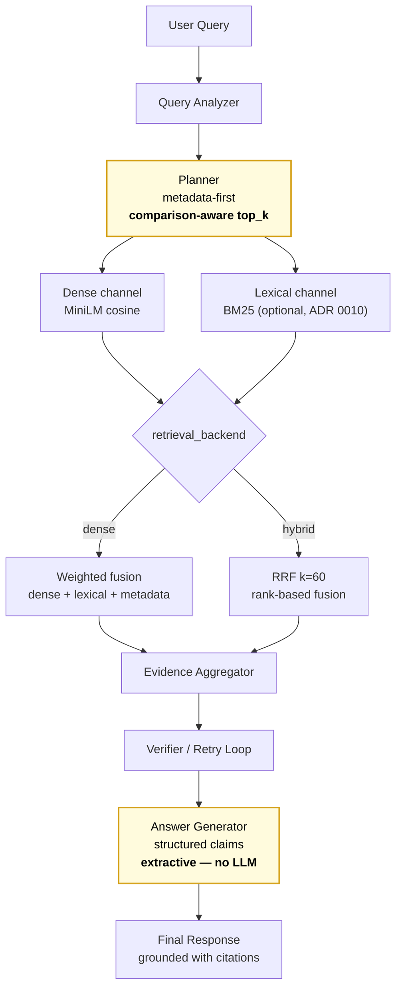

# BidMate Agent
**RFP 문서 이해를 위한 Agentic RAG 시스템**

[](LICENSE) [](https://github.com/hskim-solv/BidMate-DocAgent/actions/workflows/pr-eval.yml) [](https://codecov.io/gh/hskim-solv/BidMate-DocAgent) [](pyproject.toml) [](https://hskim-solv.github.io/BidMate-DocAgent/) [](https://colab.research.google.com/github/hskim-solv/BidMate-DocAgent/blob/main/demo/bidmate_quickstart.ipynb) [](https://huggingface.co/spaces/hskim-solv/bidmate-docagent) [](https://bidmate-docagent-demo.fly.dev/)

<!-- Hero demo asset slot. Asset (docs/assets/demo.gif) not yet captured;
     image line is commented out to avoid broken-image rendering on GitHub.
     Recording guide: docs/deployment.md#recording-the-demo-video.
     To re-enable: uncomment the line below once docs/assets/demo.gif exists. -->
<!--  -->

> 일반 영어 LLM 벤치(KMMLU/MMLU) 점수 경쟁이 아닌 **한국어 RFP 도메인-특화 RAG**입니다. 차별화는 세 축: 비교 질의에서 한쪽 문서 starvation을 막는 [comparison-aware balanced top-k](#key-technical-contribution--comparison-aware-balanced-top-k), 의미 유사도 단독의 함정을 회피하는 metadata-first retrieval([ADR 0002](docs/adr/0002-metadata-first-retrieval.md)), hallucination을 구조적으로 차단하는 extractive grounded-answer 답변 계약([ADR 0003](docs/adr/0003-structured-answer-citation-contract.md)). 측정은 공개 합성 + 비공개 real-data + KorQuAD 2.1 한국어 공개셋으로 분리([ADR 0005](docs/adr/0005-eval-split-public-synthetic-private-local.md), [ADR 0018](docs/adr/0018-korean-public-rag-bench.md)) — silent regression이 한 표면에서 다른 표면으로 새지 않도록 설계됐습니다.

### 🎬 5초 비주얼 훅 — 실제 `comparison` 질의 한 건 (extractive, no LLM)

다음은 본 시스템이 실제로 출력하는 `agentic_full` 파이프라인 결과입니다. *외부 LLM 호출 없이*, retrieved evidence에서 claim을 추출하고 citation으로 잠급니다 ([ADR 0003](docs/adr/0003-structured-answer-citation-contract.md)).

```text
$ make ask
python3 app.py --input_dir data/index --query "기관 A와 기관 B의 보안 요구사항 차이를 알려줘" --pipeline agentic_full

INFO bidmate.rag_core: query_complete  status='supported'  query_type='comparison'
                                       latency_ms=5.79      retry_count=0
                                       claim_count=2        citation_count=2

[OK] Answer written: outputs/answer.json

─ Answer ───────────────────────────────────────────────────────────────────
기관 A — 모델 품질관리, 보안 통제, 로그 추적
        [rfp-agency-a-ai-quality::chunk-001]
기관 B — 개인정보 비식별화, 접근 권한 분리
        [rfp-agency-b-mlops-governance::chunk-001]
────────────────────────────────────────────────────────────────────────────
```

- 두 기관이 **모두** 인용된 점이 핵심 — [comparison-aware balanced top-k](#key-technical-contribution--comparison-aware-balanced-top-k)가 한쪽 문서 starvation을 막은 결과.
- 외부 API 호출 없음 (extractive). 위 5.79 ms는 in-memory index · n=2 docs 기준 실측치.
- 5초 터미널 재생 (asciinema 설치 시): `asciinema play docs/assets/demo.cast`. 풀 워크스루 가이드: [`docs/deployment.md`](docs/deployment.md#recording-the-demo-video).

## 🚀 Live demo

| 경로 | 상태 | 비고 |
|---|---|---|
| **Colab 5분 quickstart** | [](https://colab.research.google.com/github/hskim-solv/BidMate-DocAgent/blob/main/demo/bidmate_quickstart.ipynb) | 클론 / 설치 없이 브라우저에서 바로 grounded answer 1건 실행 |
| **🟢 Live demo (Fly.io)** | [https://bidmate-docagent-demo.fly.dev/](https://bidmate-docagent-demo.fly.dev/) | 메인 머지마다 자동 재배포 ([deploy-fly.yml](.github/workflows/deploy-fly.yml)). 첫 요청 cold-start 약 5–10s. 운영: [`docs/deployment.md`](docs/deployment.md) |
| **Streamlit on HF Spaces** | [](https://huggingface.co/spaces/hskim-solv/bidmate-docagent) | Fly.io 다운 시 fallback. Space sleep 시 cold-start 약 30–60s |
| **One-line docker run** | `docker run -p 8501:8501 -p 8000:8000 -e BIDMATE_DEMO_MODE=both ghcr.io/hskim-solv/bidmate-demo:latest` | 클론 없이 Streamlit + FastAPI 동시 실행 |
| **FastAPI Swagger** | `make api` 후 [/docs](http://localhost:8000/docs) | 프로그래매틱 사용·통합 테스트용 |
| **로컬 1분 시작** | `make index && make demo` | `http://localhost:8501` |
| **📈 Live leaderboard** | [https://hskim-solv.github.io/BidMate-DocAgent/leaderboard/](https://hskim-solv.github.io/BidMate-DocAgent/leaderboard/) | 메인 브랜치 머지마다 자동 누적 headline metric time-series (ADR 0030) |

데모 UI는 3개 pipeline preset(`naive_baseline` · `agentic_full` · `agentic_full_llm`)을 라디오 버튼으로 전환하고 extractive vs LLM 합성 답변을 side-by-side로 비교합니다.

## Why extractive, not generative?

기본 pipeline(`naive_baseline`, `agentic_full`)은 외부 LLM 호출 없이 retrieved evidence에서 claim을 추출하는 **extractive grounded-answer**입니다. Generator를 의도적으로 extractive로 한정한 4가지 이유:

1. **재현성**: 외부 API 키 / 네트워크 / 모델 버전 의존이 0. CI에서 매 PR마다 동일 평가셋을 같은 결과로 재실행 가능.
2. **비용 영점**: query당 LLM token cost = 0. retry policy의 cost-quality trade-off가 latency 1축으로 단순화됨.
3. **LLM-as-judge confound 제거**: generator와 verifier가 같은 LLM이 아니므로 self-consistency 편향 없음.
4. **Citation grounding 내재화**: claim이 retrieved evidence에서만 도출되므로 hallucination이 구조적으로 불가능.

**한계 / Trade-off**: 생성 유창성에 제약. RFP 도메인은 정확도와 근거 추적이 우선이므로 수용 가능한 trade-off. 결정 계약: [ADR 0003](docs/adr/0003-structured-answer-citation-contract.md) + [`docs/answer-policy.md`](docs/answer-policy.md).

LLM synthesis opt-in(`agentic_full_llm`, [ADR 0011](docs/adr/0011-llm-synthesis-as-additive-ablation.md))과 LLM Ops observability([ADR 0013](docs/adr/0013-observability-as-additive-pluggable-surface.md))는 extractive 파이프라인을 *교체하지 않고* additive ablation으로 추가됩니다 — [`docs/answer-policy.md`](docs/answer-policy.md) / [`docs/observability.md`](docs/observability.md).

> **다음 실험 사이클 (현재 1순위)**: 공개 synthetic n=42 → **n≥100 확장** + bootstrap CI 재측정. Detection-blind ablation 14행의 통계적 분리는 n≥100에서 가능. Tracking: [issue #570](https://github.com/hskim-solv/BidMate-DocAgent/issues/570).

## TL;DR
- **문제**: 길고 복잡한 RFP 문서에서 실무 의사결정에 필요한 핵심 조건(예산/일정/요구사항/제출조건)을 빠르게 찾기 어렵습니다.
- **해결**: 질문 유형 분석 + metadata-first 검색 + local dense retrieval/reranking + 근거 검증/retry를 결합한 Agentic RAG 파이프라인.
- **시스템 설계**: 외부 LLM 호출 없이 evidence에서 claim을 추출하고 citation을 연결하는 **extractive grounded-answer 파이프라인** ([ADR 0003](docs/adr/0003-structured-answer-citation-contract.md)).
- **성과**: 공개 synthetic 평가셋 **n=42** (single_doc 14 / comparison 10 / follow_up 9 / abstention 9) 기준 근거 기반 응답 품질 검증. Abstention **+77.8pp** / Citation Precision **+39.3pp** (CI 분리, 통계적으로 유의).
- **Latency** (naive_baseline, hashing, macOS CPU, n=42): p50 1.9ms / p95 5.9ms.

---

## Key technical contribution — comparison-aware balanced top-k

본 프로젝트의 가장 큰 차별점은 RFP 비교 질의(`query_type == "comparison"`)에서 발생하는 한쪽 문서 starvation을 막는 **balanced top-k retrieval ranking** 입니다. 일반 agentic RAG 튜토리얼에는 없는 RFP 도메인-특화 ranking 결정입니다.

**문제 패턴**: 단순 global top-k 컷은 score가 높은 한 문서가 결과 슬롯을 과점하면 다른 비교 대상 문서가 evidence에서 누락됩니다. 이로 인해 verifier가 근거 부족을 감지해 불필요한 retry를 트리거하거나 abstention으로 응답하는 실패가 발생합니다.

**설계**: Query Analyzer가 추출한 비교 target 별로 `min_per_target=1` 이상 evidence를 보장한 뒤, 남은 슬롯을 글로벌 score 순으로 채웁니다. 단일 문서 질의에서는 no-op으로 동작해 추가 비용이 없습니다.

- 구현: [`apply_comparison_balance()` (rag_core.py)](rag_core.py), 기본 설정 [`DEFAULT_COMPARISON_BALANCE` (rag_core.py)](rag_core.py)
- 테스트: [tests/test_fuzzy_retrieval.py](tests/test_fuzzy_retrieval.py) — asymmetric corpus 균형 보장, disabled 시 global ordering 보존, single-doc no-op
- 설계 문서: [`docs/comparison-ranking.md`](docs/comparison-ranking.md)

> **One-line pitch**: RFP 비교 질의의 실패 패턴(한쪽 문서 starvation → verifier retry → abstention)을 발견하고, 이를 막는 retrieval ranking 전략을 설계·구현·테스트로 검증한 것이 본 프로젝트의 핵심 기여입니다.

---

## 핵심 성능표 (실측)

**측정 환경**:
- **시스템 타입**: Extractive-only — 외부 LLM(GPT/Claude 등) 호출 없음, 의도된 설계입니다.
- **임베딩 백엔드**: 아래 metric table은 `hashing` (CI source of truth) 측정값입니다. `MiniLM-L12-v2` 비교: [`docs/benchmarking.md`](docs/benchmarking.md).
- **측정 범위**: `Latency p95` 컬럼은 query_analysis + context_resolution + answer_generation 합의 walltime. retrieve/verify stage는 `reports/eval_summary.json`의 `stage_latency` 블록.
- **실행 환경**: macOS / CPU-only / Python 3.11 / 단일 워커.
- **Cold start 분리**: hashing ≈ 2.1ms / sentence-transformers ≈ 5.7s.
- **평가셋**: 공개 synthetic n=42 (single_doc 14 / comparison 10 / follow_up 9 / abstention 9). 비공개 RFP eval은 [ADR 0005](docs/adr/0005-eval-split-public-synthetic-private-local.md)에 따라 분리합니다.
- **헤드라인 latency 기준 preset**: naive_baseline Latency p95 (5.9ms)가 CI source of truth. `agentic_full_llm`은 LLM 레이턴시 포함해 환경 의존적이므로 CI 고정 대상 아님.
- **`agentic_full_llm` 백엔드 구분**: ablation 표의 `full_llm` 행은 `BIDMATE_SYNTHESIS_BACKEND=stub`(token-less, deterministic; [ADR 0011](docs/adr/0011-llm-synthesis-as-additive-ablation.md)) 기준. stub은 pass-through 합성이라 `full`과 동일 metric이 *정상*.
- **Rerank 종류 구분**: `Rerank on` 행 대부분은 weighted-score rerank. `full_reranker`만 cross-encoder rerank([rag_rerank.py](rag_rerank.py)) — CI default `stub`이라 `full`과 수치 일치.

<!-- METRICS_TABLE:START -->
| Category | Metric | agentic_full (95% CI) | naive_baseline (95% CI) | Δ |
|---|---|---:|---:|---:|
| Overall | Answer Accuracy | 0.906 (0.781–1.000) | 0.844 (0.719–0.969) | +6.2pp |
| Single-doc extraction | Answer Accuracy | 1.000 (1.000–1.000) | 1.000 (1.000–1.000) | +0.0pp |
| Multi-doc comparison | Groundedness Rate | 0.700 (0.400–0.900) | 0.700 (0.400–0.900) | +0.0pp |
| Follow-up | Answer Accuracy | 1.000 (1.000–1.000) | 0.750 (0.375–1.000) | +25.0pp |
| Evidence | Citation Precision | 0.905 (0.821–0.976) | 0.512 (0.393–0.631) | +39.3pp |
| Evidence | Claim Citation Alignment | 1.000 (1.000–1.000) | 0.974 (0.921–1.000) | +2.6pp |
| Evidence | Answer Format Compliance | 0.905 (0.810–0.976) | 0.667 (0.524–0.810) | +23.8pp |
| Abstention | Abstention Accuracy | 1.000 (1.000–1.000) | 0.222 (0.000–0.556) | +77.8pp |
| System | Latency (p50/p95) | p50 2.0ms / p95 5.0ms (`agentic_full`) | p50 2.2ms / p95 5.8ms (`naive_baseline` — CI source of truth) | — |
| System | Retry Rate | 0.310 (0.167–0.452) | 0.000 (0.000–0.000) | — |

### Ablation comparison

| Run | Pipeline | Top-k | Metadata-first | Rerank | Verifier/Retry | Accuracy | Groundedness | Citation | Claim Align | Format | Abstention | Retry | Latency p95 |
|---|---|---:|---:|---:|---:|---:|---:|---:|---:|---:|---:|---:|---:|
| naive_baseline | naive_baseline | 4 | off | off | off | 0.844±0.12 | 0.714±0.14 | 0.512±0.12 | 0.974±0.05 | 0.667 | 0.300 | 0.000 | 5.8ms |
| full | agentic_full | auto | on | on | on | 0.906±0.12 | 0.929±0.07 | 0.905±0.08 | 1.000±0.00 | 0.905 | 1.000 | 0.310 | 5.0ms |
| no_metadata_first | agentic_full | auto | off | on | on | 0.844±0.12 | 0.881±0.10 | 0.679±0.11 | 0.968±0.06 | 0.857 | 1.000 | 0.000 | 4.0ms |
| no_verifier_retry | agentic_full | auto | on | on | off | 0.906±0.12 | 0.762±0.14 | 0.762±0.14 | 1.000±0.00 | 0.714 | 0.300 | 0.000 | 2.9ms |

<details><summary>Detection-blind ablations under n=42 — statistically inseparable from <code>full</code>; to be re-tested at n≥100 (issue #570)</summary>

| Run | Pipeline | Top-k | Metadata-first | Rerank | Verifier/Retry | Accuracy | Groundedness | Citation | Claim Align | Format | Abstention | Retry | Latency p95 |
|---|---|---:|---:|---:|---:|---:|---:|---:|---:|---:|---:|---:|---:|
| full_llm | agentic_full_llm | auto | on | on | on | 0.906±0.12 | 0.929±0.07 | 0.905±0.08 | 1.000±0.00 | 0.905 | 1.000 | 0.310 | 5.0ms |
| full_llm_metadata | agentic_full | auto | on | on | on | 0.906±0.12 | 0.929±0.07 | 0.905±0.08 | 1.000±0.00 | 0.905 | 1.000 | 0.310 | 6.8ms |
| hierarchical | agentic_full | auto | on | on | on | 0.906±0.12 | 0.929±0.07 | 0.905±0.08 | 1.000±0.00 | 0.905 | 1.000 | 0.310 | 4.9ms |
| no_rerank | agentic_full | auto | on | off | on | 0.906±0.12 | 0.929±0.07 | 0.905±0.08 | 1.000±0.00 | 0.905 | 1.000 | 0.310 | 4.9ms |
| hybrid_bm25 | agentic_full | auto | on | on | on | 0.906±0.12 | 0.929±0.07 | 0.905±0.08 | 1.000±0.00 | 0.905 | 1.000 | 0.310 | 4.7ms |
| hybrid_bm25_k10 | agentic_full | auto | on | on | on | 0.906±0.12 | 0.929±0.07 | 0.905±0.08 | 1.000±0.00 | 0.905 | 1.000 | 0.310 | 4.9ms |
| hybrid_bm25_k30 | agentic_full | auto | on | on | on | 0.906±0.12 | 0.929±0.07 | 0.905±0.08 | 1.000±0.00 | 0.905 | 1.000 | 0.310 | 4.7ms |
| hybrid_bm25_k100 | agentic_full | auto | on | on | on | 0.906±0.12 | 0.929±0.07 | 0.905±0.08 | 1.000±0.00 | 0.905 | 1.000 | 0.310 | 4.5ms |
| hybrid_bm25_extra_stopwords | agentic_full | auto | on | on | on | 0.906±0.12 | 0.929±0.07 | 0.905±0.08 | 1.000±0.00 | 0.905 | 1.000 | 0.310 | 5.0ms |
| hybrid_bm25_k30_extra | agentic_full | auto | on | on | on | 0.906±0.12 | 0.929±0.07 | 0.905±0.08 | 1.000±0.00 | 0.905 | 1.000 | 0.310 | 4.9ms |
| full_kiwi | agentic_full | auto | on | on | on | 0.906±0.12 | 0.929±0.07 | 0.905±0.08 | 1.000±0.00 | 0.905 | 1.000 | 0.310 | 4.6ms |
| full_reranker | agentic_full | auto | on | on | on | 0.906±0.12 | 0.929±0.07 | 0.905±0.08 | 1.000±0.00 | 0.905 | 1.000 | 0.310 | 4.7ms |
| full_hyde | agentic_full | auto | on | on | on | 0.906±0.12 | 0.929±0.07 | 0.905±0.08 | 1.000±0.00 | 0.905 | 1.000 | 0.310 | 4.4ms |
| agentic_full_finetuned | agentic_full | auto | on | on | on | 0.906±0.12 | 0.929±0.07 | 0.905±0.08 | 1.000±0.00 | 0.905 | 1.000 | 0.310 | 4.4ms |
| naive_baseline_finetuned | naive_baseline | 4 | off | off | off | 0.844±0.12 | 0.714±0.14 | 0.512±0.12 | 0.974±0.05 | 0.667 | 0.300 | 0.000 | 2.7ms |

</details>

> Values shown as `mean±half-width` for the 95% bootstrap CI (n=cases, 1000 resamples, seed=17). The non-CI columns (Format, Abstention, Retry) are point estimates; their CIs appear in the detailed main table above.
<!-- METRICS_TABLE:END -->

> **Ablation 해석 — CI가 말해주는 검출 한계 vs 실측 trade-off**: `no_rerank` / `hierarchical` / `full_llm`이 `full`과 동일 metric을 보이는 것은 *기능이 동등해서가 아니라 n=42 + bootstrap CI가 차이를 검출하지 못해서*입니다 — CI 폭이 너무 넓어 미세 차이는 noise에 묻힙니다. **CI가 분리되는 진짜 효과**: `no_metadata_first` citation 0.679±0.11 (CI 0.571–0.786) vs `full` 0.905±0.08 (0.821–0.976) — CI 비겹침으로 metadata-first 효용 통계적 입증. `no_verifier_retry` groundedness 0.762±0.14 (CI 0.619–0.881) vs `full` 0.929±0.07 — verifier loop 효용 시사. 상세 latency·embedding backend 비교: [`docs/benchmarking.md`](docs/benchmarking.md).

---

## 아키텍처 (요약)



> 강조된 두 노드: Planner의 `comparison-aware top_k` → [Key technical contribution](#key-technical-contribution--comparison-aware-balanced-top-k), Answer Generator의 `extractive — no LLM` → [Why extractive?](#why-extractive-not-generative)

비교 질의(`query_type == "comparison"`)에서는 balanced top-k 컷을 적용해 각 비교 대상에 최소 1개 이상의 evidence를 보장합니다. Metadata filter staging, alias lexicon, follow-up carryover 상세: [`docs/retrieval-hardening.md`](docs/retrieval-hardening.md). `retrieval_backend` hybrid(BM25+RRF) 근거: [ADR 0010](docs/adr/0010-hybrid-bm25-dense-retrieval-rrf.md).

---

## 실행 (5분 quickstart)

```bash
python3 -m venv .venv && source .venv/bin/activate && pip install -r requirements.txt
python3 scripts/build_index.py --input_dir data/raw --output_dir data/index
python3 app.py --input_dir data/index --query "기관 A와 기관 B의 AI 요구사항 차이 알려줘" --pipeline agentic_full
python3 eval/run_eval.py --index_dir data/index --output_dir reports --config eval/config.yaml
python3 scripts/update_readme_metrics.py --report reports/eval_summary.json --readme README.md
```

상세 실행 방법 (FastAPI demo, PDF/HWP ingestion, visual parsing v2, private 100-doc eval, harness): [`docs/api-demo.md`](docs/api-demo.md).

---

## 주요 링크

| 목적 | 링크 |
|---|---|
| 포트폴리오 리뷰 + 5분 리뷰어 경로 + Quick Review | [`docs/portfolio-case-study.md`](docs/portfolio-case-study.md) |
| 시니어 엔지니어링 narrative + interview talking points | [`docs/senior-positioning.md`](docs/senior-positioning.md) |
| ADR 인덱스 (33개 결정 + Roadmap 5개) | [`docs/adr/README.md`](docs/adr/README.md) |
| Ablation results + benchmarking + latency 비교 | [`docs/benchmarking.md`](docs/benchmarking.md) / [`docs/ablation-results.md`](docs/ablation-results.md) |
| 설계 배경 (Korean RFP adaptations, 5가지) | [`docs/design-background.md`](docs/design-background.md) |
| 답변 출력 정책 + Evidence boundary + Baseline policy | [`docs/answer-policy.md`](docs/answer-policy.md) |
| 한계 + 회고 + 실패 사례 | [`docs/failure-cases.md`](docs/failure-cases.md) / [`docs/retrospective.md`](docs/retrospective.md) |
| 엔지니어링 블로그 (GitHub Pages) | [hskim-solv.github.io/BidMate-DocAgent](https://hskim-solv.github.io/BidMate-DocAgent/) |
| 전체 문서 인덱스 | [`docs/README.md`](docs/README.md) |

---

## Notice
- 원본 RFP 문서는 외부 공유 제한으로 저장소에 포함하지 않았습니다.
- `data/raw` 문서는 공개 재현을 위해 작성한 synthetic RFP 샘플입니다.
- 본 저장소는 재현 가능한 구조/평가 관점의 포트폴리오 문서화를 목표로 합니다.
