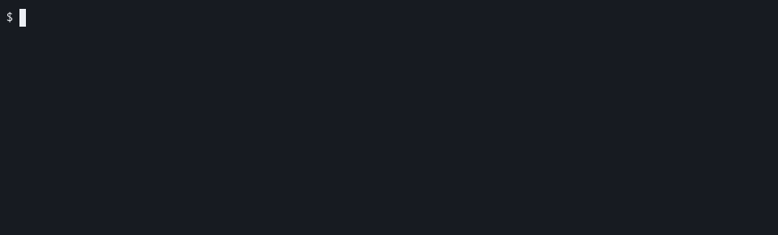
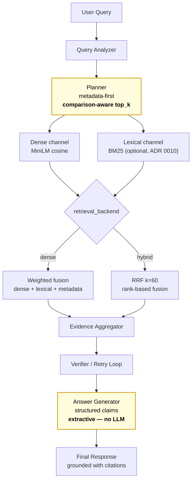

# BidMate Agent
**RFP 문서 이해를 위한 Agentic RAG 시스템**

[](LICENSE) [](https://github.com/hskim-solv/BidMate-DocAgent/actions/workflows/pr-eval.yml) [](https://codecov.io/gh/hskim-solv/BidMate-DocAgent) [](pyproject.toml) [](https://hskim-solv.github.io/BidMate-DocAgent/) [](https://colab.research.google.com/github/hskim-solv/BidMate-DocAgent/blob/main/demo/bidmate_quickstart.ipynb) [](https://huggingface.co/spaces/hskim-solv/bidmate-docagent) [](https://bidmate-docagent-demo.fly.dev/)

**Topics**: `rag` · `agentic-rag` · `korean-nlp` · `rfp` · `grounded-answer` · `evaluation-rigor` · `llm-ops`



## 30초 요약 — What this proves

> 한 줄: 한국 공공·B2B 입찰 RFP 에서 발생하는 **검색 실패 · 근거 부족 · 비교 질의 편향을 failure mode 로 정의**하고, 이를 baseline / ablation / eval / CI 로 검증 가능하게 만든 **근거 기반(citation-grounded) 추출형 RAG** 시스템.

| | |
|---|---|
| **무엇을 (what)** | RFP 문서용 citation-grounded **extractive** RAG — 외부 LLM 호출 없이 retrieved evidence 에서 claim 추출 + citation 잠금 ([ADR 0003](docs/adr/0003-structured-answer-citation-contract.md)) |
| **왜 어려운지 (why hard)** | 한국어 공공/B2B RFP 는 길고 noisy 하며, 기관·사업명이 유사해 문서 간 비교·요건 추출이 구조적으로 어렵다 |
| **무엇을 엔지니어링 (engineered)** | 메타데이터 우선 검색 ([ADR 0002](docs/adr/0002-metadata-first-retrieval.md)) + [comparison-aware balanced top-k](#핵심-기술-기여--comparison-aware-balanced-top-k) + verifier/retry + 근거 불충분 시 보류(abstention) |
| **어떻게 평가 (evaluated)** | baseline 보존 ablation ([ADR 0001](docs/adr/0001-preserve-naive-baseline.md)) + 공개 fixture smoke / private internal eval 분리 ([ADR 0005](docs/adr/0005-eval-split-public-synthetic-private-local.md)) + PR 마다 회귀 게이트 ([pr-eval.yml](.github/workflows/pr-eval.yml)) + 79 ADR |
| **어떻게 실행 (run it)** | `make index && make demo`, 또는 [5분 quickstart](#실행-5분-quickstart) · [Colab](https://colab.research.google.com/github/hskim-solv/BidMate-DocAgent/blob/main/demo/bidmate_quickstart.ipynb) · [Live demo](https://bidmate-docagent-demo.fly.dev/) |

> **Portfolio signal**: 외부 LLM API 를 호출하는 RAG 데모가 아니라, RFP 도메인의 실패 모드를 직접 정의하고 그것을 막는 평가·CI·provenance 게이트를 **소유(system ownership)** 한 사례. 현재 포지셔닝은 narrow RAG 가 아니라 문서·표·이미지 evidence 를 다루는 **Multimodal Agentic AI Product Engineer** 트랙으로 확장 중이며, 런타임 변경은 모두 opt-in follow-up task 로 분리한다. 리뷰어용 진입점 → [모듈 맵](docs/architecture/module-map.md) · [실패 모드 케이스 스터디](docs/case-studies/failure-modes.md) · [면접 피치](docs/portfolio-pitch.md).

> **real-eval 읽는 법 (오해 방지)**: 현재 claim-bearing private evidence 는 `real100_v2` aggregate-only 표면만 사용한다. 공개 fixture smoke eval은 CI 재현성과 평가 harness 동작 확인만 담당하고, 실제 성능 판단은 private/internal eval set aggregate를 기준으로 한다 ([ADR 0005](docs/adr/0005-eval-split-public-synthetic-private-local.md)). 이전 세대 private-eval artifact 와 wording 은 archive-only 이며, maintainer 가 명시적으로 다시 허용하기 전까지 새 task·PR·claim·handoff 근거로 사용하지 않는다.

<details><summary><b>측정 상세 (over-claim 가드 — 펼치기)</b></summary>

> **측정**: 공개 가능한 작은 fixture는 `make smoke`와 PR CI에서 평가 harness, metrics schema, latency SLO가 깨지지 않는지 확인하는 용도다. 실제 성능 수치는 `real100_v2` private/internal aggregate 로 관리하며, raw question/answer/evidence/text/path/id 는 커밋하지 않는다. 새 성능 claim 은 paired `real100_v2` aggregate delta, provenance, privacy audit, claim audit 를 함께 요구한다. 공개 fixture smoke + private/internal eval 분리 평가 ([ADR 0005](docs/adr/0005-eval-split-public-synthetic-private-local.md)), 81개 설계 결정 (ADR).

</details>

### 5초 비주얼 훅 — 실제 `comparison` 질의 한 건 (extractive, no LLM)

본 시스템의 실제 `agentic_full` 파이프라인 출력. *외부 LLM 호출 없이* retrieved evidence 에서 claim 추출 + citation 잠금 ([ADR 0003](docs/adr/0003-structured-answer-citation-contract.md)).

```text
$ make ask
python3 app.py --input_dir data/index --output_dir outputs --query "기관 A와 기관 B의 보안 요구사항 차이를 알려줘" --pipeline agentic_full

INFO bidmate.rag_core: query_complete  status='supported'  query_type='comparison'
                                       latency_ms=6.18      retrieval_backend='hybrid'
                                       claim_count=2        citation_count=2

[OK] Answer written: outputs/answer.json

─ Answer ───────────────────────────────────────────────────────────────────
기관 A — 핵심 AI 요구사항은 모델 품질관리, 보안 통제, 로그 추적이다.
        [rfp-agency-a-ai-quality::chunk-001]
기관 B — 모든 승인 이력은 감사 로그로 남겨야 하며 운영자는 월간 감사 리포트를 생성할 수 있어야 한다.
        [rfp-agency-b-mlops-governance::chunk-001]
────────────────────────────────────────────────────────────────────────────
```

- 두 기관이 **모두** 인용된 점이 핵심 — [comparison-aware balanced top-k](#핵심-기술-기여--comparison-aware-balanced-top-k) 가 한쪽 문서 starvation 방지
- 외부 API 호출 없음 (extractive). 위 출력은 **현재 public fixture index(5-doc) 실측** — `make ask` 복붙 시 동일 claim·citation(chunk-001 / chunk-001) 재현. ~6 ms 는 in-memory hybrid 검색 ([ADR 0058](docs/adr/0058-phase35-mode-winner.md) 기본값) 단발 wall-clock (머신별 상이, 리포트 p95 메트릭 아님)
- 5초 터미널 재생: `asciinema play docs/assets/demo.cast`. 풀 워크스루: [`docs/operations/deployment.md`](docs/operations/deployment.md#recording-the-demo-video)

## 라이브 데모

| 경로 | 상태 | 비고 |
|---|---|---|
| **Colab 5분 quickstart** | [](https://colab.research.google.com/github/hskim-solv/BidMate-DocAgent/blob/main/demo/bidmate_quickstart.ipynb) | 클론/설치 없이 브라우저에서 grounded answer 1건 실행 |
| **Live demo (Fly.io)** | [https://bidmate-docagent-demo.fly.dev/](https://bidmate-docagent-demo.fly.dev/) | 메인 머지마다 자동 재배포 ([deploy-fly.yml](.github/workflows/deploy-fly.yml)). 첫 요청 cold-start 5–10s. 운영: [`docs/operations/deployment.md`](docs/operations/deployment.md) |
| **Streamlit on HF Spaces** | [](https://huggingface.co/spaces/hskim-solv/bidmate-docagent) | Fly.io 다운 시 fallback. Space sleep 시 cold-start 30–60s |
| **One-line docker** | `docker run -p 8501:8501 -p 8000:8000 -e BIDMATE_DEMO_MODE=both ghcr.io/hskim-solv/bidmate-demo:latest` | 클론 없이 Streamlit + FastAPI 동시 |
| **FastAPI Swagger** | `make api` 후 [/docs](http://localhost:8000/docs) | 프로그래매틱 사용·통합 테스트 |
| **로컬 1분 시작** | `make index && make demo` | `http://localhost:8501` |

데모 UI 는 3 파이프라인 preset (`naive_baseline` · `agentic_full` · `agentic_full_llm`) 을 라디오 버튼으로 전환, extractive vs LLM 합성 답변 side-by-side 비교.

<a id="why-extractive-not-generative"></a>

## 왜 추출형(extractive)인가, 생성형(generative)이 아닌가?

기본 파이프라인 (`naive_baseline`, `agentic_full`) 은 외부 LLM 호출 없이 retrieved evidence 에서 claim 을 추출하는 **추출형 근거 답변**. 생성기를 의도적으로 추출형으로 한정한 4가지 이유:

1. **재현성**: 외부 API 키 / 네트워크 / 모델 버전 의존 0. 매 PR CI 가 동일 평가셋을 같은 결과로 재실행
2. **비용 영점**: query 당 LLM token cost = 0. 재시도 정책의 cost-quality trade-off 가 latency 1축으로 단순화
3. **LLM-as-judge confound 제거**: 생성기와 검증기가 같은 LLM 이 아니므로 self-consistency 편향 없음
4. **Citation grounding 내재화**: claim 이 retrieved evidence 에서만 도출되므로 hallucination 구조적 불가능

**한계 / Trade-off**: 생성 유창성 제약. RFP 도메인은 정확도와 근거 추적이 우선이라 수용 가능. 결정 계약: [ADR 0003](docs/adr/0003-structured-answer-citation-contract.md) + [`docs/agentic/answer-policy.md`](docs/agentic/answer-policy.md).

LLM synthesis opt-in (`agentic_full_llm`, [ADR 0011](docs/adr/0011-llm-synthesis-as-additive-ablation.md)) 과 LLM Ops observability ([ADR 0013](docs/adr/0013-observability-as-additive-pluggable-surface.md)) 는 추출형 파이프라인을 *교체하지 않고* additive 분석 변형으로 추가 — [`docs/agentic/answer-policy.md`](docs/agentic/answer-policy.md) / [`docs/operations/observability.md`](docs/operations/observability.md).

> **평가 경계**: 이 레포지토리는 공개 가능한 작은 fixture를 smoke test 용도로만 사용합니다. 실제 성능 평가는 레포지토리에 커밋하지 않는 private/internal eval set aggregate를 기준으로 수행하는 것을 전제로 합니다. 현재 새 task와 PR의 private evidence lane 은 `real100_v2` 전용이며, 이전 세대 private-eval artifact 와 wording 은 archive-only 로 남긴다. Detection-blind 분석 변형 real-eval 측정은 별도 follow-up.

## 핵심 기술 기여 — comparison-aware balanced top-k

RFP 비교 질의 (`query_type == "comparison"`) 에서 발생하는 한쪽 문서 starvation 을 막는 **balanced top-k 검색 ranking**. 일반 agentic RAG 튜토리얼에 없는 RFP 도메인 특화 결정.

**문제 패턴**: 단순 global top-k cut 은 score 가 높은 한 문서가 결과 슬롯 과점 → 다른 비교 대상 문서가 evidence 누락 → verifier 가 근거 부족 감지해 불필요 재시도 또는 보류 응답

**설계**: Query Analyzer 가 추출한 비교 target 별로 `min_per_target=1` 이상 evidence 보장, 남은 슬롯은 글로벌 score 순. 단일 문서 질의에서는 no-op (추가 비용 0)

- 구현: [`apply_comparison_balance()` (rag_core.py)](rag_core.py), 기본 설정 [`DEFAULT_COMPARISON_BALANCE` (rag_core.py)](rag_core.py)
- 테스트: [tests/test_fuzzy_retrieval.py](tests/test_fuzzy_retrieval.py) — asymmetric corpus 균등 보장, disabled 시 global ordering 보존, single-doc no-op
- 설계: [`docs/retrieval/comparison-ranking.md`](docs/retrieval/comparison-ranking.md)

> **한 줄 피치**: RFP 비교 질의 실패 패턴 (한쪽 문서 starvation → verifier 재시도 → 보류) 을 발견하고, 이를 막는 검색 ranking 전략을 설계·구현·테스트로 검증한 것이 본 프로젝트의 핵심 기여

---

<a id="ablation-comparison"></a>

## 평가 스토리

이 레포지토리는 공개 가능한 작은 fixture를 smoke test 용도로만 사용합니다. 실제 성능 평가는 레포지토리에 커밋하지 않는 private/internal eval set을 기준으로 수행하는 것을 전제로 합니다.

공개 fixture smoke eval의 목적은 성능 주장(benchmark)이 아니라 CI 재현성 확인입니다. `eval/fixtures/smoke_rfp/raw/`의 작은 RFP fixture와 `eval/config.yaml`을 사용해 검색(retrieval), 답변 품질(answer quality), 인용 정확도(citation accuracy), 근거 검증(evidence verification), 지연시간(latency) 집계가 모두 생성되는지 확인합니다.

실제 성능 평가는 private/internal eval set에서 수행합니다. 원문 RFP, case-level prediction, trace는 커밋하지 않고 aggregate-only artifact와 reviewer-friendly evidence 문서만 공개 가능한 범위에서 남깁니다. 이 경계는 [ADR 0005](docs/adr/0005-eval-split-public-synthetic-private-local.md)가 정의합니다.

평가 지표는 하나의 순위표가 아니라 다음 축으로 읽습니다.

| 축 | 확인 내용 | 공개 fixture smoke에서의 역할 | private/internal eval에서의 역할 |
|---|---|---|---|
| Retrieval quality | `chunk_recall@k`, MRR, nDCG, rerank delta | metric schema와 deterministic 실행 확인 | 실제 검색 품질 비교 |
| Answer quality | accuracy, groundedness, format compliance, abstention outcome | scorer wiring과 edge-case 회귀 확인 | 제품 품질·hardcase 분석 |
| Citation / evidence | citation precision, claim-citation alignment, evidence coverage | citation/evidence 산출물 존재 확인 | reviewer-facing 근거 검증 |
| Latency | p50/p95, stage latency, retry cost | CI latency SLO smoke check | 운영 trade-off 분석 |

분석 변형(ablation)은 `naive_baseline`을 보존한 상태에서 additive preset으로 비교합니다. 공개 fixture 결과는 “harness가 깨지지 않는다”는 신호로만 사용하고, 성능 claim은 private/internal aggregate와 paired delta 문서에서만 다룹니다.

---

## 아키텍처 (요약)


```mermaid
flowchart TD
    Q[User Query] --> A[Query Analyzer]
    A --> P["Planner<br/>metadata-first<br/><b>comparison-aware top_k</b>"]
    P --> RD["Dense channel<br/>MiniLM cosine"]
    P --> RB["Lexical channel<br/>BM25 (optional, ADR 0010)"]
    RD --> FU{retrieval_backend}
    RB --> FU
    FU -->|dense| W["Weighted fusion<br/>dense + lexical + metadata"]
    FU -->|hybrid| RRF["RRF k=60<br/>rank-based fusion"]
    W --> E[Evidence Aggregator]
    RRF --> E
    E --> V[Verifier / Retry Loop]
    V --> G["Answer Generator<br/>structured claims<br/><b>extractive — no LLM</b>"]
    G --> F[Final Response<br/>grounded with citations]

    classDef highlight fill:#fffbdd,stroke:#d4a017,stroke-width:2px,color:#000
    class P,G highlight
```

> 강조 2 노드: Planner 의 `comparison-aware top_k` → [핵심 기술 기여](#핵심-기술-기여--comparison-aware-balanced-top-k), Answer Generator 의 `extractive — no LLM` → [왜 추출형인가?](#왜-추출형extractive인가-생성형generative이-아닌가)

비교 질의 (`query_type == "comparison"`) 에서는 balanced top-k cut 으로 각 비교 대상에 최소 1개 evidence 보장. 메타데이터 filter staging, alias lexicon, follow-up carryover: [`docs/retrieval/retrieval-hardening.md`](docs/retrieval/retrieval-hardening.md). `retrieval_backend` hybrid (BM25+RRF) 근거: [ADR 0010](docs/adr/0010-hybrid-bm25-dense-retrieval-rrf.md). "agentic" 의 의미 (bounded 재시도 vs ReAct/Reflexion 비교): [`docs/agentic/agentic-definition.md`](docs/agentic/agentic-definition.md).

---

## 실행 (5분 quickstart)

```bash
python3 -m venv .venv && source .venv/bin/activate && pip install -r requirements.txt
python3 scripts/build_index.py --input_dir eval/fixtures/smoke_rfp/raw --output_dir data/index
python3 app.py --input_dir data/index --query "기관 A와 기관 B의 AI 요구사항 차이 알려줘" --pipeline agentic_full
python3 eval/run_eval.py --index_dir data/index --output_dir reports --config eval/config.yaml
python3 scripts/check_latency_slo.py --config eval/config.yaml --summary reports/eval_summary.json
```

상세 실행 (FastAPI 데모, PDF/HWP ingestion, visual parsing v2, 비공개 100-doc eval, harness): [`docs/operations/api-demo.md`](docs/operations/api-demo.md).

---

## 면접에서 이 프로젝트를 설명하는 법

> 이 프로젝트에서 저는 RAG 파이프라인을 단순 구현한 것이 아니라, RFP 문서에서 실제로 발생하는 **검색 실패 · 근거 부족 · 비교 질의 편향을 failure mode 로 정의**하고, 이를 **baseline / ablation / eval / CI 로 검증 가능한 시스템**으로 만들었습니다.

- **Baseline preservation** — `naive_baseline` 을 byte-identical 로 보존해 모든 개선을 *additive ablation* 으로만 측정 ([ADR 0001](docs/adr/0001-preserve-naive-baseline.md))
- **Failure-mode-driven design** — comparison starvation · metadata ambiguity · abstention · follow-up · citation drift 5개 실패 모드를 명시하고 각각에 설계로 대응 ([실패 모드](docs/case-studies/failure-modes.md))
- **Eval/CI regression prevention** — PR 마다 회귀 게이트 + failure-rate ratchet 으로 품질 후퇴 차단 ([pr-eval.yml](.github/workflows/pr-eval.yml) · [ADR 0062](docs/adr/0062-failure-rate-regression-contract.md))

전체 피치 (STAR 정리 + 인터뷰 답변): [`docs/portfolio-pitch.md`](docs/portfolio-pitch.md).

---

## 주요 링크

| 목적 | 링크 |
|---|---|
| AI-agent 장기 작업 운영 모델 | [`docs/operations/ai-engineering-operating-system.md`](docs/operations/ai-engineering-operating-system.md) |
| Persistent task queue | [`tasks/queue.md`](tasks/queue.md) |
| Eval surface / claim boundary | [`docs/evaluation/surface-map.md`](docs/evaluation/surface-map.md) |
| ADR 인덱스 (81개 결정) | [`docs/adr/README.md`](docs/adr/README.md) |
| 분석 변형 결과 + benchmarking + latency 비교 | [`docs/benchmarking.md`](docs/benchmarking.md) / [`docs/eval/ablation-results.md`](docs/eval/ablation-results.md) |
| 설계 배경 (한국 RFP 적응 5가지) | [`docs/design-background.md`](docs/design-background.md) |
| 답변 출력 정책 + Evidence boundary + Baseline policy | [`docs/agentic/answer-policy.md`](docs/agentic/answer-policy.md) |
| 한계 + 실패 사례 (real-data taxonomy) | [`docs/real-data/failure-cases.md`](docs/real-data/failure-cases.md) / [`docs/real-data/real-data-failure-taxonomy.md`](docs/real-data/real-data-failure-taxonomy.md) |
| 공개 fixture smoke eval spec | [`docs/eval/eval-dataset-spec.md`](docs/eval/eval-dataset-spec.md) |
| 비공개 100-doc aggregate 정책 + placeholder | [`docs/real-data/private-100-doc-experiments.md`](docs/real-data/private-100-doc-experiments.md) |
| 엔지니어링 블로그 (GitHub Pages) | [hskim-solv.github.io/BidMate-DocAgent](https://hskim-solv.github.io/BidMate-DocAgent/) |
| 전체 문서 인덱스 | [`docs/README.md`](docs/README.md) |

---

## Claude Code 와의 협업 (AI 협업 투명성)

이 프로젝트는 [Claude Code](https://claude.ai/code) (Opus 4.x) 를 개발 파트너로 사용. 과잉 주장 (over-claim) 방지를 위한 역할 분담:

**사람 영역**
- ADR 설계 및 의사결정 게이트 — 어떤 문제를, 언제, 왜 해결
- 포트폴리오 플랜 + 우선순위 (채용 funnel 4층 프레임워크)
- 5축 협업 self-review 기준 정의 및 분기별 진단
- 평가 설계 (공개/비공개 분리 경계, ADR 0005) 및 회귀 기준

**Claude Code 영역**
- 코드 구현, 리팩터링, 문서 초안, 테스트 작성
- 브랜치/PR/이슈 생성 및 CI gate 운영 보조
- 탐색 (Explore subagent), 설계 검토 (Plan subagent), 반복 작업 자동화

**Governance 가 막은 실제 인시던트 3건** — 합성 CI 가 놓친 보류 회귀 (#69), stacked-PR child auto-close, ADR 번호 worktree 충돌. 각 사고와 사후 보강 hook/rule: [`docs/engineering-governance.md` Governance saves](docs/engineering-governance.md#governance-saves-실제-막은-인시던트). 거버넌스가 *있다* 는 신호보다 *rent 를 냈다* 는 신호 우선.

**분기별 협업 자가진단** — `/self-review-quarterly` skill 로 4축 (포트폴리오 진행도) + 5축 (Claude 협업 효율) 을 한 보고서로 생성. 최신: [`docs/self-review/Q2-2026.md`](docs/self-review/Q2-2026.md)

---

## 안내
- 원본 RFP 문서는 외부 공유 제한으로 저장소 미포함
- `eval/fixtures/smoke_rfp/raw` 는 CI 재현성 확인용 공개 fixture
- 본 저장소 = 재현 가능 구조/평가 관점의 포트폴리오 문서화 목표
