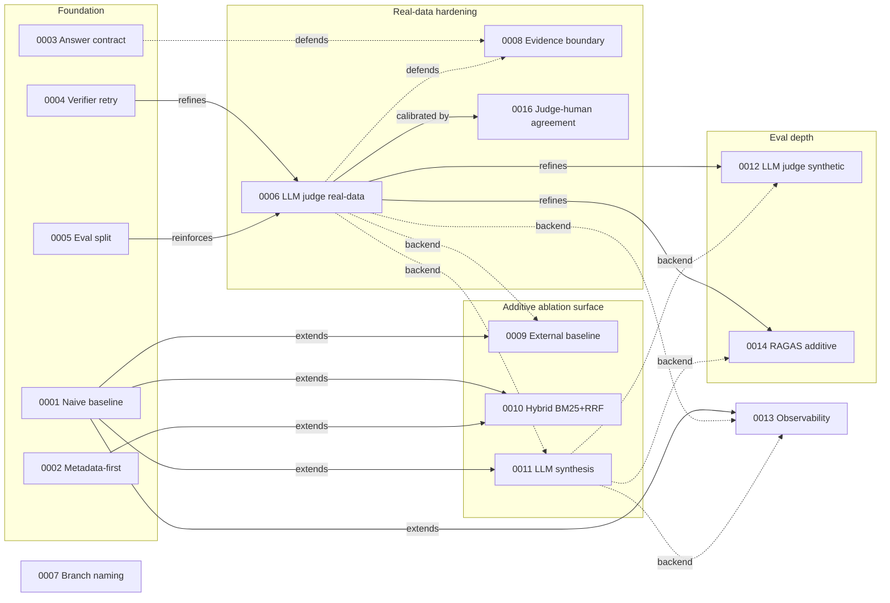

# Architecture Decision Records (ADR)

This directory holds the **load-bearing decisions** for BidMate-DocAgent
— the ones that, if reversed, would force significant rework or
invalidate published evaluation results.

## When to write an ADR

Write one when a change:

- Removes, replaces, or fundamentally alters a baseline / pipeline /
  evaluation contract that other parts of the system depend on.
- Picks between two viable approaches whose trade-off you will need to
  defend later (in review, in an interview, or to your future self).
- Establishes a new convention that future changes must follow.

Do **not** write one for routine code changes, bug fixes, refactors,
or doc edits. Those go straight into the PR description.

## File layout

```
docs/adr/
├── README.md           # this file
├── _template.md        # copy this when starting a new ADR
└── NNNN-slug.md        # one ADR per file
```

- `NNNN` is a 4-digit zero-padded sequence, e.g. `0001`, `0023`.
- Numbers are **never reused or renumbered**, even if an ADR is later
  superseded. Continuity matters more than tidiness.
- `slug` is short, kebab-case, and stable. Pick a name you will not
  want to rename later (e.g. `metadata-first-retrieval`, not
  `retrieval-changes-v2`).

## Status lifecycle

| status | meaning |
|---|---|
| `proposed` | Decision drafted but not yet implemented or merged. Open for change. |
| `accepted` | Reflected in code / docs / tests. Treated as the current convention. |
| `superseded by NNNN` | Replaced by a later ADR. The old file stays; the new one links back. |
| `deprecated` | No longer applies but no replacement exists. Rare. |

Always update the status header when status changes. Do not delete
old ADRs even when superseded — their existence is part of the
project record.

## Authoring conventions

- Keep each ADR short. One screen is the target. If you need more
  room, the decision probably needs to be split or the context
  belongs in a regular design doc.
- Use the section headings from [`_template.md`](./_template.md):
  **Context**, **Decision**, **Consequences**, **Alternatives
  considered**.
- Reference concrete code paths (`rag_core.py:L1843`) and existing
  docs rather than restating their content.
- Cross-link from any prose doc that previously held the rationale,
  so the ADR becomes the canonical source.

## Index

| # | Status | Title |
|---|---|---|
| [0001](./0001-preserve-naive-baseline.md) | accepted | Preserve a naive baseline alongside the agentic pipeline |
| [0002](./0002-metadata-first-retrieval.md) | accepted | Metadata-first retrieval strategy |
| [0003](./0003-structured-answer-citation-contract.md) | accepted | Structured answer / citation contract (`schema_version: 2`) |
| [0004](./0004-verifier-retry-policy.md) | accepted | Verifier-driven retry with strict → relaxed staging |
| [0005](./0005-eval-split-public-synthetic-private-local.md) | accepted | Eval split: public synthetic vs private local |
| [0006](./0006-llm-judge-on-real-data-only.md) | accepted | LLM-judge on the real-data surface only (refines 0004) |
| [0007](./0007-issue-linked-branch-naming.md) | accepted | Issue-linked branch naming convention |
| [0008](./0008-evidence-boundary.md) | accepted | Evidence-boundary defense against prompt injection |
| [0009](./0009-external-baseline-comparison.md) | proposed | External baseline comparison via a separate script (extends 0001) |
| [0010](./0010-hybrid-bm25-dense-retrieval-rrf.md) | accepted | Hybrid BM25 + dense retrieval with RRF fusion |
| [0011](./0011-llm-synthesis-as-additive-ablation.md) | proposed | LLM answer synthesis as additive ablation (extends 0001, preserves 0003) |
| [0012](./0012-llm-judge-on-public-synthetic.md) | accepted | LLM-judge on the public synthetic eval, stub-default (refines 0006, reuses 0011 backend pattern) |
| [0013](./0013-observability-as-additive-pluggable-surface.md) | accepted | Observability as an additive, pluggable, fail-closed surface |
| [0014](./0014-ragas-judge-additive-synthetic.md) | accepted | RAGAS-style LLM judge as additive enrichment on synthetic surface (extends 0012) |
| [0015](./0015-cost-telemetry-additive.md) | accepted | Cost telemetry as additive observability (extends 0011, 0013) |
| [0016](./0016-judge-human-agreement.md) | proposed | Judge↔human agreement as calibration gate on real-data eval (refines 0006) |
| [0017](./0017-llm-metadata-extraction-additive.md) | proposed | LLM metadata extraction as additive backend (extends 0011) |

## Decision evolution

Every ADR file carries `Date: 2026-05-11` because that's when the ADR
governance itself was introduced (PR #87 back-filled the five
foundational ADRs in a single batch). The decisions themselves
*evolved* through two weeks of build — see [`docs/portfolio-case-study.md`](../portfolio-case-study.md)
and the [`docs/blog/`](../blog) series for the experiment-narrative — but
on the time axis they look bunched.
The more honest evolution axis is **logical dependency**: what extends,
refines, defends, or reuses the backend of what. See
[`docs/engineering-governance.md`](../engineering-governance.md) for the
broader process context.

### Clusters

#### Foundation — what to preserve, what to measure (0001–0005)

[ADR 0001](./0001-preserve-naive-baseline.md) freezes the extractive
baseline as an invariant. [ADR 0002](./0002-metadata-first-retrieval.md)
names the retrieval strategy that beats naive lexical/dense on Korean
RFPs. [ADR 0003](./0003-structured-answer-citation-contract.md) is the
answer-and-citation contract every downstream metric reads.
[ADR 0004](./0004-verifier-retry-policy.md) makes verifier-driven retry
the failure-handling default. [ADR 0005](./0005-eval-split-public-synthetic-private-local.md)
splits public-synthetic from private-local eval so reviewers can
reproduce something without the private corpus.

#### Real-data hardening — when synthetic CI isn't enough (0006, 0008)

The deterministic verifier in 0004 hit a ceiling on real procurement
documents (issue #69 abstention regression). [ADR 0006](./0006-llm-judge-on-real-data-only.md)
refines 0004 with an LLM judge restricted to the private surface,
reinforcing 0005's public reproducibility. [ADR 0008](./0008-evidence-boundary.md)
defends the answer contract (0003) and the LLM judge (0006) against
prompt-injection patterns embedded in retrieved evidence.
[ADR 0016](./0016-judge-human-agreement.md) calibrates the 0006 judge
against human spot-labels (Cohen's κ + Spearman ρ) so a verifier-judge
co-regression cannot pass undetected.

#### Governance — process codified as a decision (0007)

[ADR 0007](./0007-issue-linked-branch-naming.md) lifts the issue↔branch
convention from informal practice to a CI-enforced rule. Without 0007
the rest of this index could not be maintained at scale.

#### Additive ablation surface — extend, don't replace (0009, 0010, 0011)

0001's "preserve the baseline" invariant materializes in three
alongside-ablations: [ADR 0009](./0009-external-baseline-comparison.md)
(external frameworks), [ADR 0010](./0010-hybrid-bm25-dense-retrieval-rrf.md)
(hybrid BM25+RRF retrieval), and [ADR 0011](./0011-llm-synthesis-as-additive-ablation.md)
(LLM answer synthesis). Each adds a preset; none removes one. 0011 also
reuses the 0006 backend pattern so cost/trace plumbing stays consistent.

#### Eval depth — same answer, more lenses (0012, 0014)

[ADR 0012](./0012-llm-judge-on-public-synthetic.md) extends LLM-as-judge
to the synthetic surface as a stub-default enrichment, refining 0006's
"real-data only" restriction without breaking 0005's reproducibility.
[ADR 0014](./0014-ragas-judge-additive-synthetic.md) layers RAGAS-style
multi-axis judgment on top — both strictly additive (not gating).

#### Ops — observability as a fail-closed surface (0013)

[ADR 0013](./0013-observability-as-additive-pluggable-surface.md) makes
LangFuse / OpenTelemetry trace emission optional, pluggable, and
fail-closed. It extends 0001, preserves 0003, reuses the 0006 and 0011
backend pattern, and respects 0005's eval split.

### Dependency graph



Legend:

- **`-- extends -->`** — new ADR builds on an earlier invariant (0001's "preserve baseline" is the most extended).
- **`-- refines -->`** / **`-- reinforces -->`** — tightens or specializes an earlier decision.
- **`-. defends .->`** — protects an earlier contract against a specific attack or regression.
- **`-. backend .->`** — reuses the LLM-call backend pattern (env-keyed providers, fail-closed, cost/latency in diagnostics).

Edges intentionally omitted from the diagram (kept in each ADR's
`Related` field for accuracy): the chain of "preserves" courtesies that
0011, 0012, 0013, and 0014 extend toward 0003/0004/0005 — they reinforce
the cluster narratives but would clutter the visual.
