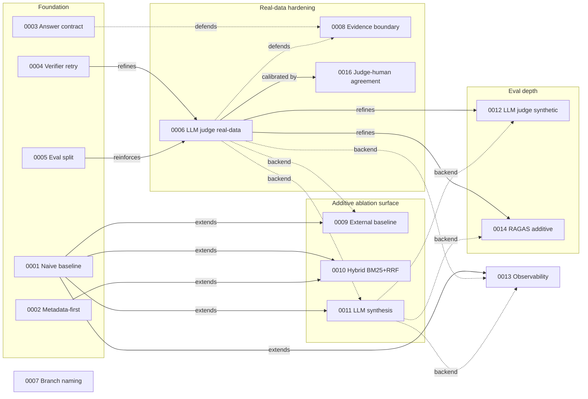

# Architecture Decision Records (ADR)

This directory holds the **load-bearing decisions** for BidMate-DocAgent
— the ones that, if reversed, would force significant rework or
invalidate published evaluation results.

## When to write an ADR

Write one when a change:

- Removes, replaces, or fundamentally alters a baseline / pipeline /
  evaluation contract that other parts of the system depend on.
- Picks between two viable approaches whose trade-off you will need to
  defend later (in review, in an interview, or to your future self).
- Establishes a new convention that future changes must follow.

Do **not** write one for routine code changes, bug fixes, refactors,
or doc edits. Those go straight into the PR description.

## File layout

```
docs/adr/
├── README.md           # this file
├── _template.md        # copy this when starting a new ADR
└── NNNN-slug.md        # one ADR per file
```

- `NNNN` is a 4-digit zero-padded sequence, e.g. `0001`, `0023`.
- Numbers are **never reused or renumbered**, even if an ADR is later
  superseded. Continuity matters more than tidiness.
- **Reserve the next number with the CLI before drafting**:
  `python scripts/_governance.py --next-adr-number`.
  The pre-commit hook ([`.githooks/pre-commit`](../../.githooks/pre-commit))
  refuses to commit when two ADR files share the same `NNNN` prefix
  (issue [#757](https://github.com/hskim-solv/BidMate-DocAgent/issues/757)),
  but it cannot see open PRs in concurrent worktrees — also run
  `gh pr list --search "ADR" --state open` per CLAUDE.md
  `Reserve ADR numbers up front`.
- `slug` is short, kebab-case, and stable. Pick a name you will not
  want to rename later (e.g. `metadata-first-retrieval`, not
  `retrieval-changes-v2`).

## Status lifecycle

| status | meaning |
|---|---|
| `proposed` | Decision drafted but not yet implemented or merged. Open for change. |
| `accepted` | Reflected in code / docs / tests. Treated as the current convention. |
| `superseded by NNNN` | Replaced by a later ADR. The old file stays; the new one links back. |
| `deprecated` | No longer applies but no replacement exists. Rare. |

Always update the status header when status changes. Do not delete
old ADRs even when superseded — their existence is part of the
project record.

## Authoring conventions

- Keep each ADR short. One screen is the target. If you need more
  room, the decision probably needs to be split or the context
  belongs in a regular design doc.
- Use the section headings from [`_template.md`](./_template.md):
  **Context**, **Decision**, **Consequences**, **Alternatives
  considered**, **Verification**.
- **New ADRs must include a `## Verification` section with at least one
  `<!-- verifies-key: <path>:<key> -->` marker** so the Consequences
  promise stays machine-checkable (issue
  [#793](https://github.com/hskim-solv/BidMate-DocAgent/issues/793)).
  Run `python scripts/_governance.py --lint-adr-consequences docs/adr/NNNN-slug.md`
  to verify locally; the pre-commit hook applies the same check to newly
  added files. The 41 existing ADRs are grandfathered — retrofit happens
  per-ADR in follow-ups.
- Reference concrete code paths (`rag_core.py:L1843`) and existing
  docs rather than restating their content.
- Cross-link from any prose doc that previously held the rationale,
  so the ADR becomes the canonical source.

## Index

| # | Status | Title |
|---|---|---|
| [0001](./0001-preserve-naive-baseline.md) | accepted | agentic 파이프라인과 나란히 naive 기준선 유지 |
| [0002](./0002-metadata-first-retrieval.md) | accepted | 메타데이터 우선 검색 전략 |
| [0003](./0003-structured-answer-citation-contract.md) | accepted | 구조화된 답변/인용 계약 (`schema_version: 2`) |
| [0004](./0004-verifier-retry-policy.md) | accepted | 검증기 주도 retry — strict → relaxed 단계화 |
| [0005](./0005-eval-split-public-synthetic-private-local.md) | accepted | Eval 분리 — public synthetic vs private local |
| [0006](./0006-llm-judge-on-real-data-only.md) | superseded by 0005 | LLM-judge 는 real-data 표면 전용 |
| [0007](./0007-issue-linked-branch-naming.md) | accepted | 이슈 연결 브랜치 네이밍을 required check 로 |
| [0008](./0008-evidence-boundary.md) | accepted | 근거 텍스트 경계 + instruction-like 패턴 무력화 |
| [0009](./0009-external-baseline-comparison.md) | accepted | 별도 스크립트로 외부 기준선 비교 |
| [0010](./0010-hybrid-bm25-dense-retrieval-rrf.md) | accepted | Hybrid BM25 + dense 검색 + RRF 융합 |
| [0012](./0012-llm-judge-on-public-synthetic.md) | superseded by 0005 | 공개 합성 eval 에서 stub-기본 LLM 평가자 |
| [0013](./0013-observability-as-additive-pluggable-surface.md) | accepted | 관측성을 추가·pluggable·fail-closed 표면으로 |
| [0014](./0014-ragas-judge-additive-synthetic.md) | superseded by 0005 | 합성 표면에 RAGAS 스타일 LLM 평가자를 추가 enrichment 로 |
| [0015](./0015-cost-telemetry-additive.md) | superseded by 0011 | 비용 telemetry 를 추가 관측성으로 (0011, 0013 확장) |
| [0017](./0017-llm-metadata-extraction-additive.md) | superseded by 0011 | LLM 메타데이터 추출을 추가 백엔드로 (0011 확장) |
| [0018](./0018-korean-public-rag-bench.md) | accepted | 한국어 공개 RAG bench 를 보조 out-of-domain 표면으로 |
| [0019](./0019-embedding-default-stays-minilm.md) | superseded by 0001 | 임베딩 기본은 MiniLM-L12-v2 유지 + 명시 재오픈 조건 |
| [0020](./0020-protocol-based-pluggability.md) | accepted | 검색 측 확장 포인트의 Protocol 기반 pluggability |
| [0021](./0021-bge-m3-completes-phase-1-3.md) | accepted | BGE-M3가 ADR 0019 조건 2를 충족; 기본 embedding은 MiniLM 유지 |
| [0022](./0022-langgraph-orchestration-stage-1.md) | accepted | agentic_full preset용 LangGraph orchestrator 경로 — stage 1 (passthrough) & 2 (multi-node) |
| [0024](./0024-agentic-full-llm-as-api-default.md) | accepted | agentic_full_llm을 API default로 (preset만; backend default는 stub 유지) |
| [0025](./0025-cost-frontier-defer-until-real-baselines.md) | superseded by 0038 | 외부 기준선 실측 도착 전까지 cost-accuracy frontier 보류 |
| [0038](./0038-cost-model-and-frontier-interpretation.md) | accepted | Cost 모델: PRICING_PER_MTOK_USD 룩업 테이블; frontier x축 = 측정된 $/query |
| [0026](./0026-cross-encoder-reranker-deferral.md) | superseded by 0025 | Cross-encoder reranker default는 stub-identity 유지; real-backend 측정 보류 |
| [0027](./0027-lora-finetuned-embedding-additive.md) | superseded by 0011 | LoRA-fine-tuned embedding adapter는 additive 분석 변형 |
| [0028](./0028-security-screen-additive.md) | accepted | Prompt-injection screen + PII redaction을 additive 보안 layer로 |
| [0030](./0030-leaderboard-headline-includes-agentic-full.md) | accepted | 리더보드 headline에 `naive_baseline`과 함께 `agentic_full` 포함 |
| [0031](./0031-bm25-korean-morphology-additive.md) | superseded by 0010 | BM25 Korean morphology tokenizer (`bm25_tokenizer: "regex" \| "kiwi"`) as additive ablation |
| [0032](./0032-eval-saturation-routed-subset.md) | accepted | Eval-set saturation 가설 + routed-subset 측정 surface |
| [0034](./0034-vlm-provider-ablation.md) | accepted | VLM Provider 분석 변형 — Donut 보류 + PaddleOCR 실측 |
| [0035](./0035-dict-not-pydantic-v2.md) | accepted | Answer dict — parallel Pydantic / TypedDict shadow 모델 금지 |
| [0036](./0036-hwp-native-loader-pyhwp-gated-default.md) | superseded by 0049 | HwpNativeLoader를 pyhwp-gated 기본값으로 승격 |
| [0037](./0037-kure-v1-closes-phase-1-5.md) | accepted | KURE-v1이 ADR 0019 issue #447 re-open 조건 close; 기본값은 MiniLM 유지 |
| [0039](./0039-hwp-structural-hardcase-taxonomy.md) | proposed | 공개 합성 surface용 HWP 구조 hardcase taxonomy |
| [0040](./0040-react-agent-loop-additive-preset.md) | accepted | ReAct agent loop을 추가 파이프라인 프리셋으로 |
| [0041](./0041-agent-budget-cap-contract.md) | accepted | Agent budget cap 계약 |
| [0042](./0042-tool-use-evidence-boundary-defense.md) | accepted | Tool-use 근거 경계 방어 |
| [0043](./0043-pr-cadence-for-live-llm-judge.md) | accepted | live LLM-judge 신호를 위한 PR 단위 cadence (label-gated workflow) |
| [0044](./0044-realN-eval-case-expansion.md) | accepted (superseded by [0052](./0052-real-eval-hardcase-expansion-to-200.md)) | real100 private eval cases expanded in-place (same corpus, same `reports/real100/` series) from n=21 → near-term n≥30 / long-term n≥50 to tighten Wilson 95% CI and ADR 0030 silence threshold; `num_predictions` tracked per snapshot; ADR 0005 boundary preserved (cases stay in gitignored `eval/real_config.local.yaml`); closes issue #732 |
| [0045](./0045-rag-core-leaf-migration-plan.md) | accepted | rag_core leaf 마이그레이션 계획 — embedding helpers + comparison_targets routing |
| [0046](./0046-ood-evaluation-domain-selection.md) | accepted | Out-of-distribution evaluation 도메인 — 한국어 법률 계약서 |
| [0047](./0047-solo-author-adr-governance.md) | accepted | 1인 저자 ADR governance — lifecycle SLA + verification 계약 |
| [0048](./0048-realN-metrics-extension.md) | accepted | realN aggregate-only metrics extension — `by_metadata_field` (per-field accuracy + 95% CI for `agency`/`project`/`budget`/`deadline`, opt-in via case `metadata_field` key) + `abstention_calibration` (10-bin ECE + Brier, computed only when `prediction.answer.confidence` present; forward-compat null otherwise); ADR 0001 baseline bit-identical, ADR 0005 boundary preserved; closes issue #870 |
| [0049](./0049-kordoc-replaces-pyhwp-backend.md) | proposed | kordoc (npm subprocess, Node 18+) replaces pyhwp/hwp5 as HWP backend **and** replaces `PdfCsvTextLoader`'s default cover/TOC path with `PdfKordocLoader`; `BIDMATE_HWP_LOADER` + `BIDMATE_PDF_LOADER` flip independently (`kordoc` default \| `csv_text` offline / CI / Node-missing); `_prime_kordoc_batches` pools HWP + PDF into one `npx` invocation; `csv_text` fallback preserved (ADR 0001 invariant); supersedes ADR 0036; closes issue #890 |
| [0050](./0050-m4a-axis-a-real-scale-v2-distractor-rebuild.md) | proposed | M4-A axis-A real_scale_v2_distractor 재구축 + H/I/J/K 코퍼스 확장 |
| [0051](./0051-flat-root-module-layout.md) | accepted | flat-root module layout 유지 — `src/` 마이그레이션 거절 (ADR 0045 leaf DAG 가 패키지화 이득 대체) |
| [0052](./0052-real-eval-hardcase-expansion-to-200.md) | proposed | real-eval hardcase 확장 n=21→221 — LLM-assisted generator (PR #936) + hardcase-only 5-enum 정책 (distractor_heavy / ambiguous_query / multi_hop / no_answer / long_context); ADR 0044 (incremental n≥30/n≥50) supersede; ADR 0053 distinguishing-power floor 의 첫 measurement surface; ADR 0001 byte-identity invariant + ADR 0005 private/public 경계 보존; closes issue #942 |
| [0053](./0053-distinguishing-power-floor-ablations.md) | proposed (augmented by [0054](./0054-conditional-on-answer-scorer-semantics.md)) | distinguishing-power floor ablations — `random` retrieval backend (SHA-256 deterministic, no embedding) + `single_chunk` preset (top_k=1, no rerank/retry); falsifiable lower bounds for "does retrieval pull weight?"; ADR 0001 byte-identity invariant preserved; pairs with PR-5b `scripts/distinguishing_power.py` follow-up; closes issue #938 |
| [0054](./0054-conditional-on-answer-scorer-semantics.md) | proposed | conditional-on-answer scorer semantics — `eval/scorers/case.py` quality metrics (groundedness / citation_precision / answer_format_compliance) return `None` on the (unanswerable AND abstained AND no-evidence) path instead of vacuous-truth 1.0; refusal correctness measured exclusively by `abstention` rate + `abstention_outcomes` 3-bin (PR #464); fixes the Goodhart trap surfaced by PR #946's first n=221 gauge measurement; augments ADR 0053; ADR 0001 byte-identity invariant + ADR 0003 answer-contract + ADR 0005 commit boundary all preserved; closes issue #958 |
| [0055](./0055-claim-validator-as-pr-gate.md) | proposed | `claim_validator` as PR gate — opt-in PR-body `Claim: <metric>=<+X.Xpp>` convention auto-validated against paired bootstrap CI (`eval/bootstrap.py:paired_bootstrap_ci`) on 4 conditions (CI excludes 0 / effective n ≥ min-sample / sign match / no over-claim above optimistic CI edge); reuses ADR 0054 None-pair drop for substantive-only semantics; symmetric reverse of ADR 0050/0054's `[ALLOW_REGRESSION]` escape — `ALLOW_OVERCLAIM` intentionally absent; `pr-eval.yml` opt-in step (skipped when no `Claim:` line); ADR 0001/0003/0005 invariance preserved; augments Phase 4 audit (PR #963); closes issue #964 |
| [0056](./0056-rationality-judge-measurement-surface.md) | proposed | trajectory-rationality judge as new measurement surface — `eval/judges/rationality_judge.py` scores 3 axes (planner_decomposition / retrieval_recalls / answer_reasoning) per case from `trace["planner"]` + `trace["synthesis_llm_call"]` (issue #967 v2 trace key); same `(summary, *, backend, cache_dir, token_budget) -> (local, aggregate)` contract as Gate 3 RAGAS (`eval/judges/llm_judge.py:judge_ragas`); stub backend = deterministic SHA-256 (zero cost), `openai_compatible` = generic OpenAI-compat endpoint via `judge_common.build_openai_client()`; `answer_reasoning` returns `None` when `BIDMATE_TRACE_FULL=1` was not set (ADR 0054 substantive-only semantics propagated to trajectory layer); committable aggregate at `reports/real100/rationality.{md,aggregate.json}` (mean + 95 % bootstrap CI + effective_n per axis); ADR 0001/0003/0005/0006 invariance preserved (read-only consumer, production code path 0); augments Phase 3 audit (PR #961) item 3 supply; closes issue #969 |
| [0057](./0057-bm25s-additive-backend.md) | proposed | bm25s를 추가 BM25 backend (numpy sparse, `method="robertson"`)로 — opt-in `requirements-bm25s.txt` + `bm25_backend: "okapi" \| "bm25s"` 파이프라인 config 키 + `BIDMATE_BM25_BACKEND` env fallback; 네 프리셋 모두 `bm25_backend: "okapi"` 명시 (ADR 0001 invariant); `eval/config.yaml` `full_bm25s` 분석 변형 행 신규 (hybrid_bm25 control); typed-raise on missing dep (ADR 0031의 silent-degrade와 다름 — 명시적 opt-in 측정 의도 보존); ranking parity 100% match 사전 검증 (4 queries, korean RFP corpus); ADR 0001/0003/0010/0031 invariance 보존; closes issue #988 |
| [0058](./0058-phase35-mode-winner.md) | proposed | Phase 3.5 mode-winner decision — BGE-M3 multi-channel vs dense vs BM25-hybrid on real100 kordoc corpus (n=221); renumbered from 0056→0057→0058 (two concurrent collisions with PR #987 rationality_judge + PR #988 bm25s backend); supersedes Phase 3 PR #956 (runner bug retraction) + Phase 3.5 PR #966 1차 csv_text fallback (chunk count retraction); ADR 0010 deferred BGE-M3 ablation closeout (본 ADR + ADR 0010 closeout 섹션); Decision: scenario A (SIG hybrid lift → default hybrid) or B (NULL WINNER → keep dense + hybrid as multi_hop knob) finalize after kordoc REPORT.md lands; ADR 0001 `naive_baseline` byte-identity invariant 두 시나리오 모두 보존; closes issue #981 + #982 |

## Roadmap (proposed, not yet committed)

이 ADR들은 *제안 단계*입니다 — 측정 결과 / 외부 리뷰 / 사용자 합의로 accepted로 promote되거나, 측정 결과가 약하면 deferred / superseded로 정리됩니다. 결정 lifecycle은 위 "Status lifecycle" 섹션 참고.

| # | Title | Promote 조건 |
|---|---|---|
| [0011](./0011-llm-synthesis-as-additive-ablation.md) | LLM answer synthesis as additive ablation | `full_llm` real backend (anthropic/openai_compatible)이 extractive `full` 대비 ≥+3pp accuracy lift + non-overlapping CI on real-data eval (n≥32) |
| [0016](./0016-judge-human-agreement.md) | Judge↔human agreement as calibration gate | LLM judge vs human spot-labels: Cohen's κ ≥ 0.6 ("substantial agreement", Landis & Koch 1977) + Spearman ρ ≥ 0.7 (n≥20 real-data items) |
| [0023](./0023-hyde-query-expansion-ablation.md) | HyDE query expansion as additive ablation | `full_hyde` real backend가 `full` 대비 ≥+3pp lift + non-overlapping CI on public synthetic n≥100 |
| [0029](./0029-real-data-case-proposer-additive.md) | Real-data case proposer as additive eval-set growth | Proposer accept rate ≥ 80% (human review) + eval set grows by ≥20 accepted cases without contaminating ADR 0005 public/private split |
| [0033](./0033-multihop-cross-section-eval-slice.md) | Multi-hop cross-section eval slice | Multi-hop slice spread ≥+5pp vs single-hop baseline (n=50, LLM-judge quality filter) + non-overlapping CI (supplements ADR 0019 re-open conditions) |

## Deferred decisions (measurement-gated re-open)

Several ADRs lock the *current* default while naming explicit measurement
conditions that, if satisfied, would re-open the decision and potentially
flip the default. This pattern (origin: ADR 0019 → ADR 0021) keeps the
decision honest without forcing premature changes — and provides a
ready answer when an external review re-suggests an option that was
already considered.

Each row below has a corresponding `adr-reopen`–labeled tracking issue
so the re-open condition is visible in the backlog rather than buried
in ADR prose.

| ADR | Locked default | Re-open trigger | Tracking |
|---|---|---|---|
| [0019](./0019-embedding-default-stays-minilm.md) + [0021](./0021-bge-m3-completes-phase-1-3.md) | Embedding stays MiniLM-L12-v2 | New candidate (e.g. KURE-v1, fine-tuned LoRA per [0027](./0027-lora-finetuned-embedding-additive.md)) shows ≥ +5pp `full` lift with non-overlapping 95% CIs — measurement surface for the saturation falsifier defined in [0032](./0032-eval-saturation-routed-subset.md) | [`adr-reopen` label](https://github.com/hskim-solv/BidMate-DocAgent/labels/adr-reopen) |
| [0025](./0025-cost-frontier-defer-until-real-baselines.md) | ~~No modeled cost-accuracy frontier in repo~~ **Superseded by [0038](./0038-cost-model-and-frontier-interpretation.md)** — conditions 2+3 satisfied; condition 1 (`external_baselines.json` real run) closes issue #449 | — | closed |
| [0026](./0026-cross-encoder-reranker-deferral.md) | `BIDMATE_RERANK_BACKEND=stub` (identity); `Reranker` Protocol kept | Real backend (`bge` / `bge_ko` / `cohere`) shows ≥ +3pp lift on `full_reranker` vs `full` with non-overlapping 95% CIs on public synthetic (n=42) | [`adr-reopen` label](https://github.com/hskim-solv/BidMate-DocAgent/labels/adr-reopen) |

Note that ADR 0024 (API default = `agentic_full_llm`) and ADR 0022
(LangGraph orchestrator stage 1) are *not* listed here because they are
already accepted action items, not deferrals. ADR 0027 (LoRA adapter)
is *proposed*. ADR 0032 (eval-saturation falsifier) is *accepted* (2026-05-13) — measured 4 embeddings on the routed_subset surface; spread 0.0pp (saturation_cross_validated); ADR 0019 default lock remains in force.

## Decision evolution

Every ADR file carries `Date: 2026-05-11` because that's when the ADR
governance itself was introduced (PR #87 back-filled the five
foundational ADRs in a single batch). The decisions themselves
*evolved* through two weeks of build, but on the time axis they look bunched.
The more honest evolution axis is **logical dependency**: what extends,
refines, defends, or reuses the backend of what. See
[`docs/engineering-governance.md`](../engineering-governance.md) for the
broader process context.

### Clusters

#### Foundation — what to preserve, what to measure (0001–0005)

[ADR 0001](./0001-preserve-naive-baseline.md) freezes the extractive
baseline as an invariant. [ADR 0002](./0002-metadata-first-retrieval.md)
names the retrieval strategy that beats naive lexical/dense on Korean
RFPs. [ADR 0003](./0003-structured-answer-citation-contract.md) is the
answer-and-citation contract every downstream metric reads.
[ADR 0004](./0004-verifier-retry-policy.md) makes verifier-driven retry
the failure-handling default. [ADR 0005](./0005-eval-split-public-synthetic-private-local.md)
splits public-synthetic from private-local eval so reviewers can
reproduce something without the private corpus.

#### Real-data hardening — when synthetic CI isn't enough (0006, 0008)

The deterministic verifier in 0004 hit a ceiling on real procurement
documents (issue #69 abstention regression). [ADR 0006](./0006-llm-judge-on-real-data-only.md)
refines 0004 with an LLM judge restricted to the private surface,
reinforcing 0005's public reproducibility. [ADR 0008](./0008-evidence-boundary.md)
defends the answer contract (0003) and the LLM judge (0006) against
prompt-injection patterns embedded in retrieved evidence.
[ADR 0016](./0016-judge-human-agreement.md) calibrates the 0006 judge
against human spot-labels (Cohen's κ + Spearman ρ) so a verifier-judge
co-regression cannot pass undetected.

#### Governance — process codified as a decision (0007)

[ADR 0007](./0007-issue-linked-branch-naming.md) lifts the issue↔branch
convention from informal practice to a CI-enforced rule. Without 0007
the rest of this index could not be maintained at scale.

#### Additive ablation surface — extend, don't replace (0009, 0010, 0011)

0001's "preserve the baseline" invariant materializes in three
alongside-ablations: [ADR 0009](./0009-external-baseline-comparison.md)
(external frameworks), [ADR 0010](./0010-hybrid-bm25-dense-retrieval-rrf.md)
(hybrid BM25+RRF retrieval), and [ADR 0011](./0011-llm-synthesis-as-additive-ablation.md)
(LLM answer synthesis). Each adds a preset; none removes one. 0011 also
reuses the 0006 backend pattern so cost/trace plumbing stays consistent.

#### Eval depth — same answer, more lenses (0012, 0014)

[ADR 0012](./0012-llm-judge-on-public-synthetic.md) extends LLM-as-judge
to the synthetic surface as a stub-default enrichment, refining 0006's
"real-data only" restriction without breaking 0005's reproducibility.
[ADR 0014](./0014-ragas-judge-additive-synthetic.md) layers RAGAS-style
multi-axis judgment on top — both strictly additive (not gating).

#### Ops — observability as a fail-closed surface (0013)

[ADR 0013](./0013-observability-as-additive-pluggable-surface.md) makes
LangFuse / OpenTelemetry trace emission optional, pluggable, and
fail-closed. It extends 0001, preserves 0003, reuses the 0006 and 0011
backend pattern, and respects 0005's eval split.

### Dependency graph



Legend:

- **`-- extends -->`** — new ADR builds on an earlier invariant (0001's "preserve baseline" is the most extended).
- **`-- refines -->`** / **`-- reinforces -->`** — tightens or specializes an earlier decision.
- **`-. defends .->`** — protects an earlier contract against a specific attack or regression.
- **`-. backend .->`** — reuses the LLM-call backend pattern (env-keyed providers, fail-closed, cost/latency in diagnostics).

Edges intentionally omitted from the diagram (kept in each ADR's
`Related` field for accuracy): the chain of "preserves" courtesies that
0011, 0012, 0013, and 0014 extend toward 0003/0004/0005 — they reinforce
the cluster narratives but would clutter the visual.
