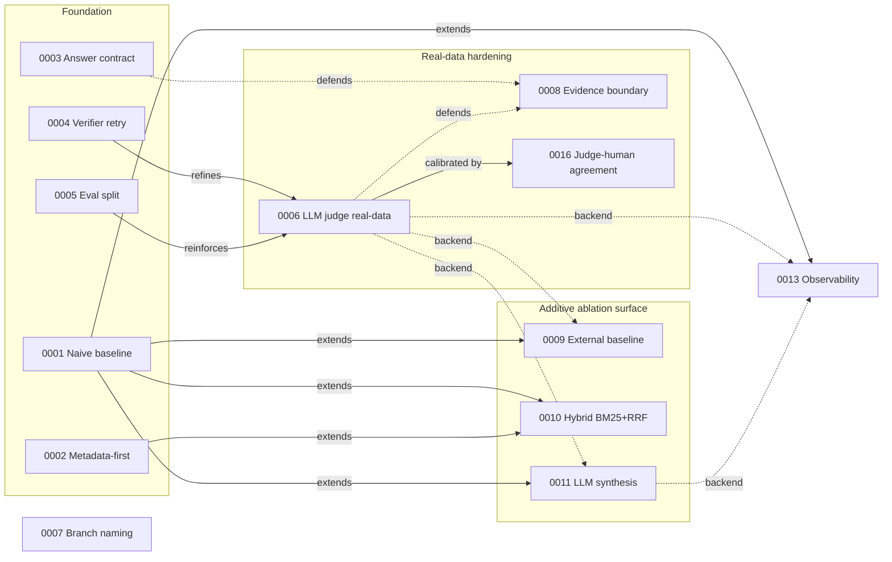

# Architecture Decision Records (ADR)

This directory holds the **load-bearing decisions** for BidMate-DocAgent
— the ones that, if reversed, would force significant rework or
invalidate published evaluation results.

## When to write an ADR

Write one when a change:

- Removes, replaces, or fundamentally alters a baseline / pipeline /
  evaluation contract that other parts of the system depend on.
- Picks between two viable approaches whose trade-off you will need to
  defend later (in review, in an interview, or to your future self).
- Establishes a new convention that future changes must follow.

Do **not** write one for routine code changes, bug fixes, refactors,
or doc edits. Those go straight into the PR description.

## File layout

```
docs/adr/
├── README.md           # this file
├── _template.md        # copy this when starting a new ADR
└── NNNN-slug.md        # one ADR per file
```

- `NNNN` is a 4-digit zero-padded sequence, e.g. `0001`, `0023`.
- Numbers are **never reused or renumbered**, even if an ADR is later
  superseded. Continuity matters more than tidiness.
- **Reserve the next number with the CLI before drafting**:
  `python scripts/_governance.py --next-adr-number`.
  The pre-commit hook ([`.githooks/pre-commit`](../../.githooks/pre-commit))
  refuses to commit when two ADR files share the same `NNNN` prefix
  (issue [#757](https://github.com/hskim-solv/BidMate-DocAgent/issues/757)),
  but it cannot see open PRs in concurrent worktrees — also run
  `gh pr list --search "ADR" --state open` per CLAUDE.md
  `Reserve ADR numbers up front`.
- `slug` is short, kebab-case, and stable. Pick a name you will not
  want to rename later (e.g. `metadata-first-retrieval`, not
  `retrieval-changes-v2`).

## Status lifecycle

| status | meaning |
|---|---|
| `proposed` | Decision drafted but not yet implemented or merged. Open for change. |
| `accepted` | Reflected in code / docs / tests. Treated as the current convention. |
| `superseded by NNNN` | Replaced by a later ADR. The old file stays; the new one links back. |
| `deprecated` | No longer applies but no replacement exists. Rare. |

Always update the status header when status changes. Do not delete
old ADRs even when superseded — their existence is part of the
project record.

## Authoring conventions

- Keep each ADR short. One screen is the target. If you need more
  room, the decision probably needs to be split or the context
  belongs in a regular design doc.
- Use the section headings from [`_template.md`](./_template.md):
  **Context**, **Decision**, **Consequences**, **Alternatives
  considered**, **Verification**.
- **New ADRs must include a `## Verification` section with at least one
  `<!-- verifies-key: <path>:<key> -->` marker** so the Consequences
  promise stays machine-checkable (issue
  [#793](https://github.com/hskim-solv/BidMate-DocAgent/issues/793)).
  Run `python scripts/_governance.py --lint-adr-consequences docs/adr/NNNN-slug.md`
  to verify locally; the pre-commit hook applies the same check to newly
  added files. The 41 existing ADRs are grandfathered — retrofit happens
  per-ADR in follow-ups.
- Reference concrete code paths (`rag_core.py:L1843`) and existing
  docs rather than restating their content.
- Cross-link from any prose doc that previously held the rationale,
  so the ADR becomes the canonical source.

## Index

| # | Status | Title |
|---|---|---|
| [0001](./0001-preserve-naive-baseline.md) | accepted | agentic 파이프라인과 나란히 naive 기준선 유지 |
| [0002](./0002-metadata-first-retrieval.md) | accepted, amended by [0074](./0074-rfp-rag-stage-separation.md) | 메타데이터 우선 검색 전략 |
| [0003](./0003-structured-answer-citation-contract.md) | accepted | 구조화된 답변/인용 계약 (`schema_version: 2`) |
| [0004](./0004-verifier-retry-policy.md) | accepted | 검증기 주도 retry — strict → relaxed 단계화 |
| [0005](./0005-eval-split-public-synthetic-private-local.md) | accepted | Eval 분리 — public fixture smoke vs private/internal eval |
| [0006](./0006-llm-judge-on-real-data-only.md) | superseded by 0005 | LLM-judge 는 real-data 표면 전용 |
| [0007](./0007-issue-linked-branch-naming.md) | accepted | 이슈 연결 브랜치 네이밍을 required check 로 |
| [0008](./0008-evidence-boundary.md) | accepted | 근거 텍스트 경계 + instruction-like 패턴 무력화 |
| [0009](./0009-external-baseline-comparison.md) | accepted | 별도 스크립트로 외부 기준선 비교 |
| [0010](./0010-hybrid-bm25-dense-retrieval-rrf.md) | accepted | Hybrid BM25 + dense 검색 + RRF 융합 |
| [0012](./0012-llm-judge-on-public-synthetic.md) | superseded by 0005 | 공개 합성 eval 에서 stub-기본 LLM 평가자 |
| [0013](./0013-observability-as-additive-pluggable-surface.md) | accepted | 관측성을 추가·pluggable·fail-closed 표면으로 |
| [0014](./0014-ragas-judge-additive-synthetic.md) | superseded by 0005 | 합성 표면에 RAGAS 스타일 LLM 평가자를 추가 enrichment 로 |
| [0015](./0015-cost-telemetry-additive.md) | superseded by 0011 | 비용 telemetry 를 추가 관측성으로 (0011, 0013 확장) |
| [0017](./0017-llm-metadata-extraction-additive.md) | superseded by 0011 | LLM 메타데이터 추출을 추가 백엔드로 (0011 확장) |
| [0018](./0018-korean-public-rag-bench.md) | accepted | 한국어 공개 RAG bench 를 보조 out-of-domain 표면으로 |
| [0019](./0019-embedding-default-stays-minilm.md) | superseded by 0001 | 임베딩 기본은 MiniLM-L12-v2 유지 + 명시 재오픈 조건 |
| [0020](./0020-protocol-based-pluggability.md) | accepted | 검색 측 확장 포인트의 Protocol 기반 pluggability |
| [0021](./0021-bge-m3-completes-phase-1-3.md) | accepted | BGE-M3가 ADR 0019 조건 2를 충족; 기본 embedding은 MiniLM 유지 |
| [0022](./0022-langgraph-orchestration-stage-1.md) | accepted | agentic_full preset용 LangGraph orchestrator 경로 — stage 1 (passthrough) & 2 (multi-node) |
| [0024](./0024-agentic-full-llm-as-api-default.md) | accepted, amended by [0074](./0074-rfp-rag-stage-separation.md) | agentic_full_llm을 API default로 (preset만; backend default는 stub 유지) |
| [0025](./0025-cost-frontier-defer-until-real-baselines.md) | superseded by 0038 | 외부 기준선 실측 도착 전까지 cost-accuracy frontier 보류 |
| [0038](./0038-cost-model-and-frontier-interpretation.md) | accepted | Cost 모델: PRICING_PER_MTOK_USD 룩업 테이블; frontier x축 = 측정된 $/query |
| [0026](./0026-cross-encoder-reranker-deferral.md) | superseded by 0025 | Cross-encoder reranker default는 stub-identity 유지; real-backend 측정 보류 |
| [0027](./0027-lora-finetuned-embedding-additive.md) | superseded by 0011 | LoRA-fine-tuned embedding adapter는 additive 분석 변형 |
| [0028](./0028-security-screen-additive.md) | accepted | Prompt-injection screen + PII redaction을 additive 보안 layer로 |
| [0030](./0030-leaderboard-headline-includes-agentic-full.md) | superseded by 0005 | 리더보드 headline에 `naive_baseline`과 함께 `agentic_full` 포함 |
| [0031](./0031-bm25-korean-morphology-additive.md) | superseded by 0010 | BM25 Korean morphology tokenizer (`bm25_tokenizer: "regex" \| "kiwi"`) as additive ablation |
| [0032](./0032-eval-saturation-routed-subset.md) | accepted | Eval-set saturation 가설 + routed-subset 측정 surface |
| [0033](./0033-multihop-cross-section-eval-slice.md) | superseded by 0005 | Multi-hop public generation slice retired |
| [0034](./0034-vlm-provider-ablation.md) | accepted | VLM Provider 분석 변형 — Donut 보류 + PaddleOCR 실측 |
| [0035](./0035-dict-not-pydantic-v2.md) | accepted | Answer dict — parallel Pydantic / TypedDict shadow 모델 금지 |
| [0036](./0036-hwp-native-loader-pyhwp-gated-default.md) | superseded by 0049 | HwpNativeLoader를 pyhwp-gated 기본값으로 승격 |
| [0037](./0037-kure-v1-closes-phase-1-5.md) | accepted | KURE-v1이 ADR 0019 issue #447 re-open 조건 close; 기본값은 MiniLM 유지 |
| [0039](./0039-hwp-structural-hardcase-taxonomy.md) | proposed | 공개 fixture smoke surface용 HWP 구조 hardcase taxonomy |
| [0040](./0040-react-agent-loop-additive-preset.md) | accepted | ReAct agent loop을 추가 파이프라인 프리셋으로 |
| [0041](./0041-agent-budget-cap-contract.md) | accepted | Agent budget cap 계약 |
| [0042](./0042-tool-use-evidence-boundary-defense.md) | accepted | Tool-use 근거 경계 방어 |
| [0043](./0043-pr-cadence-for-live-llm-judge.md) | superseded by 0005 | PR-time live LLM judge workflow retired |
| [0044](./0044-realN-eval-case-expansion.md) | accepted (superseded by [0052](./0052-real-eval-hardcase-expansion-to-200.md)) | real100 private eval cases expanded in-place (same corpus, same `reports/real100/` series) from n=21 → near-term n≥30 / long-term n≥50 to tighten Wilson 95% CI and retired aggregate policy silence threshold; `num_predictions` tracked per snapshot; ADR 0005 boundary preserved (cases stay in gitignored `eval/real_config.local.yaml`); closes issue #732 |
| [0045](./0045-rag-core-leaf-migration-plan.md) | accepted | rag_core leaf 마이그레이션 계획 — embedding helpers + comparison_targets routing |
| [0046](./0046-ood-evaluation-domain-selection.md) | superseded by 0005 | Out-of-distribution evaluation 도메인 — 한국어 법률 계약서 |
| [0047](./0047-solo-author-adr-governance.md) | accepted | 1인 저자 ADR governance — lifecycle SLA + verification 계약 |
| [0048](./0048-realN-metrics-extension.md) | accepted | realN aggregate-only metrics extension — `by_metadata_field` (per-field accuracy + 95% CI for `agency`/`project`/`budget`/`deadline`, opt-in via case `metadata_field` key) + `abstention_calibration` (10-bin ECE + Brier, computed only when `prediction.answer.confidence` present; forward-compat null otherwise); ADR 0001 baseline bit-identical, ADR 0005 boundary preserved; closes issue #870 |
| [0049](./0049-kordoc-replaces-pyhwp-backend.md) | accepted, default superseded by [0078](./0078-pymupdf4llm-canonical-page-citation.md) | kordoc (npm subprocess, Node 18+) replaced pyhwp/hwp5 as the earlier HWP/PDF parser default; ADR 0078 changes citation-bearing defaults to PyMuPDF4LLM while keeping `kordoc` as explicit legacy opt-in |
| [0050](./0050-m4a-axis-a-real-scale-v2-distractor-rebuild.md) | proposed | M4-A axis-A real_scale_v2_distractor 재구축 + H/I/J/K 코퍼스 확장 |
| [0051](./0051-flat-root-module-layout.md) | accepted | flat-root module layout 유지 — `src/` 마이그레이션 거절 (ADR 0045 leaf DAG 가 패키지화 이득 대체) |
| [0052](./0052-real-eval-hardcase-expansion-to-200.md) | proposed | real-eval hardcase 확장 n=21→221 — LLM-assisted generator (PR #936) + hardcase-only 5-enum 정책 (distractor_heavy / ambiguous_query / multi_hop / no_answer / long_context); ADR 0044 (incremental n≥30/n≥50) supersede; ADR 0053 distinguishing-power floor 의 첫 measurement surface; ADR 0001 byte-identity invariant + ADR 0005 private/public 경계 보존; closes issue #942 |
| [0053](./0053-distinguishing-power-floor-ablations.md) | accepted (augmented by [0054](./0054-conditional-on-answer-scorer-semantics.md)) | 변별력(distinguishing-power) 바닥 ablation — `random` retrieval backend (SHA-256 deterministic, no embedding) + `single_chunk` preset (top_k=1, no rerank/retry); "retrieval 이 실제로 기여하는가?"에 대한 반증 가능한 하한선; ADR 0001 byte-identity invariant 보존; PR #946 `scripts/distinguishing_power.py` gauge 로 첫 n=221 측정 완료; closes issue #938 |
| [0054](./0054-conditional-on-answer-scorer-semantics.md) | accepted | answer 조건부(conditional-on-answer) scorer 의미론 — `eval/scorers/case.py` quality metrics (groundedness / citation_precision / answer_format_compliance) 가 (unanswerable AND abstained AND no-evidence) 경로에서 vacuous-truth 1.0 대신 `None` 반환; refusal 정확도는 오직 `abstention` rate + `abstention_outcomes` 3-bin 으로 측정 (PR #464); PR #946 의 첫 n=221 gauge 측정으로 드러난 Goodhart trap 수정; ADR 0053 보강; ADR 0001 byte-identity invariant + ADR 0003 answer-contract + ADR 0005 commit boundary 모두 보존; closes issue #958 |
| [0055](./0055-claim-validator-as-pr-gate.md) | accepted | `claim_validator` 를 PR gate 로 — opt-in PR-body `Claim: <metric>=<+X.Xpp>` convention 을 paired bootstrap CI (`eval/bootstrap.py:paired_bootstrap_ci`) 대비 4 조건 (CI excludes 0 / effective n ≥ min-sample / sign match / no over-claim above optimistic CI edge) 으로 자동 검증; substantive-only 의미론을 위해 ADR 0054 의 None-pair drop 재사용; ADR 0050/0054 의 `[ALLOW_REGRESSION]` escape 의 대칭 역방향 — `ALLOW_OVERCLAIM` 은 의도적으로 부재; `pr-eval.yml` opt-in step (`Claim:` line 없으면 skip); ADR 0001/0003/0005 invariance 보존; Phase 4 audit (PR #963) 보강; closes issue #964 |
| [0056](./0056-rationality-judge-measurement-surface.md) | accepted | trajectory-rationality judge 를 신규 측정 표면으로 — `eval/judges/rationality_judge.py` 가 `trace["planner"]` + `trace["synthesis_llm_call"]` (issue #967 v2 trace key) 로부터 case 별 3 axes (planner_decomposition / retrieval_recalls / answer_reasoning) 채점; Gate 3 RAGAS (`eval/judges/llm_judge.py:judge_ragas`) 와 동일한 `(summary, *, backend, cache_dir, token_budget) -> (local, aggregate)` contract; stub backend = deterministic SHA-256 (zero cost), `openai_compatible` = `judge_common.build_openai_client()` 통한 generic OpenAI-compat endpoint; `BIDMATE_TRACE_FULL=1` 미설정 시 `answer_reasoning` 은 `None` 반환 (ADR 0054 substantive-only 의미론을 trajectory layer 로 전파); `reports/real100/rationality.{md,aggregate.json}` 에 committable aggregate (axis 별 mean + 95 % bootstrap CI + effective_n); ADR 0001/0003/0005/0006 invariance 보존 (read-only consumer, production code path 0); Phase 3 audit (PR #961) item 3 supply 보강; closes issue #969 |
| [0057](./0057-bm25s-additive-backend.md) | accepted | bm25s를 추가 BM25 backend (numpy sparse, `method="robertson"`)로 — opt-in `requirements-bm25s.txt` + `bm25_backend: "okapi" \| "bm25s"` 파이프라인 config 키 + `BIDMATE_BM25_BACKEND` env fallback; 네 프리셋 모두 `bm25_backend: "okapi"` 명시 (ADR 0001 invariant); `eval/config.yaml` `full_bm25s` 분석 변형 행 신규 (hybrid_bm25 control); typed-raise on missing dep (ADR 0031의 silent-degrade와 다름 — 명시적 opt-in 측정 의도 보존); ranking parity 100% match 사전 검증 (4 queries, korean RFP corpus); ADR 0001/0003/0010/0031 invariance 보존; closes issue #988 |
| [0058](./0058-phase35-mode-winner.md) | accepted, amended by [0074](./0074-rfp-rag-stage-separation.md) | Phase 3.5 mode-winner 결정 — **Scenario A 적용: `agentic_full` + `metadata_first` preset 에서 `retrieval_backend` default 를 `dense` 에서 `hybrid` (RRF k=60 over BGE-M3 dense + BM25) 로 전환**; `naive_baseline` 은 `dense` 유지 (ADR 0001 invariant byte-identical); 원래 real100 csv_text-fallback 898-chunk measurement 는 retired invalid/insufficient corpus artifact 로 정정됨; future claim-bearing rerun 은 kordoc 26k급 index 와 low-chunk guard 를 요구; ADR 0074에 따라 claim-bearing eval row는 retrieval knob과 dense control을 명시 |
| [0059](./0059-failure-mode-classifier-as-measurement-surface.md) | superseded | Phase 5 audit (#992) item 1 supply — 신규 `eval/scorers/failure_classifier.py` 가 7-category rule-based 분류기 (retrieval_miss / planner_under_decomposition / verifier_false_negative / verifier_false_positive / generator_hallucination / context_dilution / unknown), deterministic, case_result dict 만 input (trace JSON 무관); `case_results[*].failure_category: str \| None` + `aggregate.failure_category_counts: dict[str,int]` 신규 측정 표면 (additive, schema bump 없음); First-match-wins ordering 강제 — Phase 5 finding #1 의 87 incorrect_answer case 가 `verifier_false_negative` 로 정확히 누적 (integration test contract); `context_dilution` v1 비활성화 (chunk_id→doc_id 매핑 부재, supply 2 dashboard 보고 v2 정밀화); `generator_hallucination` threshold = 0.5 (alignment scorer per-claim acceptance threshold 와 일관); ADR 0075가 primary category names를 supersede, measurement surface와 first-match contract는 active; ADR 0001/0003/0005/0006/0054/0055/0056 invariance 보존; closes issue #996 |
| [0060](./0060-outcome-telemetry-measurement-surface.md) | accepted | 거버넌스 비판 보고서 (2026-05-19) 메타 발견 + 약점 #1/#4/#7/#8 해소 — `.claude/.hook-fires.log` v2-5field canonical 포맷 (`<ts>\|<outcome>\|<hook>\|<category>\|<path>[\|<extra>]`) + `scripts/_governance.py::emit_hook_fire()` 헬퍼 + `--emit-fire` CLI subcommand; `outcome` 9 enum (`aware/blocked/bypassed/false_positive/false_negative/nudged/pipeline_start/pipeline_end/ok`) + `hook` 7 enum (typo guard, silent drift 방지); 5 hook 의 emit 코드 통일 (loadbearing 3-field, memory-lines/delegation-gate 4-field, adr-template 5-field-but-no-hook → 모두 v2-5field+); bash-guard 의 기존 5-field 도 표준 헬퍼 경유로 통일; plan-slug-race 신규 emit; legacy 58 entries grandfathered (PR #1038 parse-compat 만 보장); 90일 후 self-review 5축 #3 채점이 input metric → outcome metric 으로 전환 가능; ADR 0001/0003/0005/0007 invariance 보존; PR #1036 (enforcement labels) + PR #1038 (analyze script) 후속; closes issue #1039 |
| [0061](./0061-external-and-paid-api-dependencies-allowed.md) | proposed | 외부·paid API 의존성 금지 (CLAUDE.md non-goal) 를 opt-in 게이트 하 허용으로 완화 — ① opt-in (env/preset), ② ADR 0001 baseline byte-identical 보존 (기본 오프라인 경로 `hashing`/`identity`/`regex`/`stub` SSoT), ③ 데이터 경계 (외부 페이로드 public fixture 한정 — `bidmate_data_boundary` guard 가 `BIDMATE_DATA_SURFACE` attestation 으로 fail-closed 코드 강제 #1154; 마스킹은 sanctioned escape hatch 아님, metadata+synthesis 적용/잔여 egress follow-up) 3조건 동시 충족 시 허용; LlamaParse/Cohere Rerank/외부 embedding/LLM-judge 도입·측정 가능; **비공개 RFP 데이터 외부 전송은 범위 밖** — ADR 0005 관할 (해제 시 별도 supersede); 명문 non-goal ↔ 기존 opt-in 백엔드 (`rag_synthesis`/`rag_query_expansion`/`rag_metadata_extraction`/`rag_rerank._cohere_backend`) 드리프트 해소 |
| [0062](./0062-failure-rate-regression-contract.md) | proposed | Phase 5 supply 3 (트릴로지 완성) — failure-rate regression contract. ADR 0059 classifier (PR #1001) + supply 2 dashboard (PR #1004) 위에 closed error loop 구축. `tests/test_failure_rate_regression.py` 가 committed `baseline.aggregate.json` 의 failure RATE 를 monotone-ratchet ceiling 으로 잠금 (`total ≤ 0.86`, `verifier_false_negative ≤ 0.40`, `retrieval_miss ≤ 0.34`); ceiling 은 fix 시 DOWN 만 (baseline regen 이 gated rate 악화 시 tighten-or-justify 강제 — silent regression 차단); rate 기반 (변동 audit #1025 가 cross-HEAD variance 49↔65↔76 측정 — count 대신 rate + margin); `docs/operations/failure-mode-harden-process.md` 가 monotone-harden workflow 문서화 (새 mode → 카테고리 + ≥5 예제 + ceiling); ADR 0059 first-match contract (vfn == incorrect_answer) 재검증; production code 0 변경 (committed baseline read-only consumer, CI-runnable); Phase 5 audit (#992) item 3 (✗→✓); ADR 번호 0060 (#1040 merged) / 0061 (#1061 open) 충돌로 0062 renumber; ADR 0001/0003/0005/0059 invariance 보존; closes issue #1066 |
| [0063](./0063-cross-worktree-adr-collision-hook.md) | accepted | Cross-worktree ADR number collision PreToolUse hook — 신규 ADR Write 시 open PR 의 예약 번호(title+headRefName, zero-pad-insensitive)와 충돌하면 exit 2 block; pre-commit filesystem-only 충돌 검사가 못 보는 cross-worktree gap 을 write-time 자동화; body 무시(false-positive 방지) + fail-open(gh 부재/네트워크/빈 결과/parse 실패); 이 ADR 자체가 0060 충돌로 0063 renumber된 dogfooding 사례; closes #1069 |
| [0064](./0064-self-review-external-judge.md) | accepted | self-review 외부 LLM anchor judge — 자기참조 cycle (외부 anchor 0개) + 인프라:사용 15:1 (Goodhart) 차단; 신규 `eval/judges/self_review_judge.py` (rationality judge 계열 패턴) = stub backend (결정론, SKILL.md 라인 127-140 임계값 직접 적용 + 3 자기통과 가드: `evidence_age_days<1.0` 자동 △ / `fires==0` 자동 ✗ / `prs_evaluated<10` 자동 △) + openai_compatible backend (외부 LLM via 기존 `judge_common.build_openai_client`, vendor-agnostic, opt-in); verdict ✓/△/✗ → `JUDGE_STATUSES` (supported/partial/insufficient) 매핑으로 `judge_agreement.cohens_kappa` 재사용; operator verdict (`docs/self-review/Qx-YYYY.md`) vs judge inter-rater κ → `reports/self_review_agreement/`; 신규 의존성 0 (openai opt-in 재사용 + stub stdlib); 결정론 채점기 흡수 (별도 PR 불요); ADR 0006/0016/0056 재사용; closes issue #1032 |
| [0065](./0065-metadata-routing-bounded-by-query-coverage.md) | accepted | Phase 4 검색 평가 결정 — 메타데이터 라우팅은 ~34% `metadata-identifiable` 집단으로 한정된 좁은 opt-in 부가 기능 (운영 기본값 변경 아님); 오라클 +0.21~0.22 `chunk_recall@10` (유의)은 모든 질의에 정답 메타데이터를 주입한 반사실적 상한 — 재현 가능한 query↔metadata 커버리지 분석(`scripts/phase4_query_metadata_coverage.py`)이 답변 가능 n=118 을 metadata-identifiable 34% / content-query 66% (gold 99% 존재) / underspecified 0.8% 로 분류; 나머지 66% 의 검색 lever 는 내용 매칭(ADR 0058 `hybrid` + Phase 2 청킹 + Phase 3 순위) 유지; 운영 라우팅 손잡이 도입은 현실 query-time 추출기 측정(issue #1107 후속; 외부/유료 시 ADR 0061 3조건)에 종속; 강한 사전 필터 ~15x 지연시간 Pareto 기록; ADR 0001 byte-identity + ADR 0005 경계 보존; closes issue #1113 |
| [0066](./0066-codex-pr-adversarial-review.md) | accepted | Local Codex adversarial pre-commit review loop — PR open/sync GitHub Actions workflow를 제거하고, `.githooks/pre-commit`이 load-bearing staged 변경에 한해 `scripts/run_codex_adversarial_precommit.py`를 실행한다; 트리거 SSoT는 `scripts/_governance.py LOAD_BEARING_PATHS`; review 대상은 staged diff(`git diff --cached`)이며 private eval path guard(ADR 0005)가 먼저 돈다; 기본 8패스를 병렬 실행해 findings 를 union(file+line overlap 클러스터링)으로 모으고 2회 이상 재현된 강한(critical/high) finding 이 있으면 block(1회성·medium/low 는 참고 렌더만) — 매 재commit 새 1회성 트집 폭주를 빈도 게이트로 차단; per-pass 기본 timeout 900초, 모든 패스 실패 시 block; artifact 는 git-dir 내부 `codex-adversarial-precommit/` (pass별 + union) local-only; PR comment/check-run evidence는 제거하고 deterministic CI와 LLM critique를 분리; closes issue #1126 |
| [0067](./0067-tree-sha-provenance-squash-invariant.md) | accepted | Tree-SHA provenance 로 squash-merge-invariant baseline 도달성 — `baseline-provenance` 게이트가 매 regen PR 머지 직후 깨지던 root cause(squash-twin: `build_provenance()` 가 기록한 PR-tip `git_commit` 이 squash 후 동일 tree·다른 SHA 로 main 에 안 올라가 dangle)를 영구 해소; `provenance.git_tree`(`git rev-parse HEAD^{tree}`, squash-invariant) 추가 + 게이트 2-tier(tier1 commit ancestry backward-compat → tier2 `git log <ref> --format=%T` tree 매칭, main history 만 걸어 CI sparse+fetch-depth:0 에서 twin 객체 부재해도 동작); pre-0067 baseline 은 tier1 만(`"unknown"` sentinel=부재 취급); production 경로·baseline metric 미터치, ADR 0001/0005 보존; closes #1222 |
| [0068](./0068-oracle-evidence-injection-ceiling-surface.md) | accepted | Oracle-evidence 주입을 컴포넌트 천장(ceiling) 측정 표면으로 — eval-only opt-in 경로가 검색을 우회하고 gold chunk 를 verify+answer 에 직접 투입, "검색이 완벽했다면 답변·검증 천장은?" 측정 (real-100 단독 표면의 직렬 의존 `_phase_analyze→_phase_retrieve_loop→_phase_build_answer` 분리); 신규 진입점 `run_rag_query_with_oracle_evidence` + `_phase_oracle_inject`(=`_phase_retrieve_loop` post-condition 미러, ADR 0045 mutation-contract lock) + `build_oracle_evidence`(`derive_gold_chunk_ids` 재사용, `score=1.0`/`retrieval_mode=oracle`); ablation 필드 `oracle_evidence_source: gold` 는 raw run dict 에서만 파싱(`PIPELINE_CONFIG_KEYS` 비경유) → production `run_rag_query` 미변경; batch1(#1282) 신호: `retrieval_miss` 38% 가 모든 row-knob arm 불변 → 검색 누락은 임베딩-bound, 답변·검증 천장 분리측정 필요; 기본 OFF·byte-equal, ADR 0001/0003/0005/0045/0054 보존; closes #1282 |
| [0069](./0069-retrieval-aggregate-and-citation-coverage-surface.md) | accepted | 새 임베딩/reranker/청킹/파싱 ablation 비교의 전제조건인 측정 표면 3종을 `reports/eval_summary.json` 에 노출 (deterministic·LLM-off) — (1) **retrieval aggregate**: case 수준만 있던 `chunk_recall_at_{5,10,20}`/`chunk_mrr_at_5`/`chunk_mrr`/`chunk_ndcg_at_{5,10,20}`/`rerank_delta_*` 를 `metric_block` 에서 run-level mean + bootstrap CI 로 집계, `None`(gold-free) 케이스 skip, 모든 키 항상 emit → `summarize_run` 의 `**metric_block` 전개로 by_query_type/by_hardcase_category/by_metadata_field/by_format 자동 전파; (2) **citation coverage**: gold-free `citation_claim_coverage`/`citation_page_coverage`/`citation_region_coverage` (`score_citation_coverage`) — gold 없는 케이스의 메타데이터 plumbing 회귀 포착, 분모 0 시 `None`(ADR 0054 정합); (3) **embedding 버저닝**: `compute_run_manifest` 가 인덱스의 `embedding.backend`/`model` 을 `embedding_backend`/`embedding_model_id` 로 기록(부재 시 `None`, config_sha256 이 못 잡는 index-time 모델 핀). 숫자 aggregate 라 ADR 0005 경계 통과(per-case 텍스트 미노출, ADR 0048 패턴), ADR 0001 ranking 불변. RAGAS context_precision/recall aggregate 통합은 LLM-judge 의존이라 별 PR(follow-up). 회귀 테스트 3종 |
| [0070](./0070-content-grounded-gold-measurement-surface.md) | accepted | Content-grounded gold 을 additive 측정 표면으로 — real-100 헤드라인 정확도 천장(0.085)이 파이프라인이 아니라 **gold 의 construct-validity 결함**임을 5-lever null cascade + oracle Δ0 (ADR 0068) 로 확정 (`docs/audits/construct-validity-gold-grounding-inspection.md`): committed catalog-gold 의 `expected_terms`(data_list.csv 예산/기관/마감일)가 색인 본문에 부재 → conjunctive `contains_all_terms` 가 정답을 0점 처리 + `verifier_false_negative`(49) 로 오분류 + 검색축 변별력 마비(retrieval_miss flat ~83). 신규 결정론 생성기 `scripts/gen_content_grounded_gold.py`(`generate_cases`, LLM 없음)가 단일-doc-고유 content 2-gram 의 verbatim 본문 구절을 `expected_terms` 로 삼는 single_doc 케이스 emit; query 는 distinctive anchor 만 포함(**project명 leak 제거** — pilot 7.5× 가 leak artifact 였음을 leak-control 0.15→0.683 로 분해, 정직한 content-grounding lift=0.085→0.15·~1.75× + vfn 49→0 + 검색축 headroom 복원). catalog gold 와 **병존**(비대체), 채점기 무변(결함은 gold 측), 산출 yaml 은 verbatim 본문이라 gitignored(ADR 0005, aggregate 만 commit) + ADR 0029 human-gate. single_doc 단일-fact 범위(multi_hop/comparison 는 follow-up). ADR 0001/0005/0029/0054/0059 보존; closes #1347 |
| [0071](./0071-readme-metric-snapshot-parity-surface.md) | superseded by 0005 | Committed README metric snapshot as parity source of truth |
| [0072](./0072-verifier-single-doc-topic-grounding.md) | accepted | 비교 아닌 쿼리는 verification topic 이 **단일 문서 내**에서 모두 ground 되어야 sufficient — Phase 5 audit finding #1(`verifier_false_negative` 2위, 81.6% multi-doc cross-doc spread)의 fix. 기존 `verify_evidence` 가 모든 evidence 를 combined pool 로 합쳐 topic A=doc1·topic B=doc2 산재를 full grounding 으로 오인 → unanswerable 답변 emit. 신규 `_max_single_doc_topic_matches`(doc_id 그룹핑 후 단일 문서 내 최대 매칭, #687 cross-entity guard 계승)로 non-comparison full+partial 판정 모두 single-doc floor 적용 → cross-doc spread 는 strict·partial 어느 경로로도 통과 못하고 abstain. comparison 은 정의상 entity 당 다른 문서이므로 면제(combined-pool 유지 + 기존 entity/doc coverage 체크). real-100 A/B(동일 hashing 인덱스): `verifier_false_negative` 76→68(−8, 전부 correct_refusal 전환), accuracy 0.161 무변, `verifier_false_positive` 0 유지. naive_baseline 미경유(ADR 0001), abstention 일급(ADR 0003), partial 정책 계승(ADR 0004). 남은 chunk-level alignment(가설 #4)는 별 ADR. 회귀 테스트 `tests/test_verifier_singledoc_grounding_regression.py`; closes #1008 |
| [0073](./0073-real100-retrieval-surface-keeps-minilm.md) | accepted | real100 retrieval 표면도 MiniLM 기본값 유지 (Phase 2.0, ADR 0019/0037 후속) — 5모델(MiniLM/EmbeddingGemma-300M/bge-m3-korean/KURE-v1/Qwen3-0.6B)을 **real100 비공개 corpus**(26376 kordoc 청크)에서 **ADR 0069 retrieval 표면**(`chunk_recall@k`/`mrr`/`ndcg` + bootstrap CI)으로 측정한 첫 소비자. `full`(hybrid) recall@10이 baseline MiniLM(0.235) 대비 4후보 전부 양(+): KURE-v1 **+6.3pp**(0.298, mrr +13.3pp 최고) · Qwen3 +3.0 · Gemma +2.7 · bge +2.0 — **Phase 1.5와 정반대**(거기선 KURE가 `full` answer accuracy −1.3pp, routing이 dense 우회). ADR 0069 retrieval 표면이 answer 표면이 가렸던 임베딩-품질 신호를 드러냄. 단 **5모델 전부 CI 중첩**(n=114 검정력) → ADR 0019 condition-3(≥+5pp **and** non-overlapping)의 CI 게이트 미충족 → `DEFAULT_EMBEDDING_MODEL` MiniLM 유지. KURE-v1을 더 큰 n 재평가 시 default-flip 후보로 기록. 측정 타당성: 청크 텍스트/ID가 5인덱스 바이트-동일(26376/26376)이라 cross-model 변동이 dense 채널 단일 변수에 귀속; `full_bm25s`(ADR 0057 BM25-lib 스왑, 임베딩-독립 control 아님)가 `full`과 ≤0.5pp 일치로 교차확인. Env: Qwen3 eval query-encode가 MPS+fp16+GQA matmul 비호환 → CPU 우회. aggregate(means+CI)만 commit(ADR 0005), `.gitignore`+`.githooks/pre-commit` allowlist 동시 갱신. ADR 0001 byte-identity 보존; closes #1359 |
| [0074](./0074-rfp-rag-stage-separation.md) | accepted | RFP RAG 단계 분리 — `naive_baseline`, retrieval improvements, answer evaluation, agentic paths, demo/API defaults 를 분리하고 ADR 0002/0024/0058 의 default 해석을 정정 |
| [0075](./0075-normalized-failure-taxonomy.md) | accepted | private baseline failure taxonomy 정규화 — ADR 0059의 7-category 이름을 `retrieval_miss` / `citation_or_page_metadata_issue` / `verifier_false_negative` / `verifier_false_positive` / `answer_synthesis_issue` / `abstention_failure` / `evaluation_label_issue` / `parse_or_metadata_issue` / residual `unknown` 으로 교체; `failure_category_counts` surface와 vfn==incorrect_answer contract는 유지; runtime RAG 경로 0 변경, aggregate-only report만 갱신 |
| [0076](./0076-multi-chunk-evidence-failure-analysis-surface.md) | accepted | multi-chunk evidence failure 분석 표면 — local `reports/real100/eval_summary.json::case_results` 의 `gold_chunk_ids` / `gold_evidence` / `retrieved_chunks` 를 읽어 `reports/real100/multi_chunk_evidence_failures.aggregate.json` 로 counts-only 집계; all/partial/none/not-observable top-k gold retrieval, same-doc vs multi-doc split, table/structured overlap, stored retrieved-order 기반 candidate-pool replay, expected-impact bucket(pool/rerank vs query decomposition vs section expansion), citation guardrail counts를 노출; runtime retrieval/verifier/prompt/chunking/answer 변경 0; ADR 0005 경계 보존 |
| [0077](./0077-real-eval-difficulty-profile.md) | accepted | private real-eval difficulty profile 표면 — local `eval_summary.json::case_results` + matching index chunk text 를 메모리에서만 join해 answerability, gold doc/chunk cardinality, expected_terms count, date/amount/score-like query, table-like evidence, similar-clause proxy, gold length, lexical-overlap buckets를 `reports/real100/difficulty_profile.{md,aggregate.json}` 로 aggregate-only 렌더; Naive primary run guard, hard benchmark vs invalid benchmark 결론, benchmark split 및 next-improvement 추천 포함; runtime retrieval/verifier/prompt/chunking/reranker/answer 변경 0; ADR 0005 경계 보존 |
| [0078](./0078-pymupdf4llm-canonical-page-citation.md) | accepted | HWP/PDF citation-bearing ingestion 기본값을 PyMuPDF4LLM page chunks 로 전환 — PDF는 source PDF, HWP는 LibreOffice/H2Orestart 변환 PDF artifact를 canonical page basis로 보존; `kordoc`는 명시 opt-in legacy parser; CSV fallback은 명시 `csv_text`에서만 허용; citation은 `citation_label` / `citation_basis` / PDF hash / `text_span_hash`를 additive로 포함 |
| [0079](./0079-agent-gated-offline-online-rfp-eval-loop.md) | accepted | conservative agent gate 기반 offline/online RFP eval loop — 폐쇄망은 외부 API 불가 + 다운로드 모델/GPU/local judge 허용, 비폐쇄망은 외부 judge/model/API 및 private RFP raw text egress 허용; private real-eval aggregate를 claim-bearing 필수 표면으로 두고 retrieval, grounding, citation, claim-citation alignment, comparison coverage, abstention, numeric/date/condition accuracy, human/judge agreement를 metric suite로 채택; 단일 headline score는 triage aid; 애매하면 draft/no-claim/follow-up/fail-closed; legacy `human-gated-*` CLI 이름은 explicit conservative gate acknowledgment로 해석; closes #1529 |
| [0080](./0080-active-loop-registry-v2-dual-agent-lanes.md) | accepted | active-loop session registry `schema_version: 2` — 기존 `four-role`/`expanded-eight` topology 위에 per-session Claude/Codex `lanes` + `write_lease_owner`(Implementer만) + `ship_gate`(lease-owner/blocking/non-blocking/control-plane), top-level `gate_policy: conservative` + `agent_mix`(Work Unit rolling window, `--agent-mix claude=5,codex=5`)를 얹는 dual-agent **lane policy**; 새 topology enum 불추가; `sessions`는 list 유지 + v1→v2 자동 lift로 four-role 동작 불변; `session-heartbeat --agent`로 lane 단위 heartbeat; lease에 `lease_type`/`active_agent` 추가; agent_loop.py는 advisory dry-run 단계라 LOAD_BEARING 미승격(Phase 5 ship-executor로 보류), 계약은 ADR + 112 tests로 고정; ledger는 ADR 0005 privacy 경계 유지; closes #1588 |
| [0081](./0081-chroma-backed-naive-baseline.md) | accepted | `naive_baseline` 을 Chroma-backed canonical baseline 으로 전환 — dense-only/top-k/no-rerank/no-verifier 알고리즘 계약은 유지하고 `vector_store_backend: chroma` + `BIDMATE_INDEX_BACKEND=chroma` 를 기본으로 고정; `memory` 는 explicit legacy/control, `qdrant` 는 ops 비교 backend; eval provenance 는 embedding backend/model 과 vector-store backend 를 분리 기록; committed private baseline aggregate refresh 는 별도 follow-up; closes #1580 |
| [0082](./0082-dual-lane-adversarial-messages-api-adaptive-thinking.md) | accepted | dual-lane adversarial transition — claude lane 의 `claude -p` CLI subprocess **유지** + claude-code 2.1.150+ 의 `--model` / `--effort` 인자 추가하여 Pro/Max 구독 OAuth 위에서 Opus 4.7 `xhigh` effort 활용 (Anthropic Messages API 직접 호출은 채택하지 않음 — Alternatives 의 폐기 사유: API key 발급 + egress guard + 벤더 우회 trust 비대칭). role 별 model × effort **대칭 매트릭스** (1차/2차 강도 매칭: Reviewer 1차 codex gpt-5.5+high → 2차 claude opus+xhigh / CI Auditor 1차 codex gpt-5.4-mini → 2차 claude sonnet+medium / Planner 1차 claude opus+xhigh → 2차 codex gpt-5.5+high / Eval·Privacy·Scout 1차 claude sonnet+medium → 2차 codex gpt-5.4-mini); `_build_agent_turn_prompt(prior_artifact)` 로 두 lane 이 서로의 verdict/findings 를 challenge (Codex lane 도 sanitized prior finding titles); `_stricter_verdict` final aggregate (lane evidence 보존, session top-level 만 갱신); `BIDMATE_DUAL_LANE_ADVERSARIAL=0` backward-compat off + `--agent` pin 시 자동 single-lane; codex `--effort` 는 companion 1.0.4 의 adversarial-review subcommand 미지원 → env 정의만 (별 PR); ADR 0066 (pre-commit surface, 동일 trust contract) + ADR 0080 (lane policy) cross-ref |
| [0083](./0083-local-gate-completion-and-real100-v2-judge-egress.md) | accepted | `make 시작` 은 기본 ship 없이 5-task bounded active-auto-loop 를 실행하고, task 완료는 runner+conservative gate pass 또는 explicit ship 으로만 기록한다; active scope 는 현재 git diff 와 branch task id 를 반영한다; `real100_v2` judge/rationality aggregate 를 commit 가능한 aggregate-only 표면으로 연결하고, private external API egress 는 `approved_external_api` / `customer_managed_cloud` 명시 profile 에서 모든 enabled external channel 단위로만 허용하며 loopback OpenAI-compatible synthesis 는 local path 로 분리한다; closes #1667 |
| [0084](./0084-deprecate-5b-real-data-delta-gate.md) | accepted | §5b real-data delta PR-body 게이트 폐지 — `check_branch_and_issue.py --check-5b` CI 스텝 + `FIVE_B_*` regex, pre-push real-eval reminder #1, auto-ship `render_5b()` cascade, pre-create bash-guard §5b soft-warn, agent_loop §5b PRBodyFinding/CIFinding, PR 템플릿 `### 5b` 섹션을 제거; `--check-5b` 가 강제할 수 있는 건 섹션·표·escape 의 *존재* 뿐이라 reviewer 계약이 못 됐고 template↔gate drift(#1048)/over-match(#1236)/base-filter 우회(#1159) 유지비만 누적 → 유지보수자가 첨부 강제 중단; 측정 도구(`run_real_eval_delta.py`, `make real-eval-delta`)·`LOAD_BEARING_PATHS` SSoT·pre-push reminders·PreToolUse awareness 는 보존(real-data aggregate 첨부는 권장, 강제 아님); ADR 0007/ceiling-ratchet 게이트는 모든 base 에서 그대로 fire; `REAL_EVAL`/`--real-eval-mode` 는 호환용 no-op; closes #1669 |
| [0085](./0085-infinite-mode-active-auto-loop.md) | accepted | `make 시작 START_INFINITE=1`(= `--max-iterations 0`/`infinite`/`unlimited`) 무한 모드 도입 — iteration/completed-target 상한을 버리고 ready-queue 소진 + 안전 가드로만 종료; 가드 3종(`BIDMATE_AGENT_LOOP_MAX_CONSECUTIVE_BLOCKERS` 기본 3 / `BIDMATE_AGENT_LOOP_MAX_WALL_CLOCK_SECONDS` 기본 0=비활성 / `deferred_task_ids` 동일-task 재시도 방지), 비정상 env 는 default 폴백; 가드 abort 는 `blocked`(`limit-reached` 아님) + wall-clock 은 `wall_clock_exceeded` 플래그; argparse 기본값을 Makefile SSoT 에 통일(`--timeout-seconds 0`=무제한 / `--max-commands-per-session 0`=무제한, per-session 명령 캡 폐지·양수면 재부과 / read·write-agent `auto`); Claude write lane 900s 강제 타임아웃 제거(`0`→무제한, `_resolve_claude_write_timeout`); codex `login status` 30s 타임아웃; bounded 5-task 기본 동작·`EXECUTE_SHIP=0` human-gated ship 불변; `agent_loop.py` 는 `LOAD_BEARING_PATHS` 비승격 유지(ADR 0080); closes #1675 |
| [0086](./0086-lane-tool-sandbox-policy-option-c.md) | accepted | active-loop lane Tool/Sandbox 정책 (safe core) — (a) write-lane(codex patch / Implementer) 샌드박스를 `DEFAULT_PATCH_SANDBOX`(env `ACTIVE_PATCH_SANDBOX`) 단일 출처로 모음(리터럴 산재 제거), **기본 `workspace-write`**(scratch 편집+명령 실행, 네트워크 egress 없음 → scope/privacy gate 관측 + load-bearing ADR 0005 경계 보존), **`danger-full-access`(codex no-sandbox: 네트워크·의존성 설치·임의 명령·scratch 밖 쓰기)는 `ACTIVE_PATCH_SANDBOX` 명시 opt-in**(gate 관측성·ADR 0005 경계 완화 → 기본 아님, ADR 0061 데이터-경계 조건); (b) Claude write lane fail-closed — Claude CLI write lane 은 codex OS 샌드박스를 강제 못 하므로 resolved write agent=claude 이고 `DEFAULT_PATCH_SANDBOX != danger-full-access` 면 차단(미spawn, blocked + guard 메시지), full-access opt-in 시에만 허용(codex write lane 동작 불변); (c) READ/review lane 은 불변(read-only review: allowlist=Read/Grep/Glob+git-read, denylist 에 mutation/ship + blanket `Bash(make:*)` 유지); in-lane review verification(러뷰 lane 이 직접 테스트 실행)은 tracked 공유 상태(data/index·outputs/answer.json) mutate → race 때문에 보류, output isolation(mktemp + git-diff dirty check) 필요한 follow-up PR 로 추적; lease/gate read-write 분리 보존; `agent_loop.py` 는 `LOAD_BEARING_PATHS` 비승격 유지(ADR 0080/0085); closes #1677 |
| [0087](./0087-opt-in-omc-team-parallel-runner.md) | accepted | opt-in OMC team 병렬 실행 runner 백엔드 — in-repo `active-codex-runner` `--max-parallel` 은 가짜 동시성(Popen 배치 후 순차 wait)인 반면 `omc team` 은 진짜 동시 tmux worker + per-worker git-worktree 격리를 제공하나 **per-worker sandbox/permission/network 플래그를 전혀 노출 안 함**(worker = DEFAULT 권한, 비공개 데이터 read + network egress → in-repo `--sandbox read-only`/tool allowlist 보다 덜 통제, ADR 0005 경계 완화). (a) `--runner {codex,omc}`(default codex) argparse(`active-codex-runner`/`active-auto-loop`)+`write_active_codex_runner`/`write_active_auto_loop` thread + Makefile `ACTIVE_RUNNER ?= codex`, **기본 codex byte-identical**(ADR 0001); (b) `runner=omc` 는 `ACTIVE_OMC_RUNNER_ACK=1`(`OMC_RUNNER_ACK_ENV`) 없으면 **fail-closed**(blocked + `OMC_RUNNER_REQUIRES_ACK_MESSAGE`, omc 미spawn) — 경계 완화는 명시 opt-in(ADR 0061); (c) adapter `_run_omc_team_runner` 는 injectable(`omc_runner`, 테스트 실omc 미spawn)로 `omc team N:claude,M:codex --no-decompose "<task>"` + `OMC_TEAM_WORKTREE_MODE=branch`, **`--auto-merge` 절대 미사용**, task privacy-scrub, worker diff 캡처 후 privacy 재감사 + claimed_files scope 재부과(누출/범위밖 → blocked), codex patch 와 동일 `patch_artifact.json` 매핑 → 기존 active-apply/Conservative Gate/human-gated ship 으로 라우팅(main 미머지), finally `omc team shutdown`, 실패 시 raise 없이 blocked; 단일-worker 경로만 구현(multi-worker diff 머지는 follow-up); (d) `agent_loop.py` 는 `LOAD_BEARING_PATHS` 비승격 유지(ADR 0080/0085/0086); closes #1679 |
| [0088](./0088-opt-in-staging-self-ship-external-enforcement.md) | proposed | opt-in staging self-ship lane (P1) — `make 시작-ship` 신규 타겟이 byte-identical `make 시작`(EXECUTE_SHIP=0 불변)에 ISOLATED `scripts/_staging_ship.py` 모듈을 post-step 합성(agent_loop.py 미변경). 루프는 `autopilot/integration` 장수 브랜치에만 머지, main 직접머지·force-push 영구 금지. 헌법불변(force-push 금지·staging 경계·breaker T1/T4·root kill-switch·데이터 경계)의 **권위 강제는 외부 경계**(GitHub branch protection required check `staging-self-ship-guard` + 권한분리 머지 토큰); in-process 가드(`_staging_ship.py`)는 1차 fast-fail 보조일 뿐 권위 아님(workspace-write runner가 우회 가능, ADR 0086). 데이터 경계 자유텍스트는 신규 `scripts/_ship_payload_guard.py`(=`_governance.py` JSON 스캐너 재사용 아님, 외부 알림 숫자-only allowlist backstop). 외부 강제 미검증 시 fail-closed(blocked-on-user, 게이트3 위장 금지). ADR 0087 (d) 조항 부분 supersede, ADR 0085 보완, ADR 0001 byte-identical 보존. 옵션3/main 자동승격/무한모드/task 자동생성은 본 ADR 범위 밖(P2/P3 별도 ADR) |
| [0090](./0090-activate-staging-self-ship-lane-live-enforcement.md) | proposed (D-minus 완료; live e2e pending) | P2.0 (D-minus) — staging self-ship 강제모델 실측 + manifest 계약 정의 (emission·머지는 P2.2). (a) P1 env-trust(`BIDMATE_SHIP_PROTECTION_VERIFIED`/`_TOKEN_SEPARATED`) **제거** → `protection_verified` = 라이브 `gh api` 조회(repo_root 바인딩, **4개 조건 전부 fail-closed**: `required_status_checks.strict=true`(stale source 차단) + `staging-self-ship-guard` required check + `allow_force_pushes=false` + `enforce_admins=true`, 슬래시 브랜치 URL-encode, gh 없거나 timeout/오류 시 fail-closed); (b) `ship_manifest.json` **계약 함수** (`write_ship_manifest`/`read_ship_manifest`/`archive_ship_manifest`, `_staging_ship.py` 유닛 테스트 포함) + verify-and-refuse 하네스(manifest 있으면 idempotent read, `--source` 수동 exercise 가능, **항상 rc 2**); **loop manifest 자동 emission seam(`_maybe_write_ship_manifest`) 은 이 PR에 없음** — `EXECUTE_SHIP=0` 으로 루프 커밋 없음 → `source_sha=HEAD` stale → emission 은 실제 커밋/HEAD-binding 이 의미 있는 P2.2 에서 구현; (c) `scripts/_ship_env.py` **단일 출처** — claude write + codex patch ×2 + read/review ×2 + omc 총 6개 runner lane 전체에서 `BIDMATE_SHIP_*` deny-by-prefix strip; `make 시작-ship` 이 loop sub-make 전 `env -u` secrets + kill-switch 사전 검사; (d) `open_pr`/`merge` 는 P2.2-deferred stub. **P2.2 유보**: loop emission seam(manifest auto-write + source_sha→PR head binding), 자율 `gh pr create`/`gh pr merge`, 권한분리 머지 토큰(`BIDMATE_SHIP_MERGE_TOKEN`) + ambient-cred strip, cap 스토어 트랜잭션 + cross-worktree 잠금(`BIDMATE_SHIP_CAP_STORE`), 직렬 promotion. **P2.1+ 예약**: `SELF_IMMUTABLE_PATHS`(`_ship_env.py`·manifest emission seam 포함) + SLA 카운터. blocked-on-user: gate-3 라이브 e2e (브랜치 보호 2026-06-01 설정 완료, VERIFIED); closes #1697 |
| [0091](./0091-constitutional-guard-codeowners-trusted-signal.md) | proposed (메커니즘 완료; owner-review e2e pending) | 헌법불변 가드 trusted signal을 author-writable PR-body 마커(`[constitutional-change-ack]`)에서 **CODEOWNERS 리뷰**로 이전 — 마커는 PR author(= 자율 루프)가 자기 손으로 써넣을 수 있어 외부 게이트가 아님(ADR 0090이 제거한 env-trust와 같은 ouroboros 부류). (a) `.github/CODEOWNERS`(신규) — ship-lane 헌법 파일을 `@hskim-solv`에 매핑, 브랜치 보호 "Require review from Code Owners" + GitHub self-approval 차단으로 루프가 자기 PR 승인 불가; (b) `scripts/check_constitutional_review.py`(신규, 테스트 가능 — `check_branch_and_issue.py` 패턴) — 순수 함수 `requires_owner_approval_violation(changed_files, author, approvers, owners)` + CLI(`gh api`로 files/author/APPROVED reviews fetch, gh-fetching injectable seam), APPROVING 리뷰어는 owner∩(≠author)일 때만 유효(author가 owner여도 방어적 제외); (c) 워크플로 `staging-self-ship-guard.yml`이 인라인 YAML 마커 검사 대신 `check_constitutional_review.py --pr <n>` 호출 + `pull-requests: read` 권한 추가; 데이터 경계 스캔 step 불변. 보호 집합을 `_ship_env.py` + `_governance.py` + `.github/CODEOWNERS` 자신으로 확장, `PROTECTED_PATHS` ↔ CODEOWNERS parity 테스트 강제. ADR 0088의 `[constitutional-change-ack]` 마커 메커니즘 부분 supersede(나머지 0088 불변 보존), ADR 0090 보완. blocked-on-user: owner-review 강제 작동 e2e (헌법파일 PR이 owner 승인 없이 차단됨 실증) — Code Owners 설정은 2026-06-01 완료(존재 VERIFIED); closes #1701 |
| [0092](./0092-lane-adaptive-autotune.md) | proposed | `make 시작` active-auto-loop에 **opt-in** per-`(role,agent)` lane 적응형 effort autotune. **PR1(이 ADR) = sense + detect + recommendation-only** (effort actuation 없음 — PR2). (a) 새 측정 표면: per-lane `elapsed_s`를 `ActiveCodexRunnerResult.sessions`로 흘려 `auto_loop_state.json`의 `cycles[].lane_stats`로 영속 + 신규 sibling 로더 `_load_active_lane_stats`(기존 `_load_active_auto_ledger` 3-tuple 시그니처 불변); (b) 순수 컨트롤러 `compute_lane_autotune(prior_lane_stats, config) -> (recommendations, events)` (cooldown_state 없음): within-agent `elapsed_s > K×median(같은 agent active lane)` flag(K 기본 2.0) + per-lane `(role,agent)` `fail_rate` 윈도우(W 기본 3, min-sample 2) + agent-flip 시 lane 윈도우 reset + 같은 agent active lane<2 no-op; (c) 병목 lane + 권고 방향(fail_rate>임계 → strengthen / 아니면 accelerate)을 `lane_autotune_recommendations`로 기록. **Default OFF == byte-identical** (`ACTIVE_LANE_AUTOTUNE` 미설정 시 컨트롤러 미호출 + 측정/권고 미영속 + codex 명령에 `-c model_reasoning_effort` 미주입). PR2(후속 stacked): effort override threading(claude `--effort` / codex `-c`) + per-agent ladder + cooldown. ADR 0087(d) non-load-bearing에 re-anchor; closes #1716 |
| [0093](./0093-comparison-groundedness-per-target-metric.md) | accepted | 비교 그라운드니스를 per-target 측정 표면으로 — pooled `groundedness` 는 답변+전체 evidence 를 한 덩어리로 `contains_all_terms` 전역 검사라 2-target 비교에서 "양쪽 독립 근거" vs "한쪽만 근거+다른쪽 term 누출" 을 구분 못 함 (핵심 주장 측정 불가); 신규 per-case `comparison_groundedness` ([case.py](../../eval/scorers/case.py) `score_comparison_groundedness`) = 각 `expected_claim_citations` spec 의 대상이 *자기* doc evidence 로 expected_terms 충족 시 grounded, grounded/total 분율; 기존 pooled 지표 무수정 (병행); None 규칙 = ADR 0054 conditional-on-substantive 계승 (non-comparison/단일대상/unanswerable→None, answerable+abstained→0.0); `metric_block` 은 `comparison_target_recall` 조건부 패턴 재사용 (block+ci, bootstrap CI 95%); per-target gold (`expected_claim_citations`) 이미 alignment scorer 가 소비 — 신규 gold 0; 결정론·오프라인, production code 0 변경; 검색은 병목 아님 (`comparison_target_recall`=1.0); ADR 0072 가 comparison 을 single-doc floor 에서 면제하며 남긴 chunk-level alignment(가설 #4) 측정 공백을 채움; answer-builder per-target claim 선택 수정은 loop #2 (별 PR, 본 지표 신호로 정당화); ADR 0001 byte-identity + ADR 0005 경계 보존; closes issue #1399 |
| [0094](./0094-concurrency-substrate-for-parallel-loop.md) | accepted | 병렬 루프(`make 시작` XYZ)를 위한 동시성 안전 substrate — codex "lease in name only" 발견(snapshot-load + full-file rewrite, atomic section 부재)과 lock 없는 ledger 쓰기(last-writer-wins) + throttle 없는 Z 를 X 활성화 **이전** 에 닫는다; (1) atomic write helper(temp + `os.replace` + `fcntl.flock`, POSIX guard·비-POSIX 는 atomic-rename only)를 2개 ledger write site(`write_cycle_checkpoint`, terminal write) + `_write_active_leases` 에 적용; (2) `LedgerState` 단일 직렬 writer(in-process `threading.Lock`, completed/deferred/cycles/blockers/consecutive_blockers — append-only fact → zero lost-update); (3) `LeaseManager.claim_disjoint` 가 read→disjoint-check→write 를 하나의 `flock(LOCK_EX)` critical section 으로 묶어 `assert_claimed_files_disjoint` snapshot TOCTOU 폐쇄 + `acquire_active_agent`/`release_active_agent` 동 lock retrofit; (4) 전역 `BoundedSemaphore(M)`(기본 8, env `BIDMATE_AGENT_LOOP_GLOBAL_CONCURRENCY` / Makefile `ACTIVE_GLOBAL_CONCURRENCY`) 모든 CLI spawn acquire, fail-closed M<=0→1. substrate 는 X 활성화와 **분리** — X=1 에서도 안전 hardening, 기본(X=1/M=8) byte-identical(ADR 0001 gate); `agent_loop.py` `LOAD_BEARING_PATHS` 비승격 유지(ADR 0080/0085/0087); 3자 YELLOW 합의 substrate-first; issue #1762 |
| [0095](./0095-task-parallel-bounded-loop.md) | accepted | task-level 병렬 bounded 루프(X) + omc multi-worker(Y) default-on — ADR 0094 substrate 의존; Y default-on: `_resolve_omc_worker_mix` 의 `total_workers=1` 핀 + `assert ... == 1` 제거(worker 수는 agent_mix 정책에서 `OMC_MAX_WORKERS` 기본 ≤3 ∧ M 으로 clamp), ADR 0087 이 미룬 multi-worker per-worker diff 캡처 빌드(**NO auto-merge** 유지), 이미 ack-gated 된 `runner=omc` 경로 한정(기본 `make 시작` codex 불변); X task pool(`ThreadPoolExecutor` + locked `claim_next_task`, race-free completed-count, convergent stop #1719 teardown 재사용, per-task artifact namespacing) DEFAULT X=1 (dark) 착륙 후 **PR-F(#1948)에서 기본 X=2 로 flip(현재 기본 = X=2 병렬)**, X=1(직렬, ADR 0001 byte-identical)은 `ACTIVE_TASK_POOL=1` / kill-switch 로 유지, end-to-end X>1 증거는 `test_x_gt_1_full_driver_real_worktree_e2e`; 단일 전역 M(ADR 0094). **ADR 0087 single-worker pin 부분 supersede**(0087 ack/거버넌스 기계는 유지, worker-count 만 번복) + **ADR 0085 직렬 루프가 *암묵적으로* 의존하던 단일 ledger writer 안전성(0085 명시 결정 아닌 ambient 불변식)을 ADR 0094 locking 계약으로 대체**(0085 가드 SEMANTICS — consecutive-blocker/wall-clock/exit-code — 보존, consecutive-blocker 는 "since last completion" 재정의); `EXECUTE_SHIP=0`(ADR 0083) 불변, X=1/M=8 byte-identical(ADR 0001), `agent_loop.py` `LOAD_BEARING_PATHS` 비승격 유지; issue #1762 |
| [0096](./0096-auto-worktree-branch-cleanup.md) | accepted | SessionStart 머지 worktree 자동 정리 (다음-세션-청소) — `make worktree-cleanup`(PR1 #1782 의 `--delete-branches` 포함)을 호출하는 신규 SessionStart 훅 `scripts/claude-hooks/sessionstart-worktree-hygiene.sh` 도입(`set -u` + 항상 `exit 0` + orphan 0 early-exit). self-worktree 는 cwd 점유로 세션 내 즉시삭제 불가(ship-arm 은 세션 종료 후 외부 프로세스라 자기삭제 가능, ship-pr 세션 내 동기는 불가) → 다음-세션-청소; 3가드(self-skip/clean-only/4신호 머지확정)가 미커밋·미머지·재사용 worktree 를 보호; 자동삭제 default(경고만 아님, 사용자 명시 결정); 원격 브랜치 삭제는 cleanup 범위 밖(stacked 감사 선행 → ship-pr/ship-arm 담당, issue #1283); `--delete-branches` 는 squash-merge patch-equiv 라 `-D`(PR1 승계). `.claude/settings.json` SessionStart 키 최초 도입(자동화 표면 추가); closes #1783 |
| [0097](./0097-auto-cmux-workspace-cleanup.md) | accepted | cmux orphan workspace 자동 정리 — worktree 가 ADR 0096 으로 정리돼도 대응 cmux 탭은 잔존하는 gap. orphan 판정은 머지 4신호 재발명 없이 "workspace cwd 가 `git worktree list` 에 부재"로 ADR 0096 에 위임(transitive trust); 3가드(self `$CMUX_WORKSPACE_ID` / active `cmux tree` 마커 / 현존 worktree 보호) + 정보부족(cwd 불명·파싱 실패·self 미식별·다중 PID 일부 live) 전부 skip(fail-safe, 닫는 칸은 진리표에서 하나); cwd 매핑은 `cmux top --processes`→claude PID→`lsof -d cwd`, 단일 close 는 `cmux rpc workspace.close`(CLI `workspace-action` 엔 없음, `surface.close` 는 마지막-surface 거부). close 가 비가역(탭/스크롤백 영구 소멸)이라 이번 범위는 수동 `make cmux-cleanup`(+ `cmux-cleanup-dry-run` 기본 권장)만 — SessionStart 자동화는 후속 issue 로 점진 도입; 신규 `scripts/cmux-cleanup.sh`(soft `exit 0`, push 무관이라 `.githooks/` 아닌 `scripts/`); 경로 정규화(`/private/var`↔`/var`)로 false-orphan 방지; closes #1795 |
| [0098](./0098-agentic-confidence-emission-abstention-calibration.md) | proposed | agentic 경로(`verifier_retry=True`)만 답변 dict 에 `confidence` ∈ [0,1] 방출 — ADR 0048 §50/§56 이 "미래 ADR" 로 연기한 emission 을 fulfill 해 `abstention_calibration`(ECE/Brier) 블록을 non-null 활성화. semantic = `P(decision correct)`(`eval/run_eval.py:_calibration_correctness` 타겟 정합: answerable→정확도, unanswerable→보류성공), U-shape 4-tier 매핑(`supported` 0.90 / `partial` 0.45 / `insufficient`+`no_evidence` 0.85 / 기타 0.55 — first-pass 가설, ECE/Brier 로 튜닝). additive nullable-optional(`schema_version` bump 없음, 핀 계약 스냅샷 제외), naive_baseline 은 검증기 미호출로 confidence signal 부재 → ADR 0001 byte-identical 구조적 보존. PR-2 재생성에서 confidence emission 메커니즘 작동 + `abstention_calibration` by_format non-null 산출을 보조 관찰(durable 증거는 PR-1 #1822 unit test; 재생성 run 자체는 non-durable 이라 proof 로 쓰지 않음)했으나, 같은 run 이 #1851(gold-label 이 boilerplate chunk 지목)로 retrieval 거의 0 붕괴→accuracy 급락·오염(정확 진단 수치는 #1851 기록, non-durable run) → 오염 run 으로 canonical baseline 덮어쓰기 거부(Codex BLOCK), canonical HEAD 보존 + proposed 유지; accept 는 #1851 해소+clean 재측정 후; closes #1820 |
| [0099](./0099-reviewer-gate-objective-signal-composition.md) | proposed | active-loop conservative gate 에 객관 검증 신호 **opt-in** 합성 — reviewer/role 의 self-report verdict 문자열 매칭(`_active_role_status_ok` 의 `{pass,approved,clear,...}`)만 보던 gate 에, `write_active_gate_evidence(run_validation=True)`(기본 `False` → ADR 0001 byte-identical) 시 신규 `_gate_validation_signal` 이 기존 `run_validation_commands`(allowlist subprocess) 를 **재사용**해 `validation`={ran,passed,returncode,command_count} 를 `privacy` 패턴으로 방출하고 `ready = role_ok ∧ (validation.passed is not False)` 로 강화(precedence: **self-report < validation**, stale heartbeat 무효화 → fail-open 차단). 근거: "전문 리뷰 agent 를 reviewer lane 에 subagent spawn" 은 headless `-p` tool_use crash(#1598)+read lane allowlist 부재+ADR 0094 concurrency 로 **구조적 불가**, 정답은 객관신호 wiring(architect↔Codex 2차 의견 합의, `.omc/research/sijak-autoloop-asset-recommendation.md` v3). 범위=evidence gate 1경로(나머지 3 gate 경로 precedence 통일 + ADR 0086 mktemp 완전격리는 follow-up); ADR 0080/0082 verdict-composition 연장; closes #1828 |
| [0100](./0100-operator-skill-eval-surface.md) | proposed | `agent-evals/` per-task 측정 표면 신설 — **운영자(사람)의 코딩-에이전트 운영 능력**(모델 아님)을 측정. 독립변수 = 운영자의 **frozen playbook vN**(v0 naive / v1 spec-first), model·repo·budget 고정; training freeze → unseen holdout paired(주장은 paired **delta** 뿐, 절대율 아님 — 운영자-기억 오염이 v0·v1 common-mode 라 delta 에서 상쇄). acceptance oracle: 원래 PR 테스트+pytest+regression=necessary gate, **cross-family fresh-context reviewer(`reviewer_family != candidate_family` fail-closed — codex 는 candidate 가 non-codex 일 때만; issue+patch 만)** = "accepted" primary arbiter → same-family LLM-judges-LLM([ADR 0064](./0064-self-review-external-judge.md)) pathology 회피. 데이터 경계=aggregate-only([ADR 0005](./0005-eval-split-public-synthetic-private-local.md), run-log/diff gitignore). core↔adapter 추출 경계([ADR 0045](./0045-rag-core-leaf-migration-plan.md) back-edge=0 패턴). construct 한정="static frozen-playbook quality under fixed budget"(live intervention=deferred); thin slice 는 유의한 v1>v0 **비주장**(falsifiable). 5축 self-review 상호보완(비 load-bearing, `LOAD_BEARING_PATHS` 비추가). PR1=ADR+scaffold / PR2=core+mining+3-task smoke / PR3=full runner+holdout report; closes #1844 |

| [0101](./0101-supervised-coordinated-fleet-m1.md) | proposed | Supervised Coordinated Fleet 조율 표준 — **worktree-per-team** 토폴로지(팀끼리 worktree 격리 = 독립 task N개, 팀 내부 = 각 런타임 native 협업: claude-teams SendMessage / codex-teams thread-spawn) + **M1 cross-process 파일 예약**(`scripts/fleet_coordination.py`, 고정경로 `.omc/state/fleet/` first-writer-wins BLOCK, [ADR 0094](./0094-concurrency-substrate-for-parallel-loop.md) `LeaseManager` flock 재인스턴스화 — 새 엔진 빌드 0, two-open honesty probe 로 lying-FS 거부) + **단일 fleet-status monitor**(lockless read, exit 0, `--check` 만 stale/overlap gating) + **M2 cross-family review 토글**(`FLEET_COUPLING`=off/reserve/adversarial, candidate↔opposite family **fail-closed**, codex↔claude **양방향**, 기존 `agent_loop_*_turn.run_turn` **직접 재사용** — `agent-turn` 진입점은 active-loop session/role/ledger 결합으로 비경유). [ADR 0005](./0005-eval-split-public-synthetic-private-local.md) 경계: reviews/reservations.json positive-shape allowlist **메타만**(`.omc/` gitignore → 커밋 누출 구조적 불가, diff/findings 텍스트 0), 외부 egress backstop 은 **structural-only + tracked-only**(자유형 RFP prose 는 미scrub 임을 정직 명시 — `write_agent_turn` 상속 속성). 비 load-bearing(`LOAD_BEARING_PATHS` 비추가). OMC `interop`/`mission-board`/`ralphthon` 과 **직교-갭**(v4.14.4 소스 대조: 각 2-party tmux / 단일-cwd omc-team / 단일-pane 자율 — N-worktree cross-process 조정 비제공). e2e(독립 worktree ≥2 동시 reserve→BLOCK→status→release + M2 same-family 거부) 실측 전 **proposed 유지**; closes #2236 |

## Roadmap (proposed, not yet committed)

이 ADR들은 *제안 단계*입니다 — 측정 결과 / 외부 리뷰 / 사용자 합의로 accepted로 promote되거나, 측정 결과가 약하면 deferred / superseded로 정리됩니다. 결정 lifecycle은 위 "Status lifecycle" 섹션 참고.

| # | Title | Promote 조건 |
|---|---|---|
| [0011](./0011-llm-synthesis-as-additive-ablation.md) | LLM answer synthesis as additive ablation | `full_llm` real backend (anthropic/openai_compatible)이 extractive `full` 대비 ≥+3pp accuracy lift + non-overlapping CI on real-data eval (n≥32) |
| [0016](./0016-judge-human-agreement.md) | Judge↔human agreement as calibration gate | LLM judge vs human spot-labels: Cohen's κ ≥ 0.6 ("substantial agreement", Landis & Koch 1977) + Spearman ρ ≥ 0.7 (n≥20 real-data items) |
| [0023](./0023-hyde-query-expansion-ablation.md) | HyDE query expansion as additive ablation | `full_hyde` real backend가 `full` 대비 ≥+3pp lift + non-overlapping CI on private/internal eval |
| [0029](./0029-real-data-case-proposer-additive.md) | Real-data case proposer as additive eval-set growth | Proposer accept rate ≥ 80% (human review) + eval set grows by ≥20 accepted cases without contaminating ADR 0005 public/private split |

## Deferred decisions (measurement-gated re-open)

Several ADRs lock the *current* default while naming explicit measurement
conditions that, if satisfied, would re-open the decision and potentially
flip the default. This pattern (origin: ADR 0019 → ADR 0021) keeps the
decision honest without forcing premature changes — and provides a
ready answer when an external review re-suggests an option that was
already considered.

Each row below has a corresponding `adr-reopen`–labeled tracking issue
so the re-open condition is visible in the backlog rather than buried
in ADR prose.

| ADR | Locked default | Re-open trigger | Tracking |
|---|---|---|---|
| [0019](./0019-embedding-default-stays-minilm.md) + [0021](./0021-bge-m3-completes-phase-1-3.md) | Embedding stays MiniLM-L12-v2 | New candidate (e.g. KURE-v1, fine-tuned LoRA per [0027](./0027-lora-finetuned-embedding-additive.md)) shows ≥ +5pp `full` lift with non-overlapping 95% CIs — measurement surface for the saturation falsifier defined in [0032](./0032-eval-saturation-routed-subset.md) | [`adr-reopen` label](https://github.com/hskim-solv/BidMate-DocAgent/labels/adr-reopen) |
| [0025](./0025-cost-frontier-defer-until-real-baselines.md) | ~~No modeled cost-accuracy frontier in repo~~ **Superseded by [0038](./0038-cost-model-and-frontier-interpretation.md)** — conditions 2+3 satisfied; condition 1 (`external_baselines.json` real run) closes issue #449 | — | closed |
| [0026](./0026-cross-encoder-reranker-deferral.md) | `BIDMATE_RERANK_BACKEND=stub` (identity); `Reranker` Protocol kept | Real backend (`bge` / `bge_ko` / `cohere`) shows ≥ +3pp lift on `full_reranker` vs `full` with non-overlapping 95% CIs on private/internal eval | [`adr-reopen` label](https://github.com/hskim-solv/BidMate-DocAgent/labels/adr-reopen) |

Note that ADR 0024 (API default = `agentic_full_llm`) and ADR 0022
(LangGraph orchestrator stage 1) are *not* listed here because they are
already accepted action items, not deferrals. ADR 0027 (LoRA adapter)
is *proposed*. ADR 0032 (eval-saturation falsifier) is *accepted* (2026-05-13) — measured 4 embeddings on the routed_subset surface; spread 0.0pp (saturation_cross_validated); ADR 0019 default lock remains in force.

## Decision evolution

Every ADR file carries `Date: 2026-05-11` because that's when the ADR
governance itself was introduced (PR #87 back-filled the five
foundational ADRs in a single batch). The decisions themselves
*evolved* through two weeks of build, but on the time axis they look bunched.
The more honest evolution axis is **logical dependency**: what extends,
refines, defends, or reuses the backend of what. See
[`docs/engineering-governance.md`](../engineering-governance.md) for the
broader process context.

### Clusters

#### Foundation — what to preserve, what to measure (0001–0005)

[ADR 0001](./0001-preserve-naive-baseline.md) freezes the extractive
baseline as an invariant. [ADR 0002](./0002-metadata-first-retrieval.md)
names the retrieval strategy that beats naive lexical/dense on Korean
RFPs. [ADR 0003](./0003-structured-answer-citation-contract.md) is the
answer-and-citation contract every downstream metric reads.
[ADR 0004](./0004-verifier-retry-policy.md) makes verifier-driven retry
the failure-handling default. [ADR 0005](./0005-eval-split-public-synthetic-private-local.md)
splits public fixture smoke from private/internal eval so reviewers can
reproduce the harness without treating public fixture data as a benchmark.

#### Real-data hardening — when fixture smoke isn't enough (0006, 0008)

The deterministic verifier in 0004 hit a ceiling on real procurement
documents (issue #69 abstention regression). [ADR 0006](./0006-llm-judge-on-real-data-only.md)
refines 0004 with an LLM judge restricted to the private surface,
reinforcing 0005's public fixture/private eval split. [ADR 0008](./0008-evidence-boundary.md)
defends the answer contract (0003) and the LLM judge (0006) against
prompt-injection patterns embedded in retrieved evidence.
[ADR 0016](./0016-judge-human-agreement.md) calibrates the 0006 judge
against human spot-labels (Cohen's κ + Spearman ρ) so a verifier-judge
co-regression cannot pass undetected.

#### Governance — process codified as a decision (0007)

[ADR 0007](./0007-issue-linked-branch-naming.md) lifts the issue↔branch
convention from informal practice to a CI-enforced rule. Without 0007
the rest of this index could not be maintained at scale.
[ADR 0051](./0051-flat-root-module-layout.md) extends the same axis by
codifying the *flat-root module layout* as the active organization
convention — `src/` migration rejected because the ADR 0045 leaf DAG
already captured the packaging benefit. Both 0007 and 0051 promote
informal practice to a referenceable decision.

#### Additive ablation surface — extend, don't replace (0009, 0010, 0011)

0001's "preserve the baseline" invariant materializes in three
alongside-ablations: [ADR 0009](./0009-external-baseline-comparison.md)
(external frameworks), [ADR 0010](./0010-hybrid-bm25-dense-retrieval-rrf.md)
(hybrid BM25+RRF retrieval), and [ADR 0011](./0011-llm-synthesis-as-additive-ablation.md)
(LLM answer synthesis). Each adds a preset; none removes one. 0011 also
reuses the 0006 backend pattern so cost/trace plumbing stays consistent.

#### Eval depth — same answer, more lenses

The public LLM-judge enrichment and public aggregate summary track were
retired with ADR 0005's updated boundary. Current eval depth lives in the core
scorers, private/internal aggregate hooks, rationality judge, failure-mode
classifier, and retrieval aggregate surfaces.

#### Ops — observability as a fail-closed surface (0013)

[ADR 0013](./0013-observability-as-additive-pluggable-surface.md) makes
LangFuse / OpenTelemetry trace emission optional, pluggable, and
fail-closed. It extends 0001, preserves 0003, reuses the 0006 and 0011
backend pattern, and respects 0005's eval split.

#### Real-data input layer — ingestion + corpus realism (0049, 0050)

The Phase 2–5 retrieval-eval sequence (cluster below) only means
something if the *input* is realistic.
[ADR 0049](./0049-kordoc-replaces-pyhwp-backend.md) swaps the HWP
backend from `pyhwp`/`hwp5` to `kordoc` (npm subprocess, Node 18+) and
extends the swap to the PDF cover/TOC path; both flip independently and
the `csv_text` fallback preserves the 0001 invariant offline (supersedes
0036).
[ADR 0050](./0050-m4a-axis-a-real-scale-v2-distractor-rebuild.md)
rebuilds the axis-A annotation scale so synthetic doc-A/B/C carry
100+ sections (was 9), removing the ceiling effect that silently
saturated axis-A measurement. 0001 ranking byte-identity preserved;
golden expected outputs drift with the corpus by design.

#### Eval framework hardening — measurement self-defense (0052–0059)

Once the eval surface itself becomes load-bearing, the next failure
mode is the eval *measuring its own confirmation bias*. Eight ADRs
harden the measurement layer against that:
[ADR 0052](./0052-real-eval-hardcase-expansion-to-200.md) expands
hardcase budget n=21 → n=221 (supersedes 0044).
[ADR 0053](./0053-distinguishing-power-floor-ablations.md) adds
falsifiable lower bounds (`random` retrieval + `single_chunk` preset)
so "does retrieval pull weight?" gets a yes/no.
[ADR 0054](./0054-conditional-on-answer-scorer-semantics.md) fixes the
Goodhart trap where quality metrics returned vacuous 1.0 on the
(unanswerable AND abstained AND no-evidence) path.
[ADR 0055](./0055-claim-validator-as-pr-gate.md) reverses the
`[ALLOW_REGRESSION]` escape into a `Claim:` PR gate that paired
bootstrap CI must support (no symmetric `ALLOW_OVERCLAIM`).
[ADR 0056](./0056-rationality-judge-measurement-surface.md) adds a
trajectory-rationality judge across planner / retrieval / answer
reasoning, reusing the 0006 backend pattern.
[ADR 0057](./0057-bm25s-additive-backend.md) lands `bm25s` as an
additive BM25 backend with 100 % ranking parity to the default (opt-in
`bm25_backend: "bm25s"`).
[ADR 0058](./0058-phase35-mode-winner.md) accepts Scenario A — switch
default `retrieval_backend` from `dense` to `hybrid` for the
`agentic_full` + `metadata_first` presets. Its original 898-chunk
csv_text-fallback measurement is retired as an insufficient private
real100 artifact; future claim-bearing reruns require a kordoc 26k급
index. `naive_baseline` stays `dense` per 0001.
[ADR 0059](./0059-failure-mode-classifier-as-measurement-surface.md)
adds a 7-category rule-based failure classifier so error attribution
is auditable rather than folkloric.

### Dependency graph — Foundation ADRs (0001–0016) excerpt

This is a **curated excerpt**, not the full dependency graph: it shows how the
foundation-era ADRs (0001–0016) build on each other. Newer ADRs (0017+) are
not drawn here — each ADR's `Related` field is the authoritative per-ADR
dependency record (the table above lists all 68). The graph is kept small on
purpose so the foundational invariants stay legible.


```mermaid
graph LR
  subgraph Foundation
    A1[0001 Naive baseline]
    A2[0002 Metadata-first]
    A3[0003 Answer contract]
    A4[0004 Verifier retry]
    A5[0005 Eval split]
  end

  A7[0007 Branch naming]

  subgraph Real-data hardening
    A6[0006 LLM judge real-data]
    A8[0008 Evidence boundary]
    A16[0016 Judge-human agreement]
  end

  subgraph Additive ablation surface
    A9[0009 External baseline]
    A10[0010 Hybrid BM25+RRF]
    A11[0011 LLM synthesis]
  end

  A13[0013 Observability]

  A4 -- refines --> A6
  A5 -- reinforces --> A6
  A3 -. defends .-> A8
  A6 -. defends .-> A8

  A1 -- extends --> A9
  A1 -- extends --> A10
  A2 -- extends --> A10
  A1 -- extends --> A11
  A1 -- extends --> A13

  A6 -- calibrated by --> A16

  A6 -. backend .-> A9
  A6 -. backend .-> A11
  A6 -. backend .-> A13
  A11 -. backend .-> A13
```

Legend:

- **`-- extends -->`** — new ADR builds on an earlier invariant (0001's "preserve baseline" is the most extended).
- **`-- refines -->`** / **`-- reinforces -->`** — tightens or specializes an earlier decision.
- **`-. defends .->`** — protects an earlier contract against a specific attack or regression.
- **`-. backend .->`** — reuses the LLM-call backend pattern (env-keyed providers, fail-closed, cost/latency in diagnostics).

Edges intentionally omitted from the diagram (kept in each ADR's
`Related` field for accuracy): the chain of "preserves" courtesies that
0011 and 0013 extend toward 0003/0004/0005 — they reinforce the cluster
narratives but would clutter the visual.
