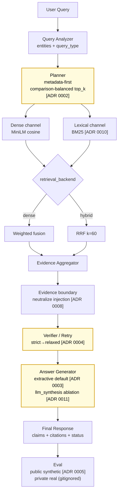

> 외부 LLM 없이 **extractive grounded answer**를 생성하고, **public synthetic + private real** 이중 평가 surface로 검증되는 RFP DocAgent. 핵심 결정은 모두 ADR로 추적되며 매 평가 호출마다 baseline 컬럼이 자동 측정된다.

## 파이프라인 (ADR 라벨 포함)

## 단계별 한 줄 요약

| Stage | 역할 | 핵심 코드 | ADR | 측정 신호 |
|---|---|---|---|---|
| Ingestion | HWP CSV fallback · 메타 6컬럼 | `ingestion.py:21,103` · `visual_ingestion.py:659` | — | `ingestion_report.json` |
| Chunking | fixed(baseline) vs section | `rag_core.py:712,809,824` | — | `chunk_seq_in_section` |
| Query analyzer | 엔터티/유형/모호성 추출 | `rag_core.py:1392` | — | `analyze_query` trace |
| Planner | metadata-first · comparison-balanced top_k | `rag_core.py:1838,1854` | 0002 | citation precision |
| Retriever | dense · BM25 · RRF k=60 | `rag_core.py:1550` | 0010 | recall@k |
| Evidence boundary | 외부 chunk의 prompt injection 무력화 | `rag_core.py` `neutralize_instruction_patterns` | 0008 | prompt injection regression test |
| Verifier / Retry | strict → relaxed, partial-topic 모드 | `rag_core.py:1843,2664` | 0004 | `retry_trigger_reason` |
| Answer generator | extractive 기본 / LLM 합성 ablation | `rag_core.py` · `rag_synthesis.py` | 0003, 0011 | `answer_format_compliance` |
| Eval | 공개 synthetic + 비공개 real (gitignored) | `eval/run_eval.py` · `scripts/run_real_eval_delta.py` | 0005 | dual-surface delta |

## 핵심 결정 4가지

| 결정 | 본문 위치 | 한 줄 *왜* |
|---|---|---|
| Extractive를 기본값으로 | [ADR 0001](https://github.com/hskim-solv/BidMate-DocAgent/blob/main/docs/adr/0001-preserve-naive-baseline.md) | advanced component는 latency·complexity·regression surface를 동반 → baseline 옆에 두지 않으면 *질 개선*인지 *실패 모드 이동*인지 판단 불가 |
| Metadata-first retrieval | [ADR 0002](https://github.com/hskim-solv/BidMate-DocAgent/blob/main/docs/adr/0002-metadata-first-retrieval.md) | RFP는 메타데이터(발주기관·사업명)가 진정한 anchor — dense top-k 단독은 비교 질의에서 starvation 발생 |
| Abstention을 1급 status로 | [ADR 0003](https://github.com/hskim-solv/BidMate-DocAgent/blob/main/docs/adr/0003-structured-answer-citation-contract.md) | 근거 부족을 *정직하게 인정*하는 것이 RFP 도메인에서 모호한 답변보다 가치 큼 |
| 평가 surface 이중화 | [ADR 0005](https://github.com/hskim-solv/BidMate-DocAgent/blob/main/docs/adr/0005-eval-split-public-synthetic-private-local.md) | 재현 가능성(public) vs honest signal(private real)을 하나의 surface로 동시에 충족 불가 |

## 측정 highlight (공개 synthetic n=42, bootstrap 95% CI)

| 비교 축 | naive_baseline | agentic_full | 해석 |
|---|---:|---:|---|
| Accuracy | 0.844 ± 0.12 | 0.906 ± 0.12 | CI **겹침** — n=42에서 통계 효과 약 |
| Citation Precision | 0.512 ± 0.12 | 0.905 ± 0.08 | CI **분리** — metadata-first의 진짜 효용 |
| Latency p95 (hashing) | 6.2ms | 2.9ms | metadata-first가 dense 호출 단축 |
| Latency p95 (ST embedding) | 367ms | 32ms | 약 10–200× cold path 비용 차이 |

real-data n=21 측정 결과는 [`docs/private-100-doc-experiments.md`](https://github.com/hskim-solv/BidMate-DocAgent/blob/main/docs/private-100-doc-experiments.md)의 aggregate-only Decision Log 참고.

## 한계와 다음 사이클

- **통계 검출력**: n=42는 ablation 차이의 통계 유의성 입증에 부족. 평가셋 확대(n≥100)가 다음 사이클 최우선.
- **Embedding 모델 ablation 미실행**: 2019년 MiniLM 사용. BGE-M3 / multilingual-e5-large / KURE 비교는 다음 사이클.
- **HWP native parsing 부재**: CSV 텍스트 fallback. native HWP parsing 라이브러리/라이선스 제약.
- **외부 baseline 비교**: ADR 0009 메서드론은 정의됐으나 stub backend만 동작. LangChain/LlamaIndex 실측은 별도 사이클.

## 더 읽을 거리

- [README §핵심 성능표](https://github.com/hskim-solv/BidMate-DocAgent#%ED%95%B5%EC%8B%AC-%EC%84%B1%EB%8A%A5%ED%91%9C-%EC%8B%A4%EC%B8%A1) — bootstrap CI 표 전체
- [Blog series](./blog/) — 결정들의 *왜*
- [ADR 인덱스](https://github.com/hskim-solv/BidMate-DocAgent/blob/main/docs/adr/README.md)
- [Engineering governance](https://github.com/hskim-solv/BidMate-DocAgent/blob/main/docs/engineering-governance.md) — workflow map
