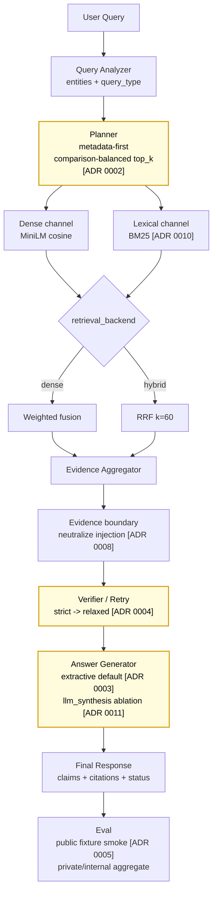

> 외부 LLM 없이 **extractive grounded answer**를 생성하고, 공개 fixture smoke + private/internal eval split으로 검증되는 RFP DocAgent. 핵심 결정은 ADR로 추적되며 매 평가 호출마다 baseline 컬럼이 자동 측정된다.

## 파이프라인 (ADR 라벨 포함)

```mermaid
flowchart TD
    Q[User Query] --> A["Query Analyzer<br/>entities + query_type"]
    A --> P["Planner<br/>metadata-first<br/>comparison-balanced top_k<br/>[ADR 0002]"]
    P --> RD["Dense channel<br/>MiniLM cosine"]
    P --> RB["Lexical channel<br/>BM25 [ADR 0010]"]
    RD --> FU{retrieval_backend}
    RB --> FU
    FU -->|dense| W["Weighted fusion"]
    FU -->|hybrid| RRF["RRF k=60"]
    W --> E[Evidence Aggregator]
    RRF --> E
    E --> EB["Evidence boundary<br/>neutralize injection [ADR 0008]"]
    EB --> V["Verifier / Retry<br/>strict -> relaxed [ADR 0004]"]
    V --> G["Answer Generator<br/>extractive default [ADR 0003]<br/>llm_synthesis ablation [ADR 0011]"]
    G --> F["Final Response<br/>claims + citations + status"]
    F --> EV["Eval<br/>public fixture smoke [ADR 0005]<br/>private/internal aggregate"]

    classDef highlight fill:#fffbdd,stroke:#d4a017,stroke-width:2px,color:#000
    class P,V,G highlight
```

## 단계별 한 줄 요약

| 단계(Stage) | 역할 | 핵심 코드 | ADR | 측정 신호 |
|---|---|---|---|---|
| Ingestion | HWP CSV fallback · 메타 6컬럼 | `ingestion.py`, `visual_ingestion.py` | — | `ingestion_report.json` |
| Chunking | fixed(baseline) vs section | `rag_core.py`, `rag_indexing.py` | — | `chunk_seq_in_section` |
| Query analyzer | 엔터티/유형/모호성 추출 | `rag_query.py` | — | `analyze_query` trace |
| Planner | metadata-first · comparison-balanced top_k | `rag_core.py`, `rag_retrieval.py` | 0002 | citation precision |
| Retriever | dense · BM25 · RRF k=60 | `rag_retrieval.py` | 0010 | recall@k |
| Evidence boundary | 외부 chunk의 prompt injection 무력화 | `rag_verifier.py` | 0008 | prompt injection regression test |
| Verifier / Retry | strict -> relaxed, partial-topic 모드 | `rag_core.py`, `rag_verifier.py` | 0004 | `retry_trigger_reason` |
| Answer generator | extractive 기본 / LLM 합성 ablation | `rag_answer.py`, `rag_synthesis.py` | 0003, 0011 | `answer_format_compliance` |
| Eval | 공개 fixture smoke + private/internal aggregate | `eval/run_eval.py`, `scripts/run_real_eval_delta.py` | 0005 | metrics split + latency |

## 평가 경계

이 레포지토리는 공개 가능한 작은 fixture를 smoke test 용도로만 사용합니다. 실제 성능 평가는 레포지토리에 커밋하지 않는 private/internal eval set을 기준으로 수행하는 것을 전제로 합니다.

공개 fixture smoke는 `eval/fixtures/smoke_rfp/raw/`와 `eval/config.yaml`로 실행되며, 목적은 평가 프레임워크가 private data 없이 deterministic하게 동작하는지 확인하는 것이다. 성능 claim의 source of truth는 private/internal eval aggregate다.

평가 지표는 다음 축으로 분리한다.

| 축 | 예시 metric | 해석 |
|---|---|---|
| 검색(retrieval) 품질 | `chunk_recall@k`, MRR, nDCG | 관련 chunk를 찾는가 |
| 답변 품질(answer quality) | accuracy, groundedness, abstention outcome | 근거 기반 답변/보류가 맞는가 |
| 인용/근거(citation/evidence) | citation precision, claim-citation alignment | claim과 evidence가 맞물리는가 |
| 지연시간(latency) | p50/p95, stage latency, retry cost | 품질 개선이 latency 비용을 정당화하는가 |

## 핵심 결정 4가지

| 결정 | 본문 위치 | 한 줄 *왜* |
|---|---|---|
| Extractive를 기본값으로 | [ADR 0001](https://github.com/hskim-solv/BidMate-DocAgent/blob/main/docs/adr/0001-preserve-naive-baseline.md) | advanced component는 latency·complexity·regression surface를 동반 → baseline 옆에 두지 않으면 *질 개선*인지 *실패 모드 이동*인지 판단 불가 |
| Metadata-first retrieval | [ADR 0002](https://github.com/hskim-solv/BidMate-DocAgent/blob/main/docs/adr/0002-metadata-first-retrieval.md) | RFP는 메타데이터(발주기관·사업명)가 진정한 anchor — dense top-k 단독은 비교 질의에서 starvation 발생 |
| Abstention을 1급 status로 | [ADR 0003](https://github.com/hskim-solv/BidMate-DocAgent/blob/main/docs/adr/0003-structured-answer-citation-contract.md) | 근거 부족을 *정직하게 인정*하는 것이 RFP 도메인에서 모호한 답변보다 가치 큼 |
| 평가 surface 분리 | [ADR 0005](https://github.com/hskim-solv/BidMate-DocAgent/blob/main/docs/adr/0005-eval-split-public-synthetic-private-local.md) | 공개 fixture 재현성과 실제 성능 신호를 하나의 surface로 동시에 충족할 수 없음 |

## 더 읽을 거리

- [README §평가 스토리](https://github.com/hskim-solv/BidMate-DocAgent#%ED%8F%89%EA%B0%80-%EC%8A%A4%ED%86%A0%EB%A6%AC)
- [ADR 인덱스](https://github.com/hskim-solv/BidMate-DocAgent/blob/main/docs/adr/README.md)
- [Engineering governance](https://github.com/hskim-solv/BidMate-DocAgent/blob/main/docs/engineering-governance.md)
