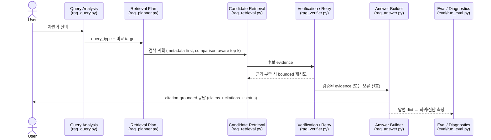

# 모듈 맵 (리뷰어용)

이 문서는 코드를 처음 보는 리뷰어가 **파이프라인 단계 → 책임 모듈 → 근거 문서**를 한눈에 따라갈 수 있도록 정리한 진입점이다. 깊은 설계 근거는 각 ADR / deep-dive 로 링크한다. 전체 흐름도(flowchart)는 [`docs/architecture-deep-dive.md`](../architecture-deep-dive.md) 의 ADR-labeled diagram 을 참조하고, 본 문서는 단계별 **모듈 소유권**과 호출 순서(sequence)에 집중한다.

파이프라인: ingestion → 메타데이터 정규화 → 청킹 → 검색 → 재순위/계획 → 근거 집계 → 근거 기반 답변 → 검증 → 평가 → reviewer 문서.

## 단계별 모듈

| 단계 | 주요 모듈 | 책임 |
|---|---|---|
| **질의 분석 (query analysis)** | [`rag_query.py`](../../rag_query.py) | `analyze_query` / `make_plan` — 질의 유형(single_doc / comparison / follow_up / abstention) 분류, 비교 target 추출, 검색 계획 수립 |
| ↳ 계획·보조 | [`rag_planner.py`](../../rag_planner.py), [`rag_clarification.py`](../../rag_clarification.py), [`rag_conversation_state.py`](../../rag_conversation_state.py) | 검색 계획, 메타데이터/문맥 모호성 시 clarification, 멀티턴 대화 상태 |
| **검색 (retrieval)** | [`rag_retrieval.py`](../../rag_retrieval.py) | `retrieve_candidates`, 4 유사도 primitive, BM25, RRF fusion, comparison-aware balance, parent-section 재조립 ([ADR 0010](../adr/0010-hybrid-bm25-dense-retrieval-rrf.md) · [ADR 0058](../adr/0058-phase35-mode-winner.md)) |
| ↳ 검색 보조 | [`rag_vector_store.py`](../../rag_vector_store.py), [`rag_reranker.py`](../../rag_reranker.py) / [`rag_rerank.py`](../../rag_rerank.py), [`rag_query_expansion.py`](../../rag_query_expansion.py) | `VectorStore` Protocol (memory/Qdrant), cross-encoder 재순위, HyDE opt-in 확장 |
| **검증 (verification)** | [`rag_verifier.py`](../../rag_verifier.py) | `verify_evidence`, topic 추출, evidence boundary + 명령 패턴 중화 ([ADR 0008](../adr/0008-evidence-boundary.md)) |
| **답변 계약 (answer contract)** | [`rag_answer.py`](../../rag_answer.py), [`rag_answer_schema.py`](../../rag_answer_schema.py) | 검증된 근거 → ADR 0003 답변 dict (`claims` + `citations` + `status`), `schema_version: 2` 계약 ([ADR 0003](../adr/0003-structured-answer-citation-contract.md)) |
| **인덱싱/청킹 (indexing)** | [`rag_indexing.py`](../../rag_indexing.py) | 청킹·인덱스 빌드 ([`scripts/build_index.py`](../../scripts/build_index.py) 진입점) |
| **임베딩 (embedding)** | [`rag_embedding.py`](../../rag_embedding.py) | dense 임베딩 primitive — 기본 오프라인 경로 `hashing`, 옵션 MiniLM/BGE-M3 |
| **수집 (ingestion)** | [`ingestion.py`](../../ingestion.py), [`visual_ingestion.py`](../../visual_ingestion.py) | 문서 로딩/파싱. HWP/PDF backend ([ADR 0049](../adr/0049-kordoc-replaces-pyhwp-backend.md)), `csv_text` fallback |
| **API** | [`api/main.py`](../../api/main.py), [`api/schemas.py`](../../api/schemas.py) | FastAPI 데모 서버 + request/response 스키마 (`api/` 전체가 SSoT) |
| **평가 (evaluation)** | [`eval/run_eval.py`](../../eval/run_eval.py), [`eval/scorers/`](../../eval/scorers/) | end-to-end eval harness + scorer 모듈 (`citation.py`, `alignment.py`, `format.py`, `failure_classifier.py`, `chunk_metrics.py` …) |
| **거버넌스/CI** | [`.github/workflows/pr-eval.yml`](../../.github/workflows/pr-eval.yml), `scripts/check_*.py` | PR-time 회귀 게이트 + lint. check 스크립트: `check_baseline_provenance.py`, `check_branch_and_issue.py`, `check_doc_links.py`, `check_embedding_routed_spread.py`, `check_latency_slo.py` |
| **데모 (demo)** | [`demo/streamlit_app.py`](../../demo/streamlit_app.py) | Streamlit UI — 3 preset side-by-side |
| **운영 (operations)** | [`docs/operations/`](../operations/) | 배포, harness, auto-ship, observability, failure-mode-harden-process |

## `rag_core.py` 는 왜 아직 존재하는가

`rag_core.py` 는 **사고로 비대해진 monolith 가 아니라, 단계적으로 분해(decompose)된 파이프라인의 호환 facade + 오케스트레이션 레이어**다 ([ADR 0045](../adr/0045-rag-core-leaf-migration-plan.md)):

- **Compatibility facade** — `rag_retrieval` / `rag_verifier` / `rag_answer` / `rag_query` / `rag_embedding` 등에서 100+ 심볼을 re-export 해, 기존 호출자(FastAPI 서버 · CLI · 벤치마크 · Streamlit 데모 · 테스트)가 import 경로 변경 없이 동작한다.
- **Stable import surface** — 분해가 진행돼도 `from rag_core import ...` 가 깨지지 않는 안정 경계. 테스트/스크립트가 내부 모듈 재배치에 결합되지 않는다.
- **Orchestration** — `_phase_analyze` / `_phase_build_answer` 등 고수준 단계 chaining + direct 경로와 LangGraph 경로([`rag_graph_agentic_full.py`](../../rag_graph_agentic_full.py) · [`rag_graph_react.py`](../../rag_graph_react.py)) 를 함께 구동.
- **Zero back-edge 검증** — leaf 모듈은 `rag_core` 로 되돌아 import 하지 않는다(back-edge 0, [ADR 0045](../adr/0045-rag-core-leaf-migration-plan.md) 검증). 분해는 호출자를 깨지 않으면서 점진적으로 진행됐다.

## 요청 흐름 (sequence)

> 위 sequence 는 단계별 모듈 소유권을 보여주는 것이 목적이며, fusion 채널·classDef 강조가 포함된 전체 데이터 흐름도는 [`docs/architecture-deep-dive.md`](../architecture-deep-dive.md) 에 있다. 실패 모드별 설계 대응은 [실패 모드 케이스 스터디](../case-studies/failure-modes.md) 참조.
